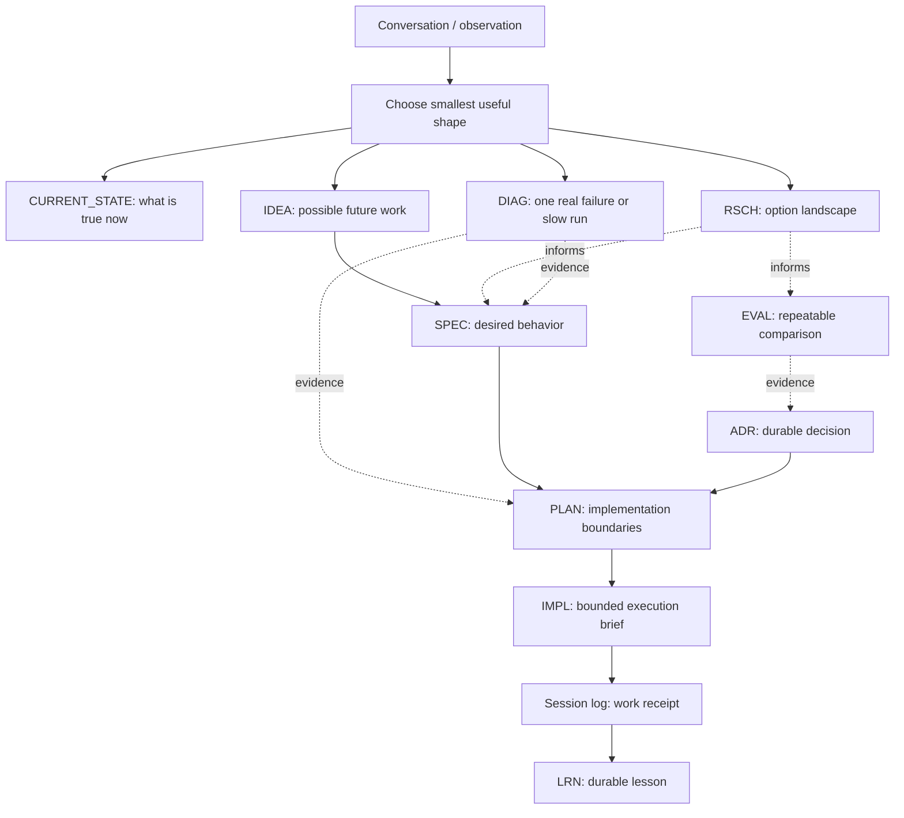

# Agent Docs Workflow

AGENT-DOCS gives AI-assisted repos a durable operating memory, so each new human or agent can see what is true now, what has been decided, what evidence exists, and what work is safe to do next without rereading old chat history.

It solves the failure mode where project knowledge exists, but is scattered across stale chats, ad hoc notes, oversized plans, and hand-maintained indexes. The differentiator is the split between source-of-truth docs, generated views, and bounded execution handoffs.

This is a **scalable workflow**, not a requirement to install every folder and doc type on day one. Start with the smallest shape that prevents confusion, then add structure only when the absence of structure is costing you comprehension.

## Quick Start

From the repo you want to document, install or update the CLI and preview the recommended small profile:

```bash
curl -fsSL https://raw.githubusercontent.com/owensantoso/AGENT-DOCS/main/install.sh | bash -s -- --profile small --dry-run
```

The curl installer installs `agent-docs` and the compatibility command
`agent-docs-init`, then previews by default. Write mode requires explicit
intent:

```bash
agent-docs-init --profile small --write
```

If you run the installer from an interactive terminal without a profile, the CLI asks where to install, explains the project-size profiles, and previews the tree. Use `small` when unsure. Existing target files are listed first, and write mode refuses to overwrite them unless you pass `--force`.

Install or update the CLI without running init:

```bash
curl -fsSL https://raw.githubusercontent.com/owensantoso/AGENT-DOCS/main/install.sh | bash -s -- --no-run
```

If you are installing from a private fork, authenticate with GitHub CLI and let `gh` handle the token instead of placing a bearer token in shell history or process listings:

```bash
gh auth login
gh api -H "Accept: application/vnd.github.raw" /repos/OWNER/AGENT-DOCS/contents/install.sh | AGENT_DOCS_REPO_URL=https://github.com/OWNER/AGENT-DOCS.git bash -s -- --profile small --dry-run
```

Non-interactive examples:

```bash
agent-docs-init --profile small --dry-run
agent-docs-init --profile small --write
agent-docs-init /path/to/project --profile growing --dry-run
agent-docs-init /path/to/project --profile full --dry-run
agent-docs-init /path/to/project --profile full --write
```

You can also use the new command namespace for init:

```bash
agent-docs init --profile small --dry-run
agent-docs init --profile small --write
```

## Why This Exists

Agent-driven projects usually do not fail because nobody wrote notes. They fail because the next session cannot tell which note is canonical, which plan is current, which decision still applies, or which evidence is safe to trust.

| Common Failure | AGENT-DOCS Answer |
|---|---|
| Current reality is inferred from code and stale chat | `CURRENT_STATE.md` is the first truth page |
| Ideas, specs, plans, and decisions blur together | Each doc type has one job and one owner of truth |
| Agents guess the next ID or hand-edit registries | `docs-meta` derives IDs and generated views from source docs |
| Bug evidence disappears into pasted logs | `DIAG-*` records preserve sanitized run evidence |
| Research, benchmarks, and decisions get mixed | `RSCH-*`, `EVAL-*`, and `ADR-*` stay separate |
| Plans become too large to hand off safely | `PLAN-*` owns scope; `IMPL-*` owns bounded execution |

The point is not the folder tree. The point is making repo memory resumable: source docs hold truth, generated views handle bookkeeping, and implementation briefs tell agents exactly what work is safe to do next.

## Start Here

| Need | Go To |
|---|---|
| Install this workflow in another repo | [INSTALL.md](INSTALL.md) |
| Contribute a focused improvement | [CONTRIBUTING.md](CONTRIBUTING.md) |
| Report a security issue | [SECURITY.md](SECURITY.md) |
| Understand the whole workflow in one pass | [guides/workflow-overview.md](guides/workflow-overview.md) |
| Decide which document type owns what | [guides/doc-types-and-responsibilities.md](guides/doc-types-and-responsibilities.md) |
| Run a scoped audit | [guides/audits/README.md](guides/audits/README.md) |
| Learn how agents split and integrate work | [guides/subagent-execution-loop.md](guides/subagent-execution-loop.md) |
| Follow an adoption checklist | [guides/adoption-checklist.md](guides/adoption-checklist.md) |
| Use the workflow as a Codex skill | [skills/structured-docs-workflow/SKILL.md](skills/structured-docs-workflow/SKILL.md) |
| Plan upstream AGENT-DOCS improvements | [plans/README.md](plans/README.md) |
| Explore the SQLite docs-index concept | [concepts/CONC-0001-read-only-sqlite-docs-index.md](concepts/CONC-0001-read-only-sqlite-docs-index.md) |
| Explore future doctor/upgrade safety | [concepts/CONC-0002-agent-docs-doctor-and-upgrade.md](concepts/CONC-0002-agent-docs-doctor-and-upgrade.md) |
| Explore open-loop review cadence | [concepts/CONC-0003-open-loop-review-cadence.md](concepts/CONC-0003-open-loop-review-cadence.md) |

## Choose A Size

AGENT-DOCS has one full scaffold today: [scaffold/](scaffold/). You do not need to copy all of it. For small projects, copy a subset and grow toward the full tree only when the project earns it.

| Profile | Use When | Recommended Shape |
|---|---|---|
| Tiny | prototype, script, single-person experiment | `AGENTS.md`, `docs/CURRENT_STATE.md`, `docs/ARCHITECTURE.md` |
| Small / MVP | real app with a few features and occasional agents | flat `docs/`, simple `plans/`, optional `ADR` and `DIAG` |
| Growing | multiple surfaces, recurring bugs, decisions, or handoffs | topic folders, `SPEC`, `PLAN`, `IMPL`, `ADR`, `DIAG`, session logs |
| Full | long-lived repo with many agents, plans, domains, and generated views | copy/adapt [scaffold/](scaffold/) plus `scripts/docs-meta` |

### Minimal Shapes

For a tiny repo:

```text
AGENTS.md
docs/
  CURRENT_STATE.md
  ARCHITECTURE.md
```

For a small product or MVP:

```text
AGENTS.md
docs/
  README.md
  CURRENT_STATE.md
  ARCHITECTURE.md
  ROADMAP.md
  plans/
  decisions/
  session-logs/
```

For a full AGENT-DOCS-style repo, use [scaffold/](scaffold/) as the source tree and delete what is irrelevant.

## Install

Supported platforms and prerequisites:

- macOS or Linux shell with Bash.
- Git for installer clone/update paths.
- Python 3.10 or newer.
- Symlink support for the installed `agent-docs` and `agent-docs-init`
  commands.
- A user-local bin directory such as `~/.local/bin` on `PATH`, or set `AGENT_DOCS_BIN_DIR`.

Use the installed command when you want the CLI to explain profiles, show the structure preview, and copy the selected scaffold. If you omit the target path, it uses the current directory in non-interactive mode and asks about the current directory in interactive mode:

```bash
agent-docs-init
```

The installer is idempotent around existing project files: it may create missing docs inside an existing `docs/` folder, but it lists exact file conflicts and refuses to overwrite those files in write mode unless `--force` is explicitly provided.

Explicit write installs create `.agent-docs/manifest.json`. Manifest schema
version 1 records the AGENT-DOCS source repo/ref/commit when available, the
selected profile, optional components such as `docs-meta`, installed file
records, and timestamps. Only reusable AGENT-DOCS tooling such as
`scripts/docs-meta` and `tests/docs-meta-smoke.sh` is checksummed and given an
expected file mode as `agent-docs-owned`; starter Markdown is recorded as
`project-owned-after-install` so future update tooling does not treat target
repo truth as automatically replaceable.

Legacy installs that predate `.agent-docs/manifest.json` can be inspected with
a preview-first baseline command:

```bash
agent-docs baseline --dry-run /path/to/project --profile small --docs-meta yes
agent-docs baseline --write /path/to/project --profile small --docs-meta yes
```

`--dry-run` is the default. Baseline write mode creates only
`.agent-docs/manifest.json`, writes it last, and refuses existing manifests,
unknown profiles, unsafe paths, missing/drifted AGENT-DOCS-owned tooling,
wrong file modes, symlinked paths, and non-regular files. Starter Markdown is
recorded as `project-owned-after-install` when present, without checksums, and
is not modified.

After a manifest-backed install, inspect the target without writing files:

```bash
agent-docs doctor /path/to/project
agent-docs upgrade /path/to/project
agent-docs upgrade --dry-run /path/to/project
```

`doctor` reports manifest health, missing owned tooling, checksum drift, safe
automatic additions, candidate tooling updates, generated-view refreshes, project-owned manual
review items, and refused or unknown shapes. Bare `agent-docs upgrade` and
`agent-docs upgrade --dry-run` use the same read-only classifier and preview
categories only.

The narrow write path is explicit:

```bash
agent-docs upgrade --write --tooling-only /path/to/project
agent-docs upgrade --write --tooling-only --generated-views /path/to/project
```

Tooling-only write mode may restore missing manifest-owned tooling, update
manifest-clean AGENT-DOCS-owned tooling to the current upstream action, repair a
missing executable bit when content still matches the manifest, and update the
manifest last. It creates backups under `.agent-docs/backups/<timestamp>/` for
touched existing files plus `.agent-docs/backups/<timestamp>/audit.json` for the
write batch. `agent-docs upgrade --write` without `--tooling-only` is refused,
and project-owned Markdown remains report-only. Generated views remain
report-only unless `--generated-views` is also provided; that opt-in mode
regenerates only manifest-tracked generated views through supported local
generators, initially `scripts/docs-meta update`.

Exit codes are `0` for healthy/current, `1` for warnings or actionable drift,
and `2` for invalid usage, refused, unknown, or incompatible shapes.
Tooling-only write mode exits with the post-write classification, so a target
that is fully repaired by the write exits `0`.

Non-interactive examples:

```bash
agent-docs-init --profile small --dry-run
agent-docs-init --profile small --write
agent-docs-init /path/to/project --profile small --dry-run
agent-docs-init /path/to/project --profile growing --dry-run
agent-docs-init /path/to/project --profile small --docs-meta yes --write
agent-docs-init /path/to/project --profile full --dry-run
agent-docs-init /path/to/project --profile full --write
```

If you have cloned this repo and want to run the script directly during development, use `scripts/agent-docs-init` from the repo root.

`tiny` and `small` synthesize smaller flat files such as `docs/CURRENT_STATE.md` and `docs/ARCHITECTURE.md`. `growing` and `full` copy selected files from the full scaffold, where current-state and architecture docs live under `docs/orientation/`. This keeps small-project docs lighter without duplicating the whole scaffold tree.

Manual install still works if you want the full scaffold plus deterministic metadata tooling:

```bash
AGENT_DOCS=/path/to/AGENT-DOCS
cp "$AGENT_DOCS/scaffold/AGENTS.md" ./AGENTS.md
mkdir -p docs
rsync -av "$AGENT_DOCS/scaffold/docs/" ./docs/
mkdir -p scripts tests
cp "$AGENT_DOCS/scripts/docs-meta" ./scripts/docs-meta
cp "$AGENT_DOCS/tests/docs-meta-smoke.sh" ./tests/docs-meta-smoke.sh
chmod +x ./scripts/docs-meta ./tests/docs-meta-smoke.sh
```

Then adapt placeholders, delete irrelevant examples, and make `AGENTS.md` plus the current-state doc truthful for that repo.

Reusable global and surface-level agent instructions live under [scaffold/agent-instructions/](scaffold/agent-instructions/). These are reusable `AGENTS.md` templates, not Codex `SKILL.md` skills. Repo-local skills live under [skills/](skills/), while [scaffold/skills/](scaffold/skills/) contains copies intended for target repos.

## Publication And Source Archives

Before public release, run:

```bash
scripts/release-check
```

Prefer GitHub tagged source archives or `git archive` for source distribution.
Those archives are built from tracked files and avoid copying local caches,
ignored generated artifacts, editor files, or secrets from a developer machine:

```bash
git archive --format=tar.gz --prefix=AGENT-DOCS/ HEAD > agent-docs-source.tar.gz
```

Do not create release archives by zipping a dirty working tree. If a manual
archive is unavoidable, first check for caches and sensitive files and exclude
anything ignored or machine-local.

## Workflow

The docs are the source of truth. GitHub issues, PRs, branches, and chat history are useful tracking surfaces, but durable intent and evidence should land in the docs.



Read this as a menu, not a required pipeline. A small bug may go straight from chat to code plus a session log. A risky model choice may need research, evaluation, ADR, and a plan.

## Document Types

Use the smallest durable doc that answers the actual question.

| Prefix | Type | Owns | Use When |
|---|---|---|---|
| `IDEA` | Idea | raw future possibility | A thought is worth keeping but not ready for requirements |
| `CONC` | Concept | domain model, naming, taxonomy | The team is confused about language or source of truth |
| `RSCH` | Research survey | sourced option landscape | You need to know what options exist |
| `EVAL` | Evaluation | repeatable fixtures, metrics, thresholds | You need evidence about which approach works better |
| `DIAG` | Diagnostic record | one real run, crash, freeze, slow flow | Debug evidence should outlive chat or pasted logs |
| `SPEC` | Spec | desired behavior and requirements | Implementation needs shared language and acceptance criteria |
| `ADR` | Architecture decision | durable decision and rejected alternatives | Future plans should honor the choice |
| `PLAN` | Parent plan | implementation scope, sequencing, boundaries | Work has multiple steps, risks, or handoff needs |
| `IMPL` | Implementation brief | bounded execution task | A plan needs delegation, resumability, or a focused handoff |
| `AREA` | Architecture area | boundary, owner, interface vocabulary | A subsystem needs stable references across work |
| `QST` | Question | unresolved uncertainty with status | A question needs ownership, evidence, or resolution history |
| `LRN` | Learning | lesson that should change future behavior | A correction or discovery should survive the chat |
| `EXPL` | Explainer | human-facing explanation or mental model | A concept needs teaching, diagrams, or reusable explanation |
| Session log | Receipt | what happened in a meaningful session | Future readers need timeline, verification, and decisions |
| Audit | Repo-health check | docs/tooling/codebase workflow health | The repo needs periodic drift or hygiene review |

## Stable File Naming

AGENT-DOCS artifacts use uppercase stable IDs in both frontmatter and filenames.
Do not create generic source docs like `plan.md`, `spec.md`, or `brief.md` when
the artifact has an ID family.

Required patterns:

```text
docs/<domain>/specs/SPEC-0001-<slug>.md
docs/<domain>/plans/PLAN-0001-<slug>/PLAN-0001-<slug>.md
docs/<domain>/plans/PLAN-0001-<slug>/IMPL-0001-01-<slug>.md
```

The parent plan folder and parent plan filename must repeat the same `PLAN-####`
ID and slug. Implementation briefs live in that plan folder and use
`IMPL-<plan-id>-<sequence>-<slug>.md`.

When `scripts/docs-meta` exists, prefer it over guessing IDs or paths. When it
does not exist, inspect existing docs and preserve the same uppercase ID pattern.

## Folder Model

Use a topic-first docs hierarchy. The top-level folder should describe the kind of work or knowledge, and artifact folders like `plans/` should live under the topic that owns them.

| Area | Owns | Typical Contents |
|---|---|---|
| `orientation/` | first-contact truth and walkthroughs | `CURRENT_STATE`, onboarding, roadmap, architecture, explainers |
| `architecture/` | split architecture boundaries | `AREA-*` docs and architecture hub |
| `product/` | user-facing behavior and product-enabling architecture | ideas, concepts, specs, plans, implementation briefs |
| `decisions/` | durable reasoning | ADRs, learnings, questions, execution readiness |
| `repo-health/` | project machinery | docs workflow, audits, session logs, state, testing, generated facts |
| `research/` | uncertainty and sourced investigation | research surveys, notes, source comparisons |
| `operations/` | running and shipping | release checklists, deployment notes, incident recovery |
| `marketing/` | launch and growth | positioning, campaign plans, audience research |

The useful question is:

> Who needs to care about this later?

If two categories are not competing for space yet, do not split them just to match the full scaffold.

## Full Structure

The full scaffold is shaped like this:

```text
docs/
  README.md
  IDEAS.md
  CONCEPTS.md
  SPECS.md
  orientation/
  architecture/
    areas/
  product/
    ideas/
    concepts/
    specs/
    plans/
  decisions/
    adr/
    learnings/
    questions/
  repo-health/
    audits/
    debugging/
    evaluations/
    session-logs/
    state/
  research/
  operations/
  marketing/
AGENTS.md
<surface>/AGENTS.md
```

The important rule is topic first, artifact type second. A plan lives under the domain that owns the outcome.

## Scaffold Map

The [scaffold/](scaffold/) folder is shaped like the docs tree it creates. Copy the parts you need instead of translating a flat template list into paths by hand.

| Scaffold Area | Includes |
|---|---|
| [scaffold/AGENTS.md](scaffold/AGENTS.md) | root agent index and repo rules |
| [scaffold/agent-instructions/](scaffold/agent-instructions/) | reusable global and surface `AGENTS.md` templates |
| [guides/audits/](guides/audits/) | reusable repo-agnostic audit-kind guides, copied into growing/full-profile repos under `docs/repo-health/audits/guides/` |
| [scaffold/docs/README.md](scaffold/docs/README.md) | target repo docs map and doc-type workflow diagram |
| [scaffold/docs/orientation/](scaffold/docs/orientation/) | current state, onboarding, roadmap, architecture |
| [scaffold/docs/architecture/](scaffold/docs/architecture/) | architecture hub and `AREA-*` example |
| [scaffold/docs/product/](scaffold/docs/product/) | ideas, concepts, specs, plans, implementation briefs |
| [scaffold/docs/decisions/](scaffold/docs/decisions/) | ADRs, learnings, durable questions |
| [scaffold/docs/repo-health/](scaffold/docs/repo-health/) | audits, diagnostics, evaluations, session logs, testing, state |
| [scaffold/docs/research/](scaffold/docs/research/) | `RSCH-*` convention and research notes |
| [scaffold/docs/operations/](scaffold/docs/operations/) | release and operational checklists |
| [scaffold/docs/marketing/](scaffold/docs/marketing/) | launch and campaign planning |
| [scripts/agent-docs](scripts/agent-docs) | command namespace for AGENT-DOCS workflows |
| [scripts/agent-docs-init](scripts/agent-docs-init) | compatibility selected scaffold installer |
| [scripts/docs-meta](scripts/docs-meta) | deterministic docs metadata CLI |

## Docs Meta

When installed in a repo, [scripts/docs-meta](scripts/docs-meta) scans Markdown filenames and frontmatter as the source of truth, then creates generated views from that state.

This exists because agents are good at synthesis but unreliable at bookkeeping. They can forget the next ID, miss a stale status, or hand-edit a registry that no longer matches the repo. `docs-meta` moves that work into a small script.

| Need | Command |
|---|---|
| Create a doc | `scripts/docs-meta new <family> "<title>" --domain <domain>` |
| Find next ID | `scripts/docs-meta next <family>` |
| Update generated views | `scripts/docs-meta update` |
| Validate metadata and generated views | `scripts/docs-meta check` |
| Validate structured todos | `scripts/docs-meta check-todos` |
| Review open loops | `scripts/docs-meta review` |
| Inspect links | `scripts/docs-meta links`, `check-links`, `backlinks`, `orphans` |
| Move docs safely | `scripts/docs-meta move OLD NEW --dry-run` |
| Check freshness | `scripts/docs-meta health --write` |

Supported stable-ID families include `IDEA`, `RSCH`, `EVAL`, `DIAG`, `CONC`, `SPEC`, `PLAN`, `IMPL`, `ADR`, `LRN`, `EXPL`, `QST`, and `TODO`.

Generated files such as `IDEAS.md`, `CONCEPTS.md`, `SPECS.md`, `DOCS-REGISTRY.md`, `TODOS.md`, `AREAS.md`, `AUDITS.md`, `ROADMAP-VIEW.md`, and `HEALTH.md` are views, not separate state. Fix the source docs, then regenerate.

Read [scripts/README.md](scripts/README.md) for the command reference and adoption notes.

## What To Reuse

The most reusable idea in this workflow is not the exact folder tree. It is the separation of jobs.

| Job | Reusable Pattern |
|---|---|
| Current reality | keep a short current-state page |
| Product direction | separate specs and roadmap from implementation plans |
| Execution | use parent plans for scope and implementation briefs for bounded handoff |
| Evidence | keep research, evaluation, and diagnostic evidence separate from decisions |
| Decisions | use ADRs for durable choices future plans must honor |
| Memory | use session logs for receipts and learnings for behavior-changing lessons |
| Teaching | use explainers when humans need durable mental models or diagrams |
| Uncertainty | use questions when unresolved uncertainty needs ownership or history |

Start small, then add structure only when the absence of structure is costing you comprehension.
