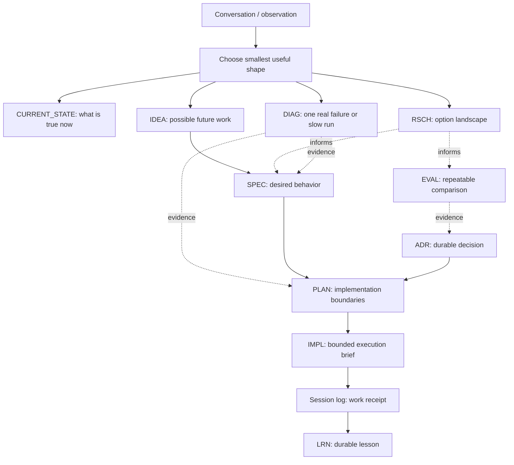

# Agent Docs Workflow

Portable docs kit for repos where humans and AI agents need to understand, plan, resume, and verify work without rereading old chat history.

Most project docs answer "what is this?" AGENT-DOCS is more opinionated: it gives a repo a durable operating memory. A fresh agent should be able to find what is true now, what is planned, what evidence exists, what decisions matter, and what exact work is safe to do next.

This is a **scalable workflow**, not a requirement to install every folder and doc type on day one. Start with the smallest shape that prevents confusion, then add structure only when the absence of structure is costing you comprehension.

## Why This Exists

Agent-driven projects create a specific kind of mess: not lack of notes, but notes that do not tell the next session what is canonical.

| Common Failure | AGENT-DOCS Answer |
|---|---|
| A fresh agent has to infer current reality from code and stale chat | `CURRENT_STATE.md` is the first truth page |
| Ideas, specs, plans, and decisions blur together | Each doc type has one job and one owner of truth |
| Agents guess the next ID or hand-edit registries | `docs-meta` derives IDs and generated views from source docs |
| A bug investigation is trapped in pasted logs | `DIAG-*` records preserve sanitized run evidence |
| Research, benchmarks, and decisions get mixed | `RSCH-*`, `EVAL-*`, and `ADR-*` stay separate |
| Plans become too big to hand off safely | `PLAN-*` owns scope; `IMPL-*` owns bounded execution |

The differentiator is not the folder tree. It is the separation between **source docs**, **generated views**, and **execution handoffs**. The repo remains the source of truth; `docs-meta` handles bookkeeping; agents use the docs to avoid inventing scope.

## Quick Start

For a small or MVP repo, run this from the target repo root:

```bash
curl -fsSL https://raw.githubusercontent.com/owensantoso/AGENT-DOCS/main/scripts/agent-docs-init -o /tmp/agent-docs-init
python3 /tmp/agent-docs-init --profile small --write
```

That standalone `curl` path is best for `tiny` and `small` profiles. For `growing`, `full`, or `docs-meta`, clone AGENT-DOCS so the installer can copy scaffold files and scripts:

```bash
git clone https://github.com/owensantoso/AGENT-DOCS.git /tmp/AGENT-DOCS
/tmp/AGENT-DOCS/scripts/agent-docs-init --profile full --write
```

You can also pass a target path explicitly:

```bash
/tmp/AGENT-DOCS/scripts/agent-docs-init /path/to/project --profile small --dry-run
```

## Start Here

| Need | Go To |
|---|---|
| Install this workflow in another repo | [INSTALL.md](INSTALL.md) |
| Understand the whole workflow in one pass | [guides/workflow-overview.md](guides/workflow-overview.md) |
| Decide which document type owns what | [guides/doc-types-and-responsibilities.md](guides/doc-types-and-responsibilities.md) |
| Learn how agents split and integrate work | [guides/subagent-execution-loop.md](guides/subagent-execution-loop.md) |
| Follow an adoption checklist | [guides/adoption-checklist.md](guides/adoption-checklist.md) |
| Use the workflow as a Codex skill | [skills/structured-docs-workflow/SKILL.md](skills/structured-docs-workflow/SKILL.md) |
| Plan upstream AGENT-DOCS improvements | [plans/README.md](plans/README.md) |
| Explore the SQLite docs-index concept | [concepts/CONC-0001-read-only-sqlite-docs-index.md](concepts/CONC-0001-read-only-sqlite-docs-index.md) |

## Choose A Size

AGENT-DOCS has one full scaffold today: [scaffold/](scaffold/). You do not need to copy all of it. For small projects, copy a subset and grow toward the full tree only when the project earns it.

| Profile | Use When | Recommended Shape |
|---|---|---|
| Tiny | prototype, script, single-person experiment | `AGENTS.md`, `docs/CURRENT_STATE.md`, `docs/ARCHITECTURE.md` |
| Small / MVP | real app with a few features and occasional agents | flat `docs/`, simple `plans/`, optional `ADR` and `DIAG` |
| Growing | multiple surfaces, recurring bugs, decisions, or handoffs | topic folders, `SPEC`, `PLAN`, `IMPL`, `ADR`, `DIAG`, session logs |
| Full | long-lived repo with many agents, plans, domains, and generated views | copy/adapt [scaffold/](scaffold/) plus `scripts/docs-meta` |

### Minimal Shapes

For a tiny repo:

```text
AGENTS.md
docs/
  CURRENT_STATE.md
  ARCHITECTURE.md
```

For a small product or MVP:

```text
AGENTS.md
docs/
  README.md
  CURRENT_STATE.md
  ARCHITECTURE.md
  ROADMAP.md
  plans/
  decisions/
  session-logs/
```

For a full AGENT-DOCS-style repo, use [scaffold/](scaffold/) as the source tree and delete what is irrelevant.

## Install

Use the interactive installer when you want the CLI to explain profiles, show the structure preview, and copy the selected scaffold. If you omit the target path, it uses the current directory in non-interactive mode and asks about the current directory in interactive mode:

```bash
scripts/agent-docs-init
```

Non-interactive examples:

```bash
scripts/agent-docs-init --profile small --dry-run
scripts/agent-docs-init --profile small --write
scripts/agent-docs-init /path/to/project --profile small --dry-run
scripts/agent-docs-init /path/to/project --profile small --docs-meta yes --write
scripts/agent-docs-init /path/to/project --profile full --write
```

`tiny` and `small` synthesize smaller files, including a simpler `ARCHITECTURE.md`. `growing` and `full` copy selected files from the full scaffold. This keeps small-project docs lighter without duplicating the whole scaffold tree.

Manual install still works if you want the full scaffold plus deterministic metadata tooling:

```bash
AGENT_DOCS=/path/to/AGENT-DOCS
cp "$AGENT_DOCS/scaffold/AGENTS.md" ./AGENTS.md
mkdir -p docs
rsync -av "$AGENT_DOCS/scaffold/docs/" ./docs/
mkdir -p scripts tests
cp "$AGENT_DOCS/scripts/docs-meta" ./scripts/docs-meta
cp "$AGENT_DOCS/tests/docs-meta-smoke.sh" ./tests/docs-meta-smoke.sh
chmod +x ./scripts/docs-meta ./tests/docs-meta-smoke.sh
```

Then adapt placeholders, delete irrelevant examples, and make `AGENTS.md` plus the current-state doc truthful for that repo.

Reusable global and surface-level agent instructions live under [scaffold/agent-instructions/](scaffold/agent-instructions/). These are reusable `AGENTS.md` templates, not Codex `SKILL.md` skills.

## Workflow

The docs are the source of truth. GitHub issues, PRs, branches, and chat history are useful tracking surfaces, but durable intent and evidence should land in the docs.



Read this as a menu, not a required pipeline. A small bug may go straight from chat to code plus a session log. A risky model choice may need research, evaluation, ADR, and a plan.

## Document Types

Use the smallest durable doc that answers the actual question.

| Prefix | Type | Owns | Use When |
|---|---|---|---|
| `IDEA` | Idea | raw future possibility | A thought is worth keeping but not ready for requirements |
| `CONC` | Concept | domain model, naming, taxonomy | The team is confused about language or source of truth |
| `RSCH` | Research survey | sourced option landscape | You need to know what options exist |
| `EVAL` | Evaluation | repeatable fixtures, metrics, thresholds | You need evidence about which approach works better |
| `DIAG` | Diagnostic record | one real run, crash, freeze, slow flow | Debug evidence should outlive chat or pasted logs |
| `SPEC` | Spec | desired behavior and requirements | Implementation needs shared language and acceptance criteria |
| `ADR` | Architecture decision | durable decision and rejected alternatives | Future plans should honor the choice |
| `PLAN` | Parent plan | implementation scope, sequencing, boundaries | Work has multiple steps, risks, or handoff needs |
| `IMPL` | Implementation brief | bounded execution task | A plan needs delegation, resumability, or a focused handoff |
| `AREA` | Architecture area | boundary, owner, interface vocabulary | A subsystem needs stable references across work |
| `QST` | Question | unresolved uncertainty with status | A question needs ownership, evidence, or resolution history |
| `LRN` | Learning | lesson that should change future behavior | A correction or discovery should survive the chat |
| `EXPL` | Explainer | human-facing explanation or mental model | A concept needs teaching, diagrams, or reusable explanation |
| Session log | Receipt | what happened in a meaningful session | Future readers need timeline, verification, and decisions |
| Audit | Repo-health check | docs/tooling/codebase workflow health | The repo needs periodic drift or hygiene review |

## Folder Model

Use a topic-first docs hierarchy. The top-level folder should describe the kind of work or knowledge, and artifact folders like `plans/` should live under the topic that owns them.

| Area | Owns | Typical Contents |
|---|---|---|
| `orientation/` | first-contact truth and walkthroughs | `CURRENT_STATE`, onboarding, roadmap, architecture, explainers |
| `architecture/` | split architecture boundaries | `AREA-*` docs and architecture hub |
| `product/` | user-facing behavior and product-enabling architecture | ideas, concepts, specs, plans, implementation briefs |
| `decisions/` | durable reasoning | ADRs, learnings, questions, execution readiness |
| `repo-health/` | project machinery | docs workflow, audits, session logs, state, testing, generated facts |
| `research/` | uncertainty and sourced investigation | research surveys, notes, source comparisons |
| `operations/` | running and shipping | release checklists, deployment notes, incident recovery |
| `marketing/` | launch and growth | positioning, campaign plans, audience research |

The useful question is:

> Who needs to care about this later?

If two categories are not competing for space yet, do not split them just to match the full scaffold.

## Full Structure

The full scaffold is shaped like this:

```text
docs/
  README.md
  IDEAS.md
  CONCEPTS.md
  SPECS.md
  orientation/
  architecture/
    areas/
  product/
    ideas/
    concepts/
    specs/
    plans/
  decisions/
    adr/
    learnings/
    questions/
  repo-health/
    audits/
    debugging/
    evaluations/
    session-logs/
    state/
  research/
  operations/
  marketing/
AGENTS.md
<surface>/AGENTS.md
```

The important rule is topic first, artifact type second. A plan lives under the domain that owns the outcome.

## Scaffold Map

The [scaffold/](scaffold/) folder is shaped like the docs tree it creates. Copy the parts you need instead of translating a flat template list into paths by hand.

| Scaffold Area | Includes |
|---|---|
| [scaffold/AGENTS.md](scaffold/AGENTS.md) | root agent index and repo rules |
| [scaffold/agent-instructions/](scaffold/agent-instructions/) | reusable global and surface `AGENTS.md` templates |
| [scaffold/docs/README.md](scaffold/docs/README.md) | target repo docs map and doc-type workflow diagram |
| [scaffold/docs/orientation/](scaffold/docs/orientation/) | current state, onboarding, roadmap, architecture |
| [scaffold/docs/architecture/](scaffold/docs/architecture/) | architecture hub and `AREA-*` example |
| [scaffold/docs/product/](scaffold/docs/product/) | ideas, concepts, specs, plans, implementation briefs |
| [scaffold/docs/decisions/](scaffold/docs/decisions/) | ADRs, learnings, durable questions |
| [scaffold/docs/repo-health/](scaffold/docs/repo-health/) | audits, diagnostics, evaluations, session logs, testing, state |
| [scaffold/docs/research/](scaffold/docs/research/) | `RSCH-*` convention and research notes |
| [scaffold/docs/operations/](scaffold/docs/operations/) | release and operational checklists |
| [scaffold/docs/marketing/](scaffold/docs/marketing/) | launch and campaign planning |
| [scripts/agent-docs-init](scripts/agent-docs-init) | interactive selected scaffold installer |
| [scripts/docs-meta](scripts/docs-meta) | deterministic docs metadata CLI |

## Docs Meta

When installed in a repo, [scripts/docs-meta](scripts/docs-meta) scans Markdown filenames and frontmatter as the source of truth, then creates generated views from that state.

This exists because agents are good at synthesis but unreliable at bookkeeping. They can forget the next ID, miss a stale status, or hand-edit a registry that no longer matches the repo. `docs-meta` moves that work into a small script.

| Need | Command |
|---|---|
| Create a doc | `scripts/docs-meta new <family> "<title>" --domain <domain>` |
| Find next ID | `scripts/docs-meta next <family>` |
| Update generated views | `scripts/docs-meta update` |
| Validate metadata and generated views | `scripts/docs-meta check` |
| Validate structured todos | `scripts/docs-meta check-todos` |
| Inspect links | `scripts/docs-meta links`, `check-links`, `backlinks`, `orphans` |
| Move docs safely | `scripts/docs-meta move OLD NEW --dry-run` |
| Check freshness | `scripts/docs-meta health --write` |

Supported stable-ID families include `IDEA`, `RSCH`, `EVAL`, `DIAG`, `CONC`, `SPEC`, `PLAN`, `IMPL`, `ADR`, `LRN`, `EXPL`, `QST`, and `TODO`.

Generated files such as `IDEAS.md`, `CONCEPTS.md`, `SPECS.md`, `DOCS-REGISTRY.md`, `TODOS.md`, `AREAS.md`, `AUDITS.md`, `ROADMAP-VIEW.md`, and `HEALTH.md` are views, not separate state. Fix the source docs, then regenerate.

Read [scripts/README.md](scripts/README.md) for the command reference and adoption notes.

## What To Reuse

The most reusable idea in this workflow is not the exact folder tree. It is the separation of jobs.

| Job | Reusable Pattern |
|---|---|
| Current reality | keep a short current-state page |
| Product direction | separate specs and roadmap from implementation plans |
| Execution | use parent plans for scope and implementation briefs for bounded handoff |
| Evidence | keep research, evaluation, and diagnostic evidence separate from decisions |
| Decisions | use ADRs for durable choices future plans must honor |
| Memory | use session logs for receipts and learnings for behavior-changing lessons |
| Teaching | use explainers when humans need durable mental models or diagrams |
| Uncertainty | use questions when unresolved uncertainty needs ownership or history |

Start small, then add structure only when the absence of structure is costing you comprehension.
