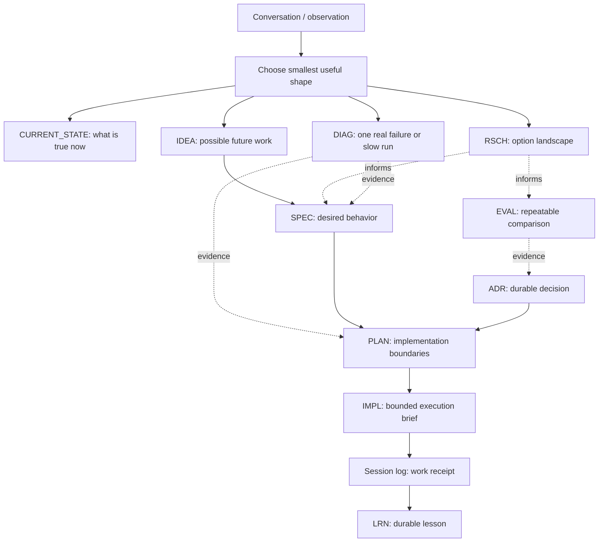

# Agent Continuity

Agent Continuity gives AI-assisted repos a durable operating memory, so each new human or agent can see what is true now, what has been decided, what evidence exists, and what work is safe to do next without rereading old chat history.

It solves the failure mode where project knowledge exists, but is scattered across stale chats, ad hoc notes, oversized plans, and hand-maintained indexes. The differentiator is the split between source-of-truth docs, generated views, and bounded execution handoffs.

This is a **scalable workflow**, not a requirement to install every folder and doc type on day one. Start with the smallest shape that prevents confusion, then add structure only when the absence of structure is costing you comprehension.

## Quick Start

Supported today: macOS and Linux shells with Bash, Git, Python 3.10+, and
symlink support. Native Windows is not first-class yet because the installer and
command setup assume Unix-style shell behavior and symlinks; use WSL for the
closest supported Windows path.

For a brand-new project, preview one complete repository transaction:

```bash
agent-continuity project new orient-server \
  --path /path/to/orient-server
```

The new-project command always uses the `complete` profile. It previews by
default, creates nothing until `--write` is supplied, initializes `main`,
installs the complete scaffold plus repository-local deterministic CI, verifies
the result, writes a named root README and Agent Index, records a bootstrap
receipt, and creates the initial commit. To also
create a GitHub repository, make that external mutation explicit:

```bash
agent-continuity project new orient-server \
  --path /path/to/orient-server \
  --github OWNER/orient-server \
  --visibility private \
  --write
```

GitHub creation happens only after local verification passes. The command then
pushes `main` and confirms the exact local commit at `origin/main`. It does not
guess a language stack, license, or project-specific test command; add those
once the project has made those choices.

From the repo you want to document, install or update the CLI and preview the recommended standard footprint:

```bash
curl -fsSL https://raw.githubusercontent.com/owensantoso/agent-continuity/main/install.sh | bash -s -- --profile standard --dry-run
```

The curl installer installs the primary `agent-continuity` command plus the
compatibility commands `agent-docs` and `agent-docs-init`, then previews by
default. Write mode requires explicit intent:

```bash
agent-continuity init --profile standard --write
```

If you run the installer from an interactive terminal without a profile, the CLI asks where to install, explains the starting-footprint profiles, and previews the tree. Use `standard` when unsure. Existing target files are listed first, and write mode refuses to overwrite them unless you pass `--force`.

Install or update the CLI without running init:

```bash
curl -fsSL https://raw.githubusercontent.com/owensantoso/agent-continuity/main/install.sh | bash -s -- --no-run
```

Upgrade an existing project that already has older Agent Continuity files by updating
the local command first, then inspecting the project:

```bash
curl -fsSL https://raw.githubusercontent.com/owensantoso/agent-continuity/main/install.sh | bash -s -- --no-run
agent-continuity doctor /path/to/project
agent-continuity upgrade --dry-run /path/to/project
```

Do not rerun `init --write` over an existing customized project. For old
installs without `.agent-continuity/manifest.json`, use the baseline preview in
[INSTALL.md](INSTALL.md) before creating a manifest. If you want an agent to do
the upgrade for you, paste them [the agent upgrade runbook](guides/agent-upgrade-existing-install.md).

If you are installing from a private fork, authenticate with GitHub CLI and let `gh` handle the token instead of placing a bearer token in shell history or process listings:

```bash
gh auth login
gh api -H "Accept: application/vnd.github.raw" /repos/OWNER/agent-continuity/contents/install.sh | AGENT_CONTINUITY_REPO_URL=https://github.com/OWNER/agent-continuity.git bash -s -- --profile standard --dry-run
```

Non-interactive examples:

```bash
agent-continuity init --profile standard --dry-run
agent-continuity init --profile standard --write
agent-continuity init /path/to/project --profile expanded --dry-run
agent-continuity init /path/to/project --profile complete --dry-run
agent-continuity init /path/to/project --profile complete --write
```

The old command names and profile names remain compatibility aliases:

```bash
agent-docs init --profile small --dry-run
agent-docs-init --profile growing --dry-run
```

## Why This Exists

Agent-driven projects usually do not fail because nobody wrote notes. They fail because the next session cannot tell which note is canonical, which plan is current, which decision still applies, or which evidence is safe to trust.

| Common Failure | Agent Continuity Answer |
|---|---|
| Current reality is inferred from code and stale chat | `CURRENT_STATE.md` is the first truth page |
| Ideas, specs, plans, and decisions blur together | Each doc type has one job and one owner of truth |
| Branches compete for numbered document identity | `agent-continuity docs` assigns UUIDv7 identity and derives generated views from source docs |
| Bug evidence disappears into pasted logs | `DIAG-*` records preserve sanitized run evidence |
| Research, benchmarks, and decisions get mixed | `RSCH-*`, `EVAL-*`, and `ADR-*` stay separate |
| Plans become too large to hand off safely | `PLAN-*` owns scope; `IMPL-*` owns bounded execution |

The point is not the folder tree. The point is making repo memory resumable: source docs hold truth, generated views handle bookkeeping, and implementation briefs tell agents exactly what work is safe to do next.

## Start Here

| Need | Go To |
|---|---|
| Create a complete new repository | `agent-continuity project new <name>` |
| Install this workflow in another repo | [INSTALL.md](INSTALL.md) |
| Ask an agent to upgrade an existing install | [guides/agent-upgrade-existing-install.md](guides/agent-upgrade-existing-install.md) |
| Contribute a focused improvement | [CONTRIBUTING.md](CONTRIBUTING.md) |
| Report a security issue | [SECURITY.md](SECURITY.md) |
| Understand the whole workflow in one pass | [guides/workflow-overview.md](guides/workflow-overview.md) |
| Decide which document type owns what | [guides/doc-types-and-responsibilities.md](guides/doc-types-and-responsibilities.md) |
| Run a scoped audit | [guides/audits/README.md](guides/audits/README.md) |
| Learn how agents split and integrate work | [guides/subagent-execution-loop.md](guides/subagent-execution-loop.md) |
| Follow an adoption checklist | [guides/adoption-checklist.md](guides/adoption-checklist.md) |
| Use the workflow as a Codex skill | [skills/structured-docs-workflow/SKILL.md](skills/structured-docs-workflow/SKILL.md) |
| Plan upstream Agent Continuity improvements | [plans/README.md](plans/README.md) |
| Follow package-manager distribution work | [PLAN-0010](plans/package-manager-distribution/PLAN-0010-package-manager-distribution.md) |
| Explore the SQLite docs-index concept | [concepts/CONC-0001-read-only-sqlite-docs-index.md](concepts/CONC-0001-read-only-sqlite-docs-index.md) |
| Explore future doctor/upgrade safety | [concepts/CONC-0002-agent-docs-doctor-and-upgrade.md](concepts/CONC-0002-agent-docs-doctor-and-upgrade.md) |
| Explore open-loop review cadence | [concepts/CONC-0003-open-loop-review-cadence.md](concepts/CONC-0003-open-loop-review-cadence.md) |

## Choose A Starting Footprint

Agent Continuity has one full scaffold today: [scaffold/](scaffold/). You do not need to copy all of it. Profiles choose the starting local docs footprint only; they do not limit later commands, audits, templates, generated views, or upgrade tooling.

| Profile | Use When | Recommended Shape |
|---|---|---|
| Core | prototype, script, single-person experiment | `AGENTS.md`, `docs/CURRENT_STATE.md`, `docs/ARCHITECTURE.md` |
| Standard | real app with a few features and occasional agents | flat `docs/`, simple `plans/`, optional `ADR` and `DIAG` |
| Expanded | multiple surfaces, recurring bugs, decisions, or handoffs | topic folders, `SPEC`, `PLAN`, `IMPL`, `ADR`, `DIAG`, session logs |
| Complete | long-lived repo with many agents, plans, domains, and generated views | copy/adapt [scaffold/](scaffold/) plus `agent-continuity docs` |

Compatibility aliases still work for at least one release cycle: `tiny` maps to
`core`, `small` maps to `standard`, `growing` maps to `expanded`, and `full`
maps to `complete`. New manifests record the canonical profile key.

### Minimal Shapes

For a core-footprint repo:

```text
AGENTS.md
docs/
  CURRENT_STATE.md
  ARCHITECTURE.md
```

For a standard-footprint product or MVP:

```text
AGENTS.md
docs/
  README.md
  CURRENT_STATE.md
  ARCHITECTURE.md
  ROADMAP.md
  plans/
  decisions/
  session-logs/
```

For a full Agent Continuity-style repo, use [scaffold/](scaffold/) as the source tree and delete what is irrelevant.

## Install

Supported platforms and prerequisites:

- macOS or Linux shell with Bash.
- Git for installer clone/update paths.
- Python 3.10 or newer.
- Symlink support for the installed `agent-continuity`, `agent-docs`, and
  `agent-docs-init` commands.
- A user-local bin directory such as `~/.local/bin` on `PATH`, or set `AGENT_CONTINUITY_BIN_DIR`.

Use the installed command when you want the CLI to explain profiles, show the structure preview, and copy the selected scaffold. If you omit the target path, it uses the current directory in non-interactive mode and asks about the current directory in interactive mode:

```bash
agent-continuity init
```

The installer is idempotent around existing project files: it may create missing docs inside an existing `docs/` folder, but it lists exact file conflicts and refuses to overwrite those files in write mode unless `--force` is explicitly provided.

Explicit write installs create `.agent-continuity/manifest.json`. Manifest schema
version 2 records the named Agent Continuity release, document-format target,
source repo/ref/commit when available, selected profile, optional components such
as `agent-continuity-docs`, installed file records, generated views, and timestamps. Only reusable tooling such as
`scripts/agent-continuity-docs` and `tests/agent-continuity-docs-smoke.sh` is checksummed and given an
expected file mode as `agent-continuity-owned`; starter Markdown is recorded as
`project-owned-after-install` so future update tooling does not treat target
repo truth as automatically replaceable.

Legacy installs that predate `.agent-continuity/manifest.json` can be inspected with
a preview-first baseline command:

```bash
agent-continuity baseline --dry-run /path/to/project --profile standard --docs yes
agent-continuity baseline --write /path/to/project --profile standard --docs yes
agent-continuity baseline --dry-run --generated-views /path/to/project --profile standard --docs yes
agent-continuity baseline --write --generated-views /path/to/project --profile standard --docs yes
```

`--dry-run` is the default. Baseline write mode creates only
`.agent-continuity/manifest.json`, writes it last, and refuses existing manifests,
unknown profiles, unsafe paths, missing/drifted Agent Continuity-owned tooling,
wrong file modes, symlinked paths, and non-regular files. Starter Markdown is
recorded as `project-owned-after-install` when present, without checksums, and
is not modified. `--generated-views` is an explicit opt-in that registers only
existing recognized `agent-continuity docs update` outputs with generated-view
markers. It does not run generators or overwrite files.

After a manifest-backed install, inspect the target without writing files:

```bash
agent-continuity doctor /path/to/project
agent-continuity upgrade /path/to/project
agent-continuity upgrade --dry-run /path/to/project
```

`doctor` reports manifest health, missing owned tooling, checksum drift, safe
automatic additions, candidate tooling updates, generated-view refreshes, project-owned manual
review items, UUID migration state, and refused or unknown shapes. When the
canonical migration plan exists, it verifies the matching receipt and reports
`ready`, `in_progress`, or `completed`, including the exact resume command when
work remains. A valid completion receipt closes the v1 compatibility window for
that migrated corpus. Bare `agent-continuity upgrade` and
`agent-continuity upgrade --dry-run` use the same read-only classifier and preview
categories only.

The narrow write path is explicit:

```bash
agent-continuity upgrade --write --tooling-only /path/to/project
agent-continuity upgrade --write --tooling-only --generated-views /path/to/project
```

Tooling-only write mode may restore missing manifest-owned tooling, update
manifest-clean Agent Continuity-owned tooling to the current upstream action, repair a
missing executable bit when content still matches the manifest, and update the
manifest last. It creates backups under `.agent-continuity/backups/<timestamp>/` for
touched existing files plus `.agent-continuity/backups/<timestamp>/audit.json` for the
write batch. `agent-continuity upgrade --write` without `--tooling-only` is refused,
and project-owned Markdown remains report-only. Generated views remain
report-only unless `--generated-views` is also provided; that opt-in mode
regenerates only manifest-tracked generated views through supported local
generators, initially `agent-continuity docs update`.

Exit codes are `0` for healthy/current, `1` for warnings or actionable drift,
and `2` for invalid usage, refused, unknown, or incompatible shapes.
Tooling-only write mode exits with the post-write classification, so a target
that is fully repaired by the write exits `0`.

Non-interactive examples:

```bash
agent-continuity init --profile standard --dry-run
agent-continuity init --profile standard --write
agent-continuity init /path/to/project --profile standard --dry-run
agent-continuity init /path/to/project --profile expanded --dry-run
agent-continuity init /path/to/project --profile standard --docs yes --write
agent-continuity init /path/to/project --profile complete --dry-run
agent-continuity init /path/to/project --profile complete --write
```

If you have cloned this repo and want to run the script directly during development, use `scripts/agent-continuity-init` from the repo root.

`core` and `standard` synthesize smaller flat files such as `docs/CURRENT_STATE.md` and `docs/ARCHITECTURE.md`. `expanded` and `complete` copy selected files from the full scaffold, where current-state and architecture docs live under `docs/orientation/`. This keeps smaller project docs lighter without duplicating the whole scaffold tree.

Use `agent-continuity init` rather than copying `scaffold/` directly. The
initializer omits legacy numbered example records, assigns UUIDv7 identity to
starter records, and regenerates derived views. The source scaffold retains
migration fixtures and reference material that should not become new project
state verbatim.

Reusable global and surface-level agent instructions live under [scaffold/agent-instructions/](scaffold/agent-instructions/). These are reusable `AGENTS.md` templates, not Codex `SKILL.md` skills. Repo-local skills live under [skills/](skills/), while [scaffold/skills/](scaffold/skills/) contains copies intended for target repos.

## Publication And Source Archives

Before public release, run:

```bash
scripts/release-check
```

Prefer GitHub tagged source archives or `git archive` for source distribution.
Those archives are built from tracked files and avoid copying local caches,
ignored generated artifacts, editor files, or secrets from a developer machine:

```bash
git archive --format=tar.gz --prefix=agent-continuity/ HEAD > agent-continuity-source.tar.gz
```

Do not create release archives by zipping a dirty working tree. If a manual
archive is unavoidable, first check for caches and sensitive files and exclude
anything ignored or machine-local.

## Workflow

The docs are the source of truth. GitHub issues, PRs, branches, and chat history are useful tracking surfaces, but durable intent and evidence should land in the docs.


```mermaid
flowchart TD
  Chat["Conversation / observation"] --> Size["Choose smallest useful shape"]
  Size --> Current["CURRENT_STATE: what is true now"]
  Size --> Idea["IDEA: possible future work"]
  Size --> Diag["DIAG: one real failure or slow run"]
  Size --> Research["RSCH: option landscape"]

  Idea --> Spec["SPEC: desired behavior"]
  Research -. informs .-> Eval["EVAL: repeatable comparison"]
  Research -. informs .-> Spec
  Diag -. evidence .-> Spec
  Diag -. evidence .-> Plan["PLAN: implementation boundaries"]
  Eval -. evidence .-> Adr["ADR: durable decision"]
  Spec --> Plan
  Adr --> Plan
  Plan --> Impl["IMPL: bounded execution brief"]
  Impl --> Session["Session log: work receipt"]
  Session --> Learn["LRN: durable lesson"]
```

Read this as a menu, not a required pipeline. A small bug may go straight from chat to code plus a session log. A risky model choice may need research, evaluation, ADR, and a plan.

## Document Types

Use the smallest durable doc that answers the actual question.

| Prefix | Type | Owns | Use When |
|---|---|---|---|
| `IDEA` | Idea | raw future possibility | A thought is worth keeping but not ready for requirements |
| `CONC` | Concept | domain model, naming, taxonomy | The team is confused about language or source of truth |
| `RSCH` | Research survey | sourced option landscape | You need to know what options exist |
| `EVAL` | Evaluation | repeatable fixtures, metrics, thresholds | You need evidence about which approach works better |
| `DIAG` | Diagnostic record | one real run, crash, freeze, slow flow | Debug evidence should outlive chat or pasted logs |
| `SPEC` | Spec | desired behavior and requirements | Implementation needs shared language and acceptance criteria |
| `ADR` | Architecture decision | durable decision and rejected alternatives | Future plans should honor the choice |
| `PLAN` | Parent plan | implementation scope, sequencing, boundaries | Work has multiple steps, risks, or handoff needs |
| `IMPL` | Implementation brief | bounded execution task | A plan needs delegation, resumability, or a focused handoff |
| `AREA` | Architecture area | boundary, owner, interface vocabulary | A subsystem needs stable references across work |
| `QST` | Question | unresolved uncertainty with status | A question needs ownership, evidence, or resolution history |
| `LRN` | Learning | lesson that should change future behavior | A correction or discovery should survive the chat |
| `EXPL` | Explainer | human-facing explanation or mental model | A concept needs teaching, diagrams, or reusable explanation |
| Session log | Receipt | what happened in a meaningful session | Future readers need timeline, verification, and decisions |
| Audit | Repo-health check | docs/tooling/codebase workflow health | The repo needs periodic drift or hygiene review |

## Stable Identity And Human File Naming

Document format v2 uses UUID version 7 (UUIDv7) as canonical identity. Filenames
use an uppercase type prefix plus a descriptive slug; they are mutable locators,
not identity or workflow order. Migrated numeric IDs remain aliases for old links.
Fresh documents use `aliases: []`.

Required patterns:

```text
docs/<domain>/specs/SPEC-<slug>.md
docs/<domain>/plans/PLAN-<slug>/PLAN-<slug>.md
docs/<domain>/plans/PLAN-<slug>/IMPL-<brief-slug>.md
```

The parent plan folder and parent plan filename repeat the same human slug.
Implementation briefs live beside their parent plan and refer to its UUID.

When `agent-continuity docs` exists, use it to generate UUIDv7 metadata and the
type-plus-slug locator. Do not allocate a numeric alias for a new document.

## Folder Model

Use a topic-first docs hierarchy. The top-level folder should describe the kind of work or knowledge, and artifact folders like `plans/` should live under the topic that owns them.

| Area | Owns | Typical Contents |
|---|---|---|
| `orientation/` | first-contact truth and walkthroughs | `CURRENT_STATE`, onboarding, roadmap, architecture, explainers |
| `architecture/` | split architecture boundaries | `AREA-*` docs and architecture hub |
| `product/` | user-facing behavior and product-enabling architecture | ideas, concepts, specs, plans, implementation briefs |
| `decisions/` | durable reasoning | ADRs, learnings, questions, execution readiness |
| `repo-health/` | project machinery | docs workflow, audits, session logs, state, testing, generated facts |
| `research/` | uncertainty and sourced investigation | research surveys, notes, source comparisons |
| `operations/` | running and shipping | release checklists, deployment notes, incident recovery |
| `marketing/` | launch and growth | positioning, campaign plans, audience research |

The useful question is:

> Who needs to care about this later?

If two categories are not competing for space yet, do not split them just to match the full scaffold.

## Full Structure

The full scaffold is shaped like this:

```text
docs/
  README.md
  IDEAS.md
  CONCEPTS.md
  SPECS.md
  orientation/
  architecture/
    areas/
  product/
    ideas/
    concepts/
    specs/
    plans/
  decisions/
    adr/
    learnings/
    questions/
  repo-health/
    audits/
    debugging/
    evaluations/
    session-logs/
    state/
  research/
  operations/
  marketing/
AGENTS.md
<surface>/AGENTS.md
```

The important rule is topic first, artifact type second. A plan lives under the domain that owns the outcome.

## Scaffold Map

The [scaffold/](scaffold/) folder is shaped like the docs tree it creates. Copy the parts you need instead of translating a flat template list into paths by hand.

| Scaffold Area | Includes |
|---|---|
| [scaffold/AGENTS.md](scaffold/AGENTS.md) | root agent index and repo rules |
| [scaffold/agent-instructions/](scaffold/agent-instructions/) | reusable global and surface `AGENTS.md` templates |
| [guides/audits/](guides/audits/) | reusable repo-agnostic audit-kind guides, copied into expanded/complete-footprint repos under `docs/repo-health/audits/guides/` |
| [scaffold/docs/README.md](scaffold/docs/README.md) | target repo docs map and doc-type workflow diagram |
| [scaffold/docs/orientation/](scaffold/docs/orientation/) | current state, onboarding, roadmap, architecture |
| [scaffold/docs/architecture/](scaffold/docs/architecture/) | architecture hub and `AREA-*` example |
| [scaffold/docs/product/](scaffold/docs/product/) | ideas, concepts, specs, plans, implementation briefs |
| [scaffold/docs/decisions/](scaffold/docs/decisions/) | ADRs, learnings, durable questions |
| [scaffold/docs/repo-health/](scaffold/docs/repo-health/) | audits, diagnostics, evaluations, session logs, testing, state |
| [scaffold/docs/research/](scaffold/docs/research/) | `RSCH-*` convention and research notes |
| [scaffold/docs/operations/](scaffold/docs/operations/) | release and operational checklists |
| [scaffold/docs/marketing/](scaffold/docs/marketing/) | launch and campaign planning |
| [scripts/agent-docs](scripts/agent-docs) | command namespace for Agent Continuity workflows |
| [scripts/agent-continuity-init](scripts/agent-continuity-init) | compatibility selected scaffold installer |
| [agent-continuity docs](scripts/agent-continuity-docs) | structured-document command |

## Docs Meta

`agent-continuity docs` scans Markdown filenames and frontmatter as the source of truth, then creates generated views from that state. The installed implementation lives at [scripts/agent-continuity-docs](scripts/agent-continuity-docs).

This exists because agents are good at synthesis but unreliable at bookkeeping. They can duplicate identity across branches, miss a stale status, or hand-edit a registry that no longer matches the repo. Agent Continuity moves that work into deterministic tooling.

| Need | Command |
|---|---|
| Create a doc | `agent-continuity docs new <family> "<title>" --domain <domain>` |
| Inspect document formats | `agent-continuity docs format-status` |
| Prepare UUID migration | `agent-continuity docs migrate-uuids --prepare-plan .agent-continuity/migrations/document-format-v2.json --write` |
| Apply committed migration | `agent-continuity docs migrate-uuids --plan .agent-continuity/migrations/document-format-v2.json --write` |
| Retire a legacy IMPL alias | `agent-continuity docs retire-id IMPL-####-## --plan PLAN-#### --reason "..." --source-type <type> --source-link <link>` |
| Update generated views | `agent-continuity docs update` |
| Validate metadata and generated views | `agent-continuity docs check` |
| Validate structured todos | `agent-continuity docs check-todos` |
| Review open loops | `agent-continuity docs review` |
| Inspect links | `agent-continuity docs links`, `check-links`, `backlinks`, `orphans` |
| Move docs safely | `agent-continuity docs move OLD NEW --dry-run` |
| Check freshness | `agent-continuity docs health --write` |

Supported document type prefixes include `IDEA`, `RSCH`, `EVAL`, `DIAG`, `CONC`, `SPEC`, `PLAN`, `IMPL`, `ADR`, `LRN`, `EXPL`, and `QST`. Structured `TODO-*` handles and legacy numeric aliases remain separate compatibility surfaces.

When an uncreated implementation-brief ID must never be reused,
`agent-continuity docs retire-id` creates a typed tombstone at
`docs/id-retirements/<IMPL-ID>.md`. Retirement is preview-first, applies only to
the current next ID for a live parent plan, and becomes immutable through the
supported CLI after `--write`. The tombstone advances allocation and appears in
the global docs registry, but it is not live work and cannot satisfy plan,
brief, TODO, or audit-follow-up references.

Publication is atomic and no-overwrite at the tombstone target path: the command
stages one complete file, performs a final rescan, and publishes only if that
path is still absent. V1 does not serialize the wider repository IMPL namespace.
Concurrent allocators still require ordinary exclusive branch and owner
discipline.

Generated files such as `IDEAS.md`, `CONCEPTS.md`, `SPECS.md`, `DOCS-REGISTRY.md`, `TODOS.md`, `AREAS.md`, `AUDITS.md`, `ROADMAP-VIEW.md`, and `HEALTH.md` are views, not separate state. Fix the source docs, then regenerate.

Read [scripts/README.md](scripts/README.md) for the command reference and adoption notes.

## What To Reuse

The most reusable idea in this workflow is not the exact folder tree. It is the separation of jobs.

| Job | Reusable Pattern |
|---|---|
| Current reality | keep a short current-state page |
| Product direction | separate specs and roadmap from implementation plans |
| Execution | use parent plans for scope and implementation briefs for bounded handoff |
| Evidence | keep research, evaluation, and diagnostic evidence separate from decisions |
| Decisions | use ADRs for durable choices future plans must honor |
| Memory | use session logs for receipts and learnings for behavior-changing lessons |
| Teaching | use explainers when humans need durable mental models or diagrams |
| Uncertainty | use questions when unresolved uncertainty needs ownership or history |

Start small, then add structure only when the absence of structure is costing you comprehension.
