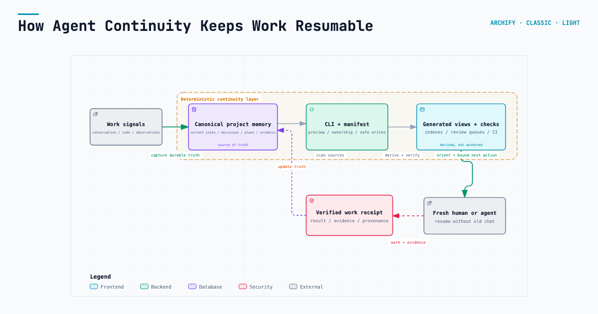

# Agent Continuity

**Durable project memory for AI-assisted software work.**

Keep current truth, decisions, evidence, and safe next actions inside the repository—so a fresh human or agent can resume without reconstructing the project from old chats.

[](https://github.com/owensantoso/agent-continuity/actions/workflows/ci.yml)
[](https://github.com/owensantoso/agent-continuity/releases/latest)
[](LICENSE)
[](https://www.python.org/)

[Quick start](#quick-start) · [How it works](#how-it-works) · [Choose a footprint](#choose-a-footprint) · [Documentation](#documentation) · [Contributing](CONTRIBUTING.md)

## How Agent Continuity Keeps Work Resumable



_Architecture source: [Archify specification](.github/assets/agent-continuity-overview.architecture.json)_

## What It Gives You

- **One place to learn what is true now.** Current state, decisions, plans, and evidence have explicit owners.
- **A safe way to hand work across sessions.** Plans own scope; implementation briefs own bounded execution; receipts record what was actually verified.
- **Deterministic bookkeeping.** The CLI validates ownership, assigns stable document identity, and regenerates indexes instead of asking agents to maintain them by hand.
- **A footprint that can grow with the project.** Start with three files or install the complete workflow; the rules stay the same.
- **Preview-first changes.** Init, upgrade, and publication flows show their intended writes before changing a repository.

Agent Continuity is not a chat archive and it is not a second project manager. It is the continuity layer inside the repository: enough durable context for the next actor to understand the work, respect its boundaries, and produce evidence.

## Quick Start

Agent Continuity supports macOS and Linux shells with Bash, Git, Python 3.10+, and symlink support. On Windows, use Windows Subsystem for Linux (WSL); native Windows is not first-class yet.

### Create A Complete New Repository

Preview the full transaction first:

```bash
agent-continuity project new orient-server \
  --path /path/to/orient-server
```

Write the repository only when the preview looks right:

```bash
agent-continuity project new orient-server \
  --path /path/to/orient-server \
  --write
```

The command creates the complete scaffold, installs repository-local deterministic continuous integration (CI), verifies the result, writes a named README and Agent Index, records a bootstrap receipt, initializes `main`, and creates the first commit.

Publishing is a separate, explicit mutation:

```bash
agent-continuity project new orient-server \
  --path /path/to/orient-server \
  --github OWNER/orient-server \
  --visibility private \
  --write
```

GitHub creation happens only after local verification passes. The command pushes `main` and confirms the exact local commit at `origin/main`. It does not invent a language stack, license, test command, release, compatibility claim, or project description.

### Add It To An Existing Repository

From the repository you want to document, install or update the CLI and preview the recommended `standard` footprint:

```bash
curl -fsSL https://raw.githubusercontent.com/owensantoso/agent-continuity/main/install.sh | bash -s -- --profile standard --dry-run
```

Apply the previewed scaffold explicitly:

```bash
agent-continuity init --profile standard --write
```

Existing files are listed first. Write mode refuses to overwrite them unless you pass `--force`.

To install or update only the CLI:

```bash
curl -fsSL https://raw.githubusercontent.com/owensantoso/agent-continuity/main/install.sh | bash -s -- --no-run
```

For an older installation, update the command and inspect the project before changing it:

```bash
curl -fsSL https://raw.githubusercontent.com/owensantoso/agent-continuity/main/install.sh | bash -s -- --no-run
agent-continuity doctor /path/to/project
agent-continuity upgrade --dry-run /path/to/project
```

Do not rerun `init --write` over an existing customized project. Installs without `.agent-continuity/manifest.json` should follow the baseline preview in [INSTALL.md](INSTALL.md).

## Before → Now

Before Agent Continuity, a new session often has to infer the project from code, stale plans, and whatever chat happens to be available.

Now the next actor can start with `AGENTS.md` and `docs/CURRENT_STATE.md`, follow links to the owning decision or plan, run the repository's checks, and leave a verified receipt for whoever comes next.

| Common failure | Agent Continuity answer |
|---|---|
| Current reality is inferred from code and stale chat | `CURRENT_STATE.md` is the first truth page |
| Ideas, specs, plans, and decisions blur together | Each document type has one job and one owner of truth |
| Branches compete for numbered document identity | Structured docs use UUIDv7 identity; human filenames stay descriptive |
| Bug evidence disappears into pasted logs | `DIAG-*` records preserve sanitized run evidence |
| Research, benchmarks, and decisions get mixed | `RSCH-*`, `EVAL-*`, and `ADR-*` stay separate |
| Plans become too large to hand off safely | `PLAN-*` owns scope; `IMPL-*` owns bounded execution |

## How It Works

1. **Capture truth in owning source docs.** Project state, decisions, plans, diagnostics, and evidence are authored where their meaning belongs.
2. **Let the CLI handle structure.** The manifest records owned tooling and document identity; commands preview writes and reject ambiguous shapes.
3. **Derive views and run checks.** Registries and review queues are generated from source docs, while CI catches drift and unsafe repository state.
4. **Orient the next actor.** A fresh human or agent reads the current truth, selects bounded work, and knows which checks establish success.
5. **Return verified evidence.** The result and its provenance update project memory instead of vanishing into the completed session.

The source-of-truth rule is the center of the system: generated views may summarize project memory, but they never replace the document that owns the meaning.

## Choose A Footprint

Profiles choose the starting documentation footprint. They do not limit later commands, audits, templates, generated views, or upgrade tooling.

| Profile | Best for | Starting shape |
|---|---|---|
| `core` | Prototype, script, or single-person experiment | `AGENTS.md`, `CURRENT_STATE.md`, `ARCHITECTURE.md` |
| `standard` | Real app with a few features and occasional agents | Flat docs, simple plans, optional decisions and diagnostics |
| `expanded` | Multiple surfaces, recurring bugs, or frequent handoffs | Topic folders plus specs, plans, briefs, decisions, diagnostics, and receipts |
| `complete` | Long-lived repository with many actors and generated views | The full [scaffold](scaffold/) and structured-docs workflow |

Compatibility aliases remain available for older installs: `tiny` → `core`, `small` → `standard`, `growing` → `expanded`, and `full` → `complete`.

For a small project, this can be enough:

```text
AGENTS.md
docs/
  CURRENT_STATE.md
  ARCHITECTURE.md
```

Add structure when its absence is costing comprehension—not because the folder tree looks satisfyingly official.

## Command Surface

```text
agent-continuity project    Create and optionally publish a complete repository
agent-continuity init       Install a scaffold profile
agent-continuity ci         Run deterministic repository checks
agent-continuity docs       Create, inspect, validate, and generate structured docs
agent-continuity doctor     Report install health and drift without writing
agent-continuity upgrade    Preview or apply safe owned-tooling upgrades
agent-continuity baseline   Preview or create a conservative legacy manifest
```

The compatibility commands `agent-docs` and `agent-docs-init` are still installed for older workflows.

## Safety Model

- Preview is the default; writes require explicit intent.
- Project-owned Markdown is not silently overwritten or auto-merged.
- Source documents own meaning; generated views own bookkeeping.
- Public installation uses tracked repository content and deterministic checks.
- Tokens should be handled by GitHub CLI (`gh`), not placed in shell history or process listings.
- A green automated check is evidence, not a substitute for human or physical acceptance when the project needs it.

For a private fork, authenticate with GitHub CLI and let it supply the token:

```bash
gh auth login
gh api -H "Accept: application/vnd.github.raw" \
  /repos/OWNER/agent-continuity/contents/install.sh \
  | AGENT_CONTINUITY_REPO_URL=https://github.com/OWNER/agent-continuity.git \
    bash -s -- --profile standard --dry-run
```

## Documentation

| If you want to… | Start here |
|---|---|
| Install or upgrade Agent Continuity | [INSTALL.md](INSTALL.md) |
| Understand the workflow in one pass | [Workflow overview](guides/workflow-overview.md) |
| Decide which document type owns what | [Document types and responsibilities](guides/doc-types-and-responsibilities.md) |
| Upgrade an older installation with an agent | [Agent upgrade runbook](guides/agent-upgrade-existing-install.md) |
| Adopt the workflow gradually | [Adoption checklist](guides/adoption-checklist.md) |
| Run a focused repository audit | [Audit guides](guides/audits/README.md) |
| Split and reintegrate agent work | [Subagent execution loop](guides/subagent-execution-loop.md) |
| Use the workflow as a Codex skill | [Structured docs skill](skills/structured-docs-workflow/SKILL.md) |
| Inspect planned upstream work | [Plans](plans/README.md) |

The full reusable structure lives in [scaffold/](scaffold/). Templates remain source material; copy only what the project can keep current.

## Project Status

Agent Continuity is actively developed. The CLI and scaffold are usable today on the supported Unix-style environments above. Package-manager distribution and some upgrade ergonomics remain planned work; see [plans/](plans/) and the [changelog](CHANGELOG.md) for the evidence behind current claims.

## Community And Security

- Read [CONTRIBUTING.md](CONTRIBUTING.md) before proposing a change.
- Report vulnerabilities through the private path in [SECURITY.md](SECURITY.md); do not place secrets or private repository data in public issues.
- Review the [MIT license](LICENSE) before redistributing the project.

The repository intentionally does not publish badges for downloads, coverage, platforms, or compatibility claims that are not backed by a current release or automated evidence.
