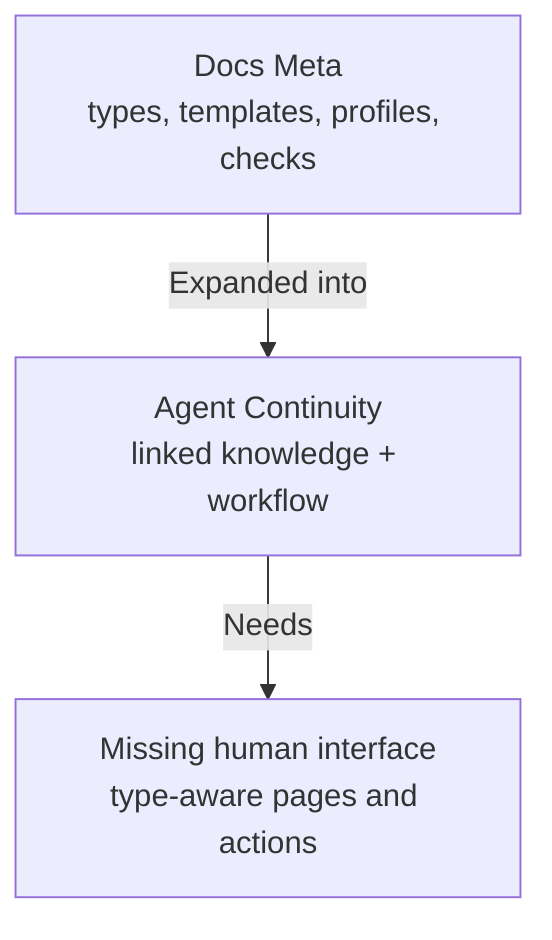
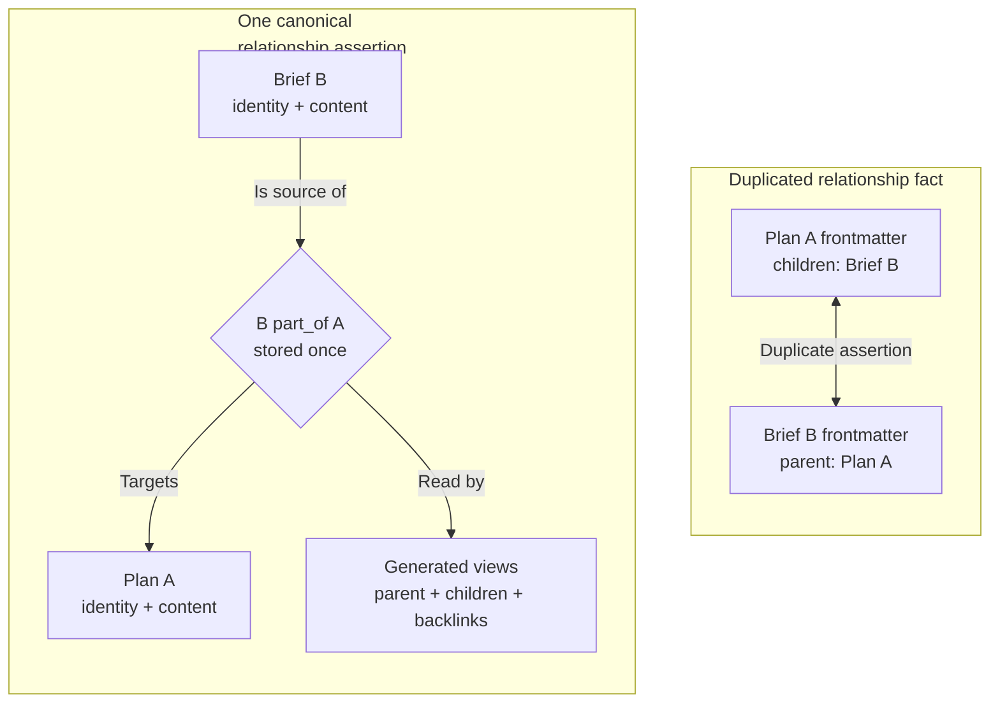
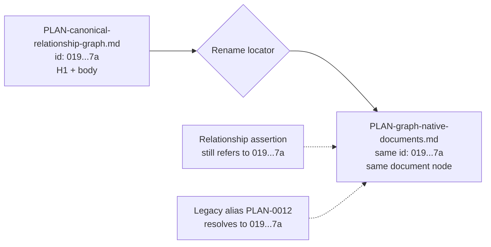
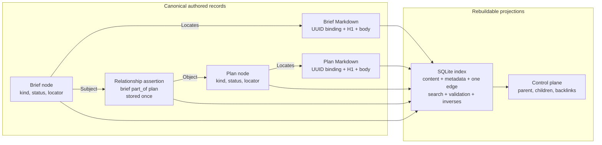
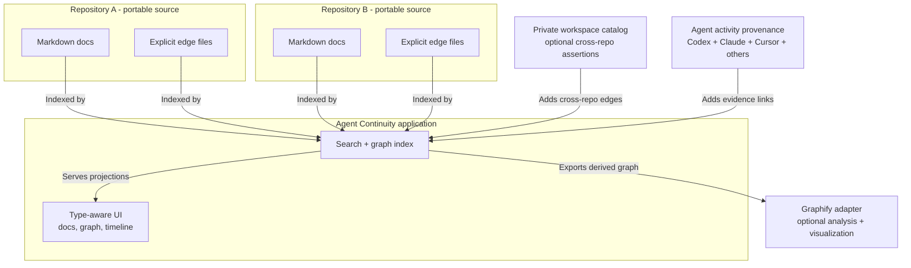
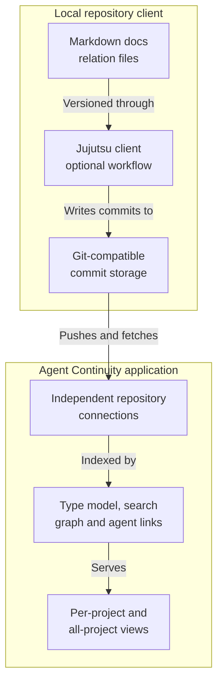
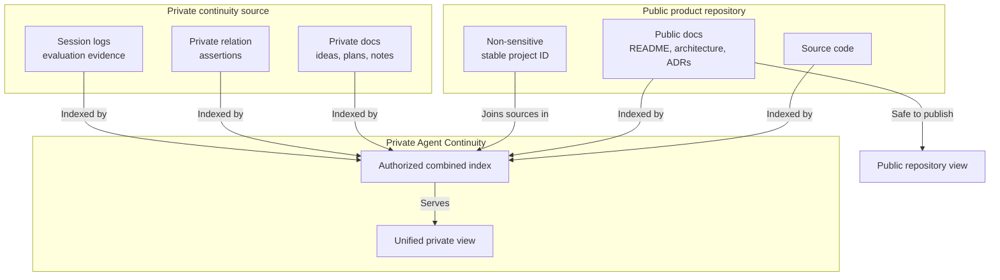
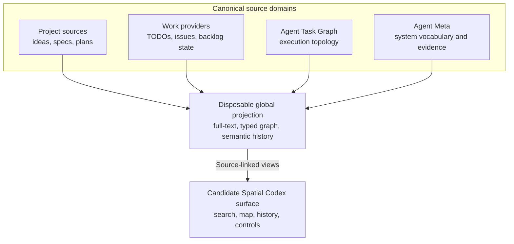

# IDEA-0003 - Federated Document Library And Canonical Relationship Graph

## Raw Thought

Agent Continuity needs a polished document library where a human can browse all ideas, explanations, specifications, plans, decisions, and evidence; search across them; and understand how they relate without reading repository trees or YAML frontmatter.

This was initially treated as one Agent Continuity system rather than a separate “forge,” “library,” and provenance product. That remains a useful conceptual umbrella, but it no longer implies one repository or release boundary. The reusable documentation framework and the human-facing continuity product have different users, research questions, release cycles, and failure modes. A separate product-incubator repository is now the leading boundary, while Agent Continuity remains active as the reusable format, workflow, and tooling source.

The current convention stores identity, lifecycle state, and many relationships in each document's frontmatter. That is portable, but reciprocal relationship declarations can duplicate one fact. A parent can name its children while each child separately names its parent. Either side can then drift.

The proposed rule is **one canonical owner per fact**:

- A Markdown document owns its content and intrinsic properties.
- A relationship store owns each explicit typed edge exactly once.
- Generated indexes and user interfaces derive both directions, backlinks, groups, and health warnings.
- External systems continue to own their native facts, such as GitHub issue state or an agent session transcript.

## Native Direction Selected For Design - 2026-08-20

The external framework comparison is parked. Agent Continuity remains the selected design direction because its broader project memory, provenance, evidence, and cross-document graph are intentional capabilities rather than gaps that either OpenSpec or Spec Kit fully covers. [RSCH-0010](../../research/RSCH-0010-spec-systems-and-agent-continuity-fit.md) and [EVAL-0002](../../repo-health/evaluations/EVAL-0002-documentation-ceremony-and-recovery-value.md) remain archived references to reopen if ceremony or token cost becomes a demonstrated problem.

The native direction separates four things that the current filename and frontmatter model partially conflates:

1. **Identity** - an immutable, branch-safe UUIDv7 that means only “this entity.”
2. **Locator** - a human filename such as `PLAN-canonical-relationship-graph.md`; its type prefix and descriptive slug aid browsing but do not identify or order the document.
3. **Content** - the Markdown heading and body, plus the minimum embedded UUID anchor needed to reconnect a moved file to its graph node.
4. **Graph records** - canonical document-node metadata and explicit typed relationship assertions, each stored once and addressed by UUID.

Workflow order belongs in typed relationships, not identifiers or filenames. Containment uses `part_of`; implementation uses `implements`; supersession uses `supersedes`; evidence uses `evidenced_by`; and only `depends_on` is required to form a directed acyclic graph (DAG), meaning a dependency graph with no route that loops back to its starting node.

This is a proposal checkpoint, not an implemented schema or migration approval. The first implementation should be a compatibility-first fixture: add UUIDs and legacy aliases, prove rename recovery, and migrate one relationship family before changing the corpus broadly.

## How The Idea Evolved



These remain stages of one conceptual ecosystem, but they need not be one repository or one installable product. Docs Meta established reusable document families and scripts that kept them aligned. Agent Continuity recognized that the documents form durable project knowledge with relationships and lifecycle. The emerging product adds a first-class human interface so those semantics become visible and actionable instead of remaining encoded mainly in YAML and links.

## Revised Repository Boundary

The uncomfortable part is not that Agent Continuity uses its own documents to describe itself. That is ordinary self-hosting and provides valuable dogfooding. The real risk is asking one repository to own three increasingly independent concerns:

| Concern | Recommended owner |
|---|---|
| Reusable document schema, templates, checks, installation, and compatibility | Agent Continuity repository |
| Personal cockpit, canonical relationship engine, goal-to-outcome experience, and broader domain research | New product-incubator repository |
| One project's code, public docs, private memory, and provider-native work | That project's own authorized sources |

Agent Continuity should retain a bootstrap invariant: its important records remain understandable as plain Markdown even when its parser, schema migration, generated indexes, or application is broken. Self-hosting is healthy only when the tool enriches the records rather than becoming necessary to recover them.

The visual document reader belongs to the product repository, not the Agent Continuity framework repository. It is the product's first vertical slice: consume one Agent Continuity corpus, render typed artifacts, search it, and explain current project state. The later human-execution workspace should begin as a second module in that same product repository because it shares identity, graph, timeline, search, and user experience. Split it only after independent use or release pressure proves a real product boundary.

The new repository should not begin by copying the entire current corpus. It should start with a small charter and an extraction manifest that classifies each candidate source as:

- **move** - the new repository becomes canonical and the old location becomes a provenance pointer
- **reference** - Agent Continuity remains canonical and the new product links to it
- **fork deliberately** - both repositories own different adaptations with the divergence made explicit
- **leave** - the source is unrelated to the new product boundary

Likely move candidates include adaptive goal-to-outcome planning, the general human-agent execution graph, the personal cockpit, and foundational reality-model research. Agent Continuity-specific schema, installation, checking, and compatibility material should remain here. Graph normalization research may inform both, but it still needs one declared canonical home.

Do not leave two editable copies of the same research document. Preserve the original commit, source path, and document ID in the extraction receipt; then use `promoted_to`, `superseded_by`, or an external canonical reference after the destination is accepted.

## Why Reciprocal Fields Drift



The normalized design does not mean the graph and Markdown compete as sources of truth. They own different facts. The document owns what it says; the relationship record owns how two identified things are related.

## Identity Is Not The Filename



The filename remains useful to a human and to ordinary repository browsing, but it is only a mutable locator. A UUIDv7 is a universally unique identifier whose timestamp-ordered layout helps files and records sort approximately by creation time without requiring a shared counter. It is still opaque identity, not workflow rank.

The Markdown file should retain the UUID anchor even if other metadata moves into graph records. Without that anchor, a free rename would require every edit to pass through one tool or would depend on Git's heuristic rename detection. With it, a scanner can find the same document after a move and repair the node's current locator deterministically.

The document node owns the identity. The same UUID in Markdown is a foreign-key-style binding to that node, not a second independently editable identity assertion. A mismatch is invalid. Likewise, the `PLAN-` prefix is a human hint that validation should compare with the node's `kind`; changing the prefix does not silently change the document type. The descriptive slug may be renamed freely. If two documents would collide in one directory, prefer a more specific human slug rather than restoring a global sequence number.

## Candidate Metadata Split

| Owner | Canonical facts | Examples |
|---|---|---|
| Markdown document | Binding reference and authored words | UUID reference, H1 title, body, inline citations |
| Document node record | Immutable identity, operational metadata, and current locator | UUID, `kind`, lifecycle `status`, current path, legacy aliases, provenance |
| Relationship assertion | One explicit typed relationship between identified entities | `part_of`, `depends_on`, `implements`, `supersedes`, `evidenced_by` |
| External system | Facts originating outside Agent Continuity | GitHub issue state, commit identity, agent transcript |
| Generated index | Rebuildable projections and search data | Backlinks, child lists, related-doc suggestions, full-text index, communities |

A future minimum Markdown header could therefore be closer to:

```yaml
---
id: 019d2f60-7d3a-7bb0-bf46-ae03ee6b6472
---

# Global Tab Surface
```

Its corresponding node record would own the non-content metadata:

```yaml
schema_version: 1
id: 019d2f60-7d3a-7bb0-bf46-ae03ee6b6472
kind: spec
status: draft
locator: specs/SPEC-global-tab-surface.md
aliases:
  - SPEC-0012
```

The H1 is the canonical human title. A generated index may cache it, and a rename tool may suggest a matching slug, but neither the node record nor filename needs a second editable title field.

This is still **one source of truth per fact**, not one source for every fact. Moving the Markdown body into a graph database would weaken plain-text recovery, Git review, and ordinary agent editing without solving a current problem.

## Candidate Relationship Format

The canonical graph does not initially require a graph database. A Git-reviewable representation could live under `.agent-continuity/graph/`, with one node record per document and relation files sharded by subject to reduce unrelated merge conflicts:

```text
.agent-continuity/
  graph/
    nodes/
      019d2f60-7d3a-7bb0-bf46-ae03ee6b6472.yaml
    relations/
      019d2f62-a44e-75cb-98c9-38e95b8980d3.yaml
```

A subject-sharded relation file can contain independently identified assertions:

```yaml
schema_version: 1
subject: 019d2f62-a44e-75cb-98c9-38e95b8980d3
edges:
  - id: 019d2f64-0b4c-79ca-880b-731480aa88b6
    predicate: part_of
    object: 019d2f60-7d3a-7bb0-bf46-ae03ee6b6472
```

The parent would not also store a `children` list. The Agent Continuity application would derive “contains” as the inverse view. A generated SQLite database could index nodes and assertions for fast joins and search without becoming canonical.

For a genuinely symmetric predicate such as `related_to`, store one assertion using canonical UUID ordering. Prefer precise directional predicates whenever the relation affects workflow; `related_to` should remain a navigation hint, not a scheduling primitive.

Cross-repository directed edges should normally be owned by the source repository. Truly workspace-level assertions with no natural source repository may live in a separate private workspace catalog. This distinction needs to be tested with real examples.

## Canonical Graph And Derived Views



Graphify remains optional analysis over a sanitized projection. It may suggest candidate edges, but it does not own document nodes, accepted relationships, workflow state, or identity.

## Do Not Turn Every Metadata Value Into A Node

“Graph-native” does not mean reifying every scalar value as a separate vertex. The useful normalized model is:

| Thing | Representation | Why |
|---|---|---|
| A plan, spec, person, project, repository, or evidence artifact | Node when it needs stable identity and relationships | It can be addressed and connected independently |
| `kind: plan` or `status: draft` | Controlled property on the document node | It has no independent lifecycle in the current model |
| `brief part_of plan` | First-class relationship assertion with its own UUID | It needs one owner, direction, provenance, validation, and possibly history |
| A Markdown link occurrence | Content-local reference plus derived index entry | Its location and surrounding prose matter |
| A Graphify suggestion | Candidate assertion in a review queue | Inference is not canonical authority |

Promote a property into its own node only when it acquires at least one of these: independent identity, independent provenance, its own lifecycle, or meaningful relationships of its own. This keeps the graph expressive without turning a five-line plan into the Library of Babel.

## Per-Repository Truth And One Unified Application



This gives both desired modes:

- Every repository remains understandable, versioned, and portable on its own.
- One local or privately hosted application can search and visualize all registered repositories.
- The application can show a single-repository view, a workspace view, or connections across projects.
- Removing the generated index does not destroy the authored documents or explicit relationships.

## Version Control And The Human Interface Are Different Layers

The repository model is not the problem. Combining every project's private history into one repository is the problem.

Git is a distributed Version Control System (VCS): it stores content snapshots, commit history, refs, and objects that can be cloned and synchronized. GitHub adds a domain-aware human layer around Git: remote hosting, identity, permissions, pull requests, issues, review, automation, search, and a web interface.

Agent Continuity can use the same separation:



The canonical unit should normally be one independently versioned documentation repository per project or permission boundary. The application can present hundreds of those repositories as one searchable experience without pretending they share one commit history.

A project in the application may bind several sources:

```text
Project: Hold Keys
  public code repository
  private documentation repository
  GitHub issues and pull requests
  agent activity records
```

This is conceptually a domain-aware interface over versioned Agent Continuity data, not another VCS. Reuse Git's durable content-addressed history and transport first; build the specialized document graph, privacy model, actions, and user experience above it. Hosting and collaboration may eventually become capabilities of the same application, but they do not justify a separate “forge” product today.

### What Makes The Interface Specific To Agent Continuity

The value is not merely rendering Markdown or drawing generic links. The application understands what each object means:

| Type | Example interface semantics |
|---|---|
| Idea | Capture state, related evidence, promotion into a concept or specification |
| Specification | Requirements, acceptance criteria, implementing plans, verification coverage |
| Plan | Dependencies, execution order, implementation briefs, progress and blockers |
| Architecture decision | Decision status, alternatives, consequences, supersession history |
| Explanation | Concepts explained, intended audience, related authoritative sources |
| Session or evidence | What happened, which work it affected, and what was actually verified |

The same underlying graph can then provide hierarchy, backlinks, dependency views, timelines, search, and type-specific actions. This is analogous to GitHub turning Git-backed project concepts into purpose-built issue, pull-request, milestone, and review interfaces.

### Role Of Jujutsu

Jujutsu (`jj`) is a strong optional local client for this model. Its production-ready backend is Git-compatible, so repositories can be pushed to ordinary Git remotes and collaborators can continue using Git. Jujutsu adds a working-copy-as-commit model, change IDs, automatic descendant rebasing, first-class conflicts, revset queries, and an operation log with undo.

The application should not initially depend on Jujutsu's private on-disk state:

- ordinary Git hosting stores commits and files, but not the full Jujutsu operation log
- Jujutsu change IDs use non-standard Git commit headers that major forges generally preserve, but not every Git operation does
- the official Jujutsu roadmap still lists forge integrations and an open-source cloud repository server as future work
- any synchronized repository contract should therefore be Git-compatible first and Jujutsu-aware second

An optional agent integration could capture selected Jujutsu operation receipts into Agent Activity Provenance. That would preserve useful “what operation rewrote this stack?” evidence without making `.jj` internals the canonical hosted format.

As of 2026-08-08, a mature universal “GitHub for Jujutsu” has not clearly emerged:

- [GitHub itself works with Jujutsu](https://github.com/jj-vcs/jj#compatible-with-git) through the Git backend; Jujutsu's own developers use that combination.
- [Just Forge](https://justforge.dev/) presents itself as Jujutsu-native, Git-compatible code hosting with basic host and browse capabilities.
- [Revset](https://www.revset.dev/) presents a commit-first Jujutsu forge, but its current public surface is still waitlist or early-access oriented.
- The [official Jujutsu roadmap](https://docs.jj-vcs.dev/latest/roadmap/) still describes native forge commands and an open-source cloud server as desired future work.

These projects are useful references, especially their commit-first and stack-aware review models, but Agent Continuity does not need a separate forge before proving its own document-specific interface.

## Public Code And Private Project Memory

Repository visibility is a security boundary. A public repository cannot contain a truly private branch, folder, or selected file on GitHub. `.gitignore` can keep local files out of Git, but it does not synchronize, back up, or share them. A `visibility: private` field inside a committed public document is classification metadata, not protection.

The recommended model separates public product sources from private project memory:



There is intentionally no path from the private source into the public view. Publishing a private idea or decision should require an explicit promotion or sanitization step, not an automatic reverse projection.

A private relationship may point to a public node without modifying the public repository. For example, a private `PLAN-0042 implements PUBLIC-SPEC-0007` assertion lives only in the private source. The authorized application can show both directions; a public clone sees only the public specification and does not learn that the private plan exists.

### Storage Options

| Option | Result | Recommendation |
|---|---|---|
| Public repo plus `.gitignore` | Private files remain on one machine unless separately synchronized | Reject as the durable model |
| Private branch or second remote in the same Git history | Easy to push private history or refs accidentally; repository hosts do not apply visibility per branch | Reject |
| Encrypted private files in the public repo | Adds key management and may leak filenames, sizes, and change patterns | Special-purpose only |
| Public repo referencing a private submodule | Exposes the private repository's existence and complicates cloning and contribution | Avoid as the default |
| Private companion repository per project | Independent history plus a clean security, sharing, retention, and deletion boundary | Recommended canonical unit |
| One private continuity vault with project namespaces | Simpler initial setup but couples unrelated projects into one commit and permission history | Optional personal shortcut only |

The application may support both private-source layouts through the same project identity contract, but its design must not assume one global vault. The default layout should be independent project repositories:

```text
repositories/
  tab-launcher/                 # public code
  tab-launcher-continuity/      # private docs and relations
  agent-continuity/             # public workflow/tooling
  agent-continuity-internal/    # private ideas and sessions
```

Each private documentation repository contains a `project.yaml` that maps a stable project ID to one or more public repositories without relying on an absolute path as canonical identity. The application uses that identity to provide an all-project view while each repository retains its own commits, permissions, retention, cloning, and release lifecycle.

## Role Of Graphify

Graphify could accelerate the derived layer:

- index source code and documents
- suggest relationships and communities
- answer path and neighborhood queries
- provide an early interactive graph view
- estimate code and pull-request overlap

Graphify alone does not remove the need for canonical metadata. Current Graphify supports generated interactive reports, incremental updates, cross-project graphs, and several export targets, so “static graph output” is no longer an accurate summary. Its generated identifiers, generic extracted references, model-inferred edges, and graph output are still not authoritative enough for dependency scheduling, human gates, or provenance. The useful integration remains:

```text
Markdown + explicit relations -> canonical Agent Continuity graph
canonical graph + code/docs -> Graphify projection and analysis
```

Suggested Graphify edges should enter a review queue as `inferred` or `ambiguous`. Only accepted explicit assertions should affect workflow state.

[RSCH-0009](../../research/RSCH-0009-graphify-and-canonical-relationship-store-fit.md) verifies this boundary against current Graphify and proposes source-sharded canonical relation files, a generated SQLite assertion index, and a migration sequence.

## One System And Its Responsibilities

Use provisional repository descriptors rather than final product names while the boundary stabilizes:

- **Authoring and maintenance** - document types, templates, profiles, schemas, checks, relationship contracts, and generators.
- **Versioned project sources** - independently stored public or private Markdown, explicit relationships, and evidence.
- **Human application** - type-aware pages, actions, hierarchy, graph, timeline, search, and project/global views.
- **Integrations** - Git hosting, GitHub work items, Codex, Claude, Cursor, Graphify, and other evidence or analysis providers.

`Agent Continuity` remains the reusable format and tooling name. `continuity-workspace` and `continuity-foundations` are provisional local repository slugs, not accepted product names. A later naming exercise can rename either repository without changing the ownership split.

## Backlog And Unified Graph Lenses

The 2026-08-11 extension is to connect product backlog, durable documents,
Codex history, agent execution, and evidence in one discoverable spatial
experience. “One global thing” should mean one query and navigation surface over
stable identities, not one repository or database that becomes the editable
owner of every fact.

Agent Continuity already has a thin backlog contract:

- structured `TODO-*` items support the `backlog` work state
- `ROADMAP.md` separates the mainline, side branches, expansion, and backlog
- generated `TODOS.md` provides a project-level work dashboard

The first product step should surface and join those existing facts rather than
introduce a second editable `BACKLOG.md`. A per-product backlog is a query scoped
to one product. An all-product backlog is the corresponding global query. If
admission, rank, or priority within a backlog later needs its own durable fact,
introduce one canonical backlog-membership assertion that points to the owning
work item instead of copying the idea, specification, or plan text.

Keep the nearby concepts distinct:

| Concept | Question | Canonical owner |
|---|---|---|
| Idea | Should this direction be considered? | `IDEA-*` document |
| Backlog work item | Has this work entered a queue, and what is its operational state? | One repo-native `TODO-*` or external work provider |
| Plan | How should an accepted outcome be delivered and verified? | `PLAN-*` document |
| Agent task | Which live or resumable agent execution is doing the work? | Agent Task Graph plus its host task binding |
| Result and evidence | What changed, landed, or was actually observed? | Git, provider state, evaluations, diagnostics, and receipts |
| Semantic event | What typed fact changed over history? | Rebuildable global index |

The integrated model is therefore one typed multigraph with several authority
domains, not one undifferentiated graph schema. An idea being promoted into a
plan, one work item depending on another, one Codex Task spawning another, and a
commit evidencing a plan are different edge kinds with different owners.



Every unlabeled arrow in this diagram means that the disposable projection reads
from the named canonical source; it does not imply that the index can write back.

Spatial Codex is the strongest current candidate for the unified human surface
because its product direction already combines complete Codex Tasks, spatial
relations, history, and full-text retrieval. It should not become the canonical
owner of Agent Continuity documents, backlog state, or Agent Task Graph state.
Its first integration should be read-only; later actions should route through
authority-specific adapters rather than mutating the disposable index.

Agent Meta may own vocabulary and authored projections for the cross-project
agent system. It should not become the global home of every product's documents
or backlog merely because it can describe them. Individual projects remain
portable and authoritative; Agent Meta and Spatial Codex provide different
cross-project views over them.

## Questions

- Should the UUID binding anchor be the only required frontmatter field, or should schema version remain beside it for offline recovery?
- Should node records and assertions use subject-sharded YAML, one-file-per-assertion YAML, or append-only JSON Lines (JSONL)?
- Does an assertion need a UUID from the first schema version, or can its canonical tuple identify it until provenance history requires more?
- How should a scan reconcile a moved Markdown file with a concurrently edited node locator?
- Which node properties need temporal history beyond ordinary Git history?
- How are symmetric assertions such as `related_to` stored once and displayed in both neighborhoods?
- Where should private cross-repository assertions live?
- Should the first application read local repositories only, or also connect directly to an existing Git server such as GitHub, Forgejo, or bare SSH remotes?
- Which Jujutsu-native concepts are valuable enough to preserve remotely: change IDs, stacks, operation receipts, or revset-backed saved views?
- Should a one-vault import remain supported only as a migration and personal-convenience adapter?
- What public-to-private promotion workflow prevents summaries, filenames, and relationship labels from leaking private information?
- Should the first interface be a native Mac app, a local web app, or a private web app that can also be reached from mobile?
- Can Graphify consume the canonical edge export without losing direction, multiple assertions, or evidence metadata?
- Which views matter first: document reader, tree, dependency graph, timeline, command palette, or global search?
- Is the existing `TODO-* [backlog]` plus roadmap model sufficient for the first cross-project backlog, or does backlog membership need a first-class assertion with its own rank and rationale?
- Should Spatial Codex become the accepted unified document, task, history, and backlog surface, or should it consume a separately owned continuity-viewer module?
- Where should a private workspace catalog live if a cross-project relationship or backlog membership has no natural project repository owner?

## Smallest Useful Pilot

1. Add a UUIDv7 field and legacy-ID alias to a disposable fixture without renaming any current corpus files.
2. Create two documents with human filenames such as `PLAN-canonical-relationship-graph.md` and `IMPL-prove-rename-recovery.md`.
3. Create their node records and one `brief part_of plan` assertion addressed only by UUID.
4. Rename both files outside the Agent Continuity tool, rescan, and prove their nodes, legacy aliases, and relationship endpoints remain intact.
5. Generate `contains` as the inverse of `part_of`; do not store a reciprocal child list.
6. Attempt concurrent branch additions and renames, then verify that UUID generation needs no allocator and graph conflicts are limited to genuinely shared facts.
7. Build a disposable SQLite projection and focused neighborhood view from the same fixture.
8. Only after the fixture passes, add UUIDs to current documents while preserving every numeric ID as a legacy alias. Migrate one relationship family before considering filename renames.

## Promotion Criteria

Promote this idea into a concept and Architecture Decision Record only after the pilot answers the ownership questions. Do not migrate current documents until the prototype proves that:

- every canonical fact has exactly one owner
- repositories remain useful without the global application
- unrelated projects do not share a commit or permission history by default
- inverse links and generated views are deterministic
- cross-repository identity survives moves and clones
- a clean public clone reveals no private-node or private-edge metadata
- inferred Graphify edges cannot silently affect authoritative workflow state
- per-product and global backlog views resolve to the same canonical work items without duplicating editable status or content
- one source-linked trace can connect an idea or plan to backlog state, an agent execution, delivery, and verification evidence

## Related Documents

- [IDEA-0001 - Docs To Code Graph](IDEA-0001-docs-to-code-graph.md)
- [IDEA-0004 - Semantic History And Work Projections](IDEA-0004-semantic-history-and-work-projections.md)
- [CONC-0001 - Read-Only SQLite Docs Index](../../concepts/CONC-0001-read-only-sqlite-docs-index.md)
- [PLAN-0001 - Docs Link Graph and Safe Move Tooling](../../plans/docs-meta-link-graph-and-safe-move/PLAN-0001-docs-meta-link-graph-and-safe-move.md)
- [RSCH-0002 - Code Knowledge Graph And Agent Context Tools](../../research/RSCH-0002-code-knowledge-graph-and-agent-context-tools.md)
