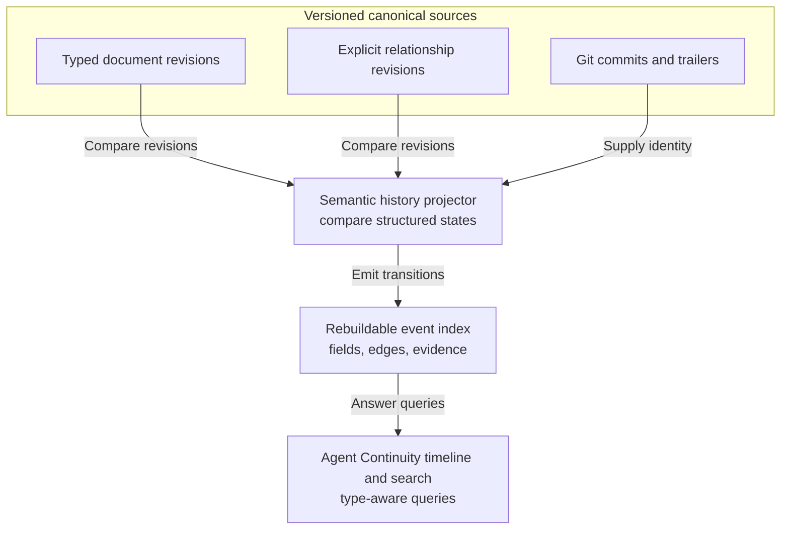

# IDEA-0004 - Semantic History And Work Projections

## Raw Thought

The future Agent Continuity application should answer semantic history questions, not only show file diffs:

- When did `PLAN-0048` become completed?
- When was an `actual_execution_end` first recorded?
- When did a specification become superseded, and what replaced it?
- When was a dependency, implementing pull request, or evidence link added?
- Which code commits, pull requests, evaluations, and sessions support a plan's closeout?

The same application also needs to distinguish durable project knowledge from executable work tracking. Specifications, plans, implementation briefs, GitHub issues, sub-issues, milestones, projects, pull requests, and commits overlap, but they are not interchangeable.

This is not currently a separate product. It is a semantic-history capability and a work-integration capability inside the Agent Continuity application described by [IDEA-0003](IDEA-0003-federated-document-library-and-relationship-graph.md).

## What Already Exists

Agent Continuity is closer to this than it first appears:

- Structured documents have stable IDs, typed statuses, timestamps, and `repo_state.based_on_commit` / `repo_state.last_reviewed_commit` fields.
- Plans and implementation briefs can link `related_issues` and `related_prs`.
- Session logs have a `commits` list.
- The scaffold asks meaningful commits to use `Plan:`, `Brief:`, `Spec:`, `ADR:`, `Todo:`, `Session:`, `Area:`, and `Verification:` trailers.
- Git already preserves every document revision and the commit in which it landed.

What does not exist yet is a first-class semantic event index. The current tooling can validate the latest document state, but it does not compare historical structured states and emit field-level or relationship-level transitions.

## Worked Repository Example

This repository already contains a useful example:

| Evidence | Meaning |
|---|---|
| Commit `639228d` | A final code fix for the public-readiness work; its message includes `Plan: PLAN-0004` and verification trailers |
| Commit `537ffb8` | The later documentation closeout commit |
| `PLAN-0004` diff in `537ffb8` | `status` changed from `in_progress` to `completed`; `actual_execution_end` was populated |
| Closeout session in `537ffb8` | Its `commits` list points to `639228d` |

The implementation evidence and the semantic lifecycle transition are different commits even though code and docs share a repository. That supports the user's conclusion: co-location can make discovery easier, but it does not create a guaranteed causal link. The links still need to be explicit and queryable.

## Candidate Semantic-History Architecture



Git and the versioned Agent Continuity sources remain canonical. A local SQLite database or hosted relational index stores rebuildable semantic events for fast search and rendering. Deleting the index must not delete authored facts.

### Minimum Derived Event

```json
{
  "event_type": "field_transition",
  "repository_id": "agent-continuity",
  "entity_id": "PLAN-0004",
  "field_path": "status",
  "from": "in_progress",
  "to": "completed",
  "commit_oid": "537ffb81c867f4b3fa03717683e185d16e30366a",
  "parent_oid": "639228d728c5a36e179c829cb661504af53be09b",
  "parser_version": 1
}
```

The first useful event kinds are:

- `entity_created`, `entity_moved`, and `entity_removed`
- `field_transition` for fields such as `status`, execution dates, owner, and sequence
- `relationship_added` and `relationship_removed`
- `todo_transition` for durable `TODO-*` lifecycle changes
- `evidence_link_added` for commits, pull requests, sessions, evaluations, and diagnostics

Stable document IDs, rather than paths, should identify an entity across moves and renames.

### Mainline Versus Branch History

Git history is a Directed Acyclic Graph (DAG), not a single sequence. The first pilot should index the default branch's first-parent history and answer “when did this land in the main project history?” Each event still records both the commit and compared parent. Branch-specific and merge-parent views can be added later without changing the event contract.

## What Changed Is Not Why It Changed

The projector can deterministically say what changed and where it landed. It must not manufacture intent or causality.

| Question | Source |
|---|---|
| What structured field or edge changed? | Derived semantic event |
| In which revision did it land? | Git commit and parent |
| What rationale was claimed? | Commit message, revision note, issue, session log, specification, or Architecture Decision Record (ADR) |
| Which implementation produced the outcome? | Explicit `implemented_by` or plan/brief commit-trailer links |
| Which evidence verified it? | Explicit `verified_by` links to evaluations, tests, diagnostics, receipts, or verification trailers |

A code-and-doc co-commit may be shown as `co_committed_with`, but that observation alone must not be upgraded to `implemented_by`.

## Cross-Repository Closeout

Separating private project documents from public code does not break this model. A plan completion can have several distinct facts:

```text
private docs commit D42
  observes: PLAN-0048 status in_progress -> completed

PLAN-0048
  implemented_by: public code commits C17, C21, C29
  delivered_by: public pull request PR-88
  verified_by: EVAL-0011 and physical receipt R7
  discussed_in: agent session S12
```

The explicit relationships may live in the versioned relationship source proposed by IDEA-0003. The combined authorized application resolves them across repositories. There is no requirement that the status transition and all implementation commits share one repository or one commit.

## Documents And GitHub Are Two Connected Graphs

The current linear shorthand, `IDEA -> SPEC -> PLAN -> IMPL -> Issues / PRs`, is useful for orientation but too simple as a domain model. A clearer model has connected object families:

| Family | Owns | Examples |
|---|---|---|
| Knowledge artifact | Durable intent, requirements, decisions, execution guidance, and explanation | Idea, research, specification, ADR, plan, implementation brief |
| Work item | Assignment, queue state, operational blocking, prioritization, and conversation | GitHub issue or sub-issue |
| Result or delivery artifact | Produced output or changed external state | Pull request, commit, report, reservation, or confirmation |
| Evidence object | What was observed or verified | Evaluation, diagnostic, test receipt, session receipt |
| Semantic event | A rebuildable statement about how one structured source changed | Status transition, edge addition, todo completion |

These are linked, not collapsed into one universal record.

### Three Different Lifecycles

| Lifecycle | Typical states | Owner |
|---|---|---|
| Artifact | Draft, approved, superseded, archived | Agent Continuity document |
| Work | Backlog, ready, in progress, blocked, done | GitHub issue or repo-native todo, depending on the chosen authority |
| Result or delivery | Produced, reviewed, accepted, merged, confirmed, or released | Provider that owns the output or external state |

Current plan and brief statuses intentionally include both artifact-like states such as `superseded` and execution-like states such as `blocked`. That can remain workable if their meanings stay type-specific. Before any GitHub synchronization, the pilot must either define an explicit mapping or prove that separate `artifact_status` and `execution_status` fields are necessary. Do not expand the schema merely to make two unlike lifecycles look identical.

## Candidate Authority Matrix

| Fact | Canonical owner | Projection or link |
|---|---|---|
| User promise and acceptance criteria | Specification, when one exists | Issue summarizes and links |
| Architecture, invariants, sequencing, durable dependencies | Plan and canonical relationship graph | Issues project runnable slices |
| Bounded execution instructions and verification | Optional implementation brief | A sub-issue links it when coordination is useful |
| Issue open/closed state, assignee, labels, and comments | GitHub issue | Agent Continuity indexes it |
| Issue-to-issue blocking | GitHub for the operational relation; import with provider identity | UI can compare it with durable plan dependencies |
| Delivery review state | Pull request provider | Docs link the pull request as delivery evidence |
| Landed repository change | Git commit | Commit trailers and explicit edges associate it with docs |
| Plan lifecycle state | Plan document | Issue closure may propose, but not silently force, a plan transition |
| Why a durable direction was chosen | Specification or ADR | Issues and pull requests link back |

The critical rule is one owner per fact. A GitHub issue and a plan can both have a status because those statuses mean different things. The issue is an operational queue item; the plan describes lifecycle of an intended outcome. They should be reconciled, not blindly synchronized.

## GitHub Mapping Without Duplicate Truth

- A parent issue usually tracks an approved plan or independent work package.
- A sub-issue is a schedulable slice. It only needs an `IMPL-*` brief when the slice deserves durable execution detail.
- A milestone groups issues around a release, deadline, or delivery target. It does not replace a plan's architecture and sequencing.
- A GitHub Project is an operational portfolio view. It does not own product requirements or durable rationale.
- A pull request is a reviewable delivery proposal. It links to the issue and the governing specification, plan, or brief.
- A commit is immutable change evidence. Commit trailers can create provider-independent links even before a pull request exists.

For small work, a GitHub issue can be enough. The system should not force a specification, plan, and brief for a trivial fix. Once a durable artifact exists, however, the issue should stop duplicating its detailed content and become the execution and discussion surface for it.

## Implementation Briefs Are Optional Refinement

The current guidance already says not to create an implementation brief for every small task. The distinction is still useful because a milestone plan and a bounded handoff answer different questions:

- The plan explains the outcome, boundaries, architecture, sequencing, and completion criteria.
- The implementation brief explains exactly what one independently executable slice owns, where to start, what to verify, and what traps to avoid.

The application should make a brief feel like an optional child view inside a plan, not like a mandatory bureaucratic stage. Create one only when at least one of these is true:

- an implementer or subagent can take the slice independently
- execution order, file ownership, migration, or verification is non-trivial
- the work must survive a handoff, worktree, or later session
- putting the detail in the parent plan would make it noisy

Otherwise, use the plan directly or let a small issue own the small task.

Use zero, one, or several briefs adaptively:

- **Zero briefs** - the plan is one coherent owner, seam, and verification bundle and can be executed directly.
- **One brief** - the work remains one coherent slice, but delegation, resumability, or tricky verification makes a handoff packet valuable.
- **Several briefs** - two or more independently valid slices exist and the split creates safe parallelism, independent review or retry, materially different risk or verification, or a distinct integration unit.

Every proposed brief must pass four validity gates before it is split out:

1. One accountable owner can claim it without ambiguous shared hot-file ownership.
2. Its start condition is explicit; `depends_on` predecessors are required only when predecessors actually exist.
3. It has its own observable done condition and focused verification.
4. Its outcome boundary does not depend on unresolved implementation choices in sibling briefs.

If any gate fails, group the work with the adjacent slice. UUIDv7 owns future brief identity, legacy numeric IDs remain aliases, and explicit `depends_on` relationships own execution order.

## The Structured Todo Conflict

The existing [stable todo specification](../../plans/stable-todo-system/SPEC-0001-stable-todo-system.md) deliberately makes Markdown `TODO-*` records canonical and treats GitHub as an optional mirror. That was a sound offline-first choice, but it conflicts with a future rule that GitHub owns live work status.

Do not allow both statuses to remain independently editable. When a durable todo is linked to a GitHub issue, choose one of these contracts in a future ADR:

1. **Repo-native authority:** the Markdown todo remains canonical and GitHub is a one-way projection.
2. **GitHub authority after publication:** creating or linking an issue freezes the todo's local work fields and turns it into a stable reference/projection.
3. **No duplicate work object:** a plan or brief links directly to the issue and no separate structured todo is created.

The best contract may vary by repository, but every individual work item must have exactly one editable status owner.

## Current GitHub Fit

GitHub already supplies most of the operational graph; Agent Continuity does not need to rebuild it:

- [Sub-issues](https://docs.github.com/en/issues/tracking-your-work-with-issues/using-issues/adding-sub-issues) provide nested work decomposition and progress views.
- [Issue dependencies](https://docs.github.com/en/enterprise-cloud@latest/issues/tracking-your-work-with-issues/using-issues/creating-issue-dependencies) provide explicit `blocked by` and `blocking` operational relationships.
- [Milestones](https://docs.github.com/en/issues/using-labels-and-milestones-to-track-work/about-milestones) group issues and pull requests around delivery targets and due dates.
- [Projects](https://docs.github.com/en/issues/planning-and-tracking-with-projects/learning-about-projects/best-practices-for-projects) provide table, board, roadmap, field, automation, and chart views; GitHub's own guidance recommends keeping each value in one source of truth.
- [Linked pull requests](https://docs.github.com/en/issues/tracking-your-work-with-issues/using-issues/linking-a-pull-request-to-an-issue) connect delivery to issues and can close issues when changes merge to the default branch.

Agent Continuity should add the durable knowledge graph, private cross-repository context, semantic history, and reconciliation warnings that GitHub does not own. Integration should be a controlled projection plus reconciliation system, not unrestricted bidirectional synchronization.

## Product, Design, Marketing, And Future Types

The current scaffold already has product, architecture, research, repo-health, operations, and marketing areas, plus a `marketing-plan` template. Design content can currently live in a product specification, plan, ADR, explainer, linked design asset, or architecture area depending on the question it answers.

Do not create a new document type merely because a department or discipline has a name. Promote a recurring artifact into its own type only when it has a distinct:

1. purpose or question
2. lifecycle and status vocabulary
3. required metadata
4. relationship pattern
5. type-specific user interface or action
6. source-of-truth owner

If the difference is only categorization, use domain, area, or tags. If the system repeatedly needs actions such as “approve design,” “publish campaign,” “record experiment result,” or “supersede positioning,” then a dedicated type may be justified.

## Beyond Software Work

Pull requests and commits are only one result family. [IDEA-0005](IDEA-0005-general-human-agent-execution-graph.md) generalizes this model to research, administration, purchasing, marketing, travel, and physical-world work. In that model, Jira, Linear, GitHub, or local files can own operational work state while Agent Continuity adds executor eligibility, agent runs, evidence, human gates, resumption conditions, and semantic history.

## Smallest Useful Pilot

1. Index the default-branch history of this repository only.
2. Parse stable document IDs and a small allowlist of fields: `status`, `actual_execution_start`, `actual_execution_end`, `supersedes`, and `superseded_by`.
3. Parse Agent Continuity commit trailers and session-log `commits` lists into typed links.
4. Reproduce the `PLAN-0004` transition and connect `537ffb8` to the implementation evidence at `639228d`.
5. Add three queries: “when did this status change?”, “what evidence supports completion?”, and “which lifecycle events occurred in this commit?”
6. Render one entity timeline and one commit page in the Agent Continuity application.
7. Compare derived events against raw diffs and fail closed on unparseable historical frontmatter.

## Questions

- Should the mainline timeline mean first-parent landing history, authoring history, or let the user switch between both?
- Which fields are semantic enough for version one, and which prose changes should remain ordinary diffs?
- Should transition rationale be an optional explicit field on the relation/event assertion, or only a link to a session, issue, ADR, or commit message?
- How should rewritten Git history invalidate or replace derived event identifiers?
- Which status correspondences are safe to propose between issues, briefs, and plans without pretending they are identical lifecycles?
- When a `TODO-*` links to an issue, which system becomes its sole editable work-status owner?
- Should GitHub issue dependencies be imported only, or can Agent Continuity publish a one-way projection from durable plan dependencies?
- When should a design or marketing artifact become a first-class type rather than a domain-specific specification, plan, or linked asset?

## Promotion Criteria

Promote this idea into a concept or specification after the pilot proves that:

- field transitions are reproducible from Git history
- stable IDs survive path moves
- code commits and documentation transitions can be linked across repositories
- derived events remain rebuildable and are never mistaken for authored rationale
- one authority matrix prevents issue, plan, and brief fields from becoming competing truth
- optional implementation briefs reduce handoff friction without becoming mandatory ceremony
- the UI answers semantic questions materially faster than manual Git archaeology

## Related Documents

- [IDEA-0005 - General Human-Agent Execution Graph](IDEA-0005-general-human-agent-execution-graph.md)
- [EXPL-0003 - Agent Continuity, Jira, Linear, And General Execution](../../docs/orientation/explainers/EXPL-0003-agent-continuity-jira-linear-and-general-execution.md)
- [EXPL-0002 - Documents, Work, Delivery, And Semantic History](../../docs/orientation/explainers/EXPL-0002-documents-work-delivery-and-semantic-history.md)
- [IDEA-0003 - Federated Document Library And Canonical Relationship Graph](IDEA-0003-federated-document-library-and-relationship-graph.md)
- [CONC-0001 - Read-Only SQLite Docs Index](../../concepts/CONC-0001-read-only-sqlite-docs-index.md)
- [Planning Docs Guide](../../scaffold/docs/product/plans/README.md)
- [SPEC-0001 - Stable Todo System](../../plans/stable-todo-system/SPEC-0001-stable-todo-system.md)
- [Doc Types And Responsibilities](../../guides/doc-types-and-responsibilities.md)
