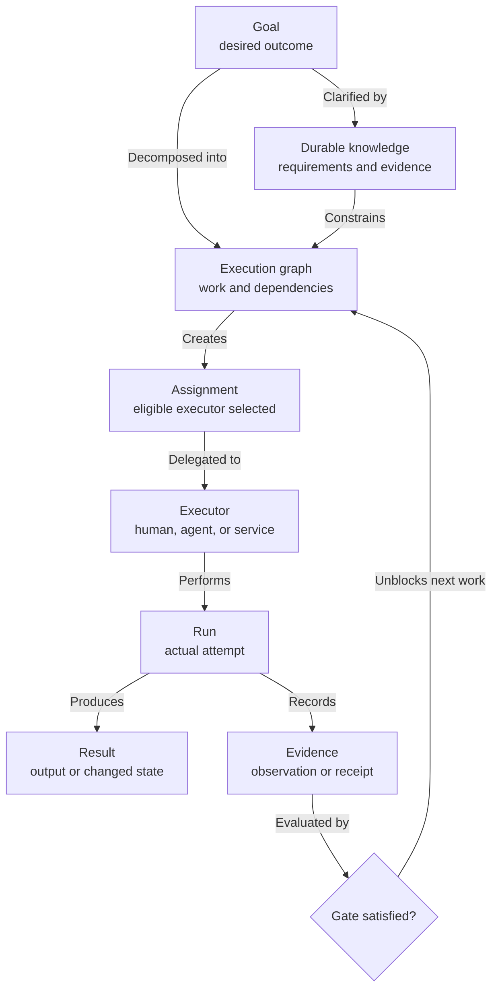

# IDEA-0005 - General Human-Agent Execution Graph

## Raw Thought

Agent Continuity may be more general than a documentation workflow for software projects or an issue tracker for coding agents. It could be a system for turning a conversation into an understandable, executable path toward an outcome:

1. clarify what the human wants
2. preserve ideas, requirements, decisions, plans, and evidence
3. decompose the outcome into dependent work
4. assign each piece to an eligible human, agent, or connected service
5. run everything that can safely proceed in parallel
6. surface the exact actions that still require a human
7. resume automatically when the required evidence or approval arrives
8. preserve what happened and why the result should be trusted

Software development is a particularly automatable instance because agents can often inspect, edit, execute, and verify the same digital environment. The model also applies to research, travel, administration, purchasing, marketing, operations, and physical-world projects, but those domains contain more actions that require human authority, embodiment, judgment, identity, or expense.

## Zoomed-Out Product Read

The goal is not to build another issue tracker. The goal is to let a human and one or more agents jointly understand and carry an outcome from fuzzy intent through execution and evidence without losing context, ownership, or the next required action.

[IDEA-0006](IDEA-0006-adaptive-goal-to-outcome-quest-planning.md) expands the previously compressed phrase “fuzzy intent” into an adaptive discovery and decomposition loop. It covers how a desire becomes sufficiently formed to specify or plan, how granularity changes by person and context, and how evidence causes local replanning.

“Jira or Linear for agents” is a useful first approximation because both products coordinate work. It is incomplete because it frames the work item as the center of the system. The stronger candidate model makes the whole project graph central:

- goals and desired outcomes
- durable knowledge and decisions
- work and dependencies
- executor eligibility and assignments
- actual runs and agent sessions
- results and evidence
- permissions, risk, cost, and human gates
- external trackers and services
- semantic history across all of the above

## Preserve The Existing Artifact Responsibilities

This broader model does not remove specifications, plans, or implementation briefs:

| Artifact | Responsibility |
|---|---|
| Idea | Preserve an uncommitted possibility |
| Specification | Define the desired truth, requirements, actors, and acceptance boundaries |
| Plan | Define the overall strategy, dependencies, sequencing, gates, parallelization, and completion criteria |
| Implementation brief | Optionally define one bounded software execution handoff |
| Future execution brief | Possible generalized name for a bounded non-software handoff, only if real fixtures justify a new type |
| Work item | Track live assignment and operational state in the selected provider |
| Run and evidence | Record what was actually attempted, produced, and verified |

The tracker is downstream of the durable artifacts. It may receive selected plan tasks or briefs as issues, but it does not replace the reasoning and execution contracts those artifacts own. Small work can skip unnecessary documents; larger work must keep the layers that answer genuinely different questions.

## What Existing Products Already Cover

| Product | What it already does well | Relationship to this idea |
|---|---|---|
| Jira | General configurable work items, workflows, fields, boards, backlogs, timelines, and dependencies | Strong operational work backend; not merely a coding tracker |
| Confluence | Versioned pages, live docs, databases, whiteboards, and embedded or linked Jira work | Atlassian's durable knowledge and planning layer |
| Jira Product Discovery | Ideas, insights, prioritization, hierarchy, roadmaps, and links into Jira delivery work | Overlaps the early idea-to-approved-work path |
| Linear | Issues, sub-issues, projects, initiatives, dependencies, milestones, documents, updates, version history, and software delivery integrations | Closest integrated product/work experience and already supports delegated agents |
| Agent Continuity candidate | Provider-neutral goals, typed knowledge, execution topology, agent runs, evidence, human gates, semantic history, and private cross-project context | A layer that can use Jira, Linear, GitHub, or local files rather than replacing all of them initially |

Relevant current capabilities:

- Jira states that a [work item can represent anything from a software bug to a project task or leave request](https://support.atlassian.com/jira-software-cloud/docs/what-is-a-work-item/).
- Jira plans can [show and manage work-item dependencies](https://support.atlassian.com/jira-software-cloud/docs/view-and-manage-dependencies-in-advanced-roadmaps/).
- Confluence supports [pages, live docs, blogs, whiteboards, databases, Smart Links, and slides](https://support.atlassian.com/confluence-cloud/docs/create-and-edit-content/).
- Atlassian supports [creating and displaying Jira work from Confluence requirements and other content](https://support.atlassian.com/confluence-cloud/docs/use-jira-and-confluence-together/).
- Jira Product Discovery connects [ideas and insights to delivery work in Jira](https://support.atlassian.com/jira-product-discovery/docs/link-an-idea-to-a-jira-issue/).
- Linear attaches [documents to projects, initiatives, teams, issues, or cycles and preserves version history](https://linear.app/docs/documents).
- Linear supports [initiatives](https://linear.app/docs/initiatives), [project dependencies](https://linear.app/docs/project-dependencies), and [issue relationships](https://linear.app/docs/issue-relations).
- Linear's [agent model](https://linear.app/docs/agents-in-linear) lets agents collaborate on issues, projects, and documents while the human remains the primary assignee and accountable owner after delegation.

These products prove that documents plus work tracking plus agents are not, by themselves, a unique product boundary.

## Candidate Product Boundary

Agent Continuity should be the provider-neutral project memory and execution layer that answers:

- What outcome are we pursuing?
- What do we currently believe, and which evidence supports it?
- What has been decided, planned, attempted, completed, or superseded?
- What can proceed now?
- Who or what is eligible to execute each action?
- What is waiting for a human, and exactly what must the human do?
- What evidence will unblock the next work?
- Which external system owns the live state of a projected work item?
- How did the project graph change over time?

Jira, Linear, GitHub, and other trackers remain operational providers. Agent Continuity can link or project selected work into them while retaining the broader graph that no single provider owns.

## General Domain Model

| Concept | Meaning | Software example | Non-software example |
|---|---|---|---|
| Goal | Desired change in the world | Ship global tab switching | Secure a legitimate badminton session |
| Knowledge artifact | Durable understanding or intent | Specification or Architecture Decision Record | Eligibility research or venue comparison |
| Work item | Schedulable unit of action | Implement tab index | Call a sports center |
| Dependency | Ordering or prerequisite relationship | API contract before UI | Eligibility confirmation before booking |
| Accountable owner | Person responsible for the outcome even when execution is delegated | Owen owns feature acceptance | Owen owns the booking decision |
| Assignment | Selection of an executor for work; it does not transfer accountability | Delegate to coding agent | Ask Owen to make a phone call |
| Executor | Human, agent, or connected service that may act | Codex, Owen, GitHub Actions | Owen, research agent, booking service |
| Run | One actual attempt to execute work | Agent coding session | Research pass or phone call attempt |
| Result | Produced output or changed external state | Commit, pull request, build | Report, reservation, completed call |
| Evidence | Observation supporting a claim or completion | Test trace or device verification | Published rule, call notes, confirmation email |
| Gate | Required condition before dependent work may proceed | Human acceptance test | Identity check, consent, phone call, payment |
| Semantic event | Derived record of a meaningful state change | Plan became completed | Court option became verified or rejected |

### Execution Shape



This is a domain model, not an approved implementation architecture. A later concept should determine which facts are authored, imported, or derived.

Assignment must never silently transfer accountability. Linear's current agent model is a useful precedent: an agent can execute delegated work while the human remains the primary assignee and responsible owner.

## Human Action, Human Gate, And Blocker Are Different

| Term | Meaning |
|---|---|
| Human action | Work assigned to a person because the person is currently the appropriate executor |
| Human gate | A required condition that policy, identity, authority, embodiment, judgment, or risk requires a human to satisfy |
| Blocker | The current reason work cannot proceed; it may be an unsatisfied human gate, dependency, permission, resource, or external event |

A human gate is not a failure and should not be buried in an issue comment. The system should create a precise action request containing:

- requested human action
- why a human is required
- project and blocked work
- deadline or expiry, if any
- minimum context needed to act safely
- expected evidence or answer
- risk, cost, permission, or privacy boundary
- exact condition that will resume the graph
- notification and escalation policy

The human-facing application can generate a dedicated **Human Inbox** from unresolved human action requests. This is a projection over gates and assignments, not a second ticket database.

## Human-Only Is A Current Capability Decision

Do not permanently encode a task as inherently human-only. Record the current eligible executor kinds and why:

```yaml
executor_policy:
  eligible: [human]
  reason: legal_identity_and_payment_authority
  reviewed_at: 2026-08-08
```

A phone call may later be executable by a trusted voice agent. A payment may remain human-gated even when technically automatable because consent or spending policy requires it. Eligibility therefore depends on capability, permission, risk, cost, privacy, and policy—not only technical possibility.

## Examples Across Domains

| Project | Agent-executable work | Human gate | Completion evidence |
|---|---|---|---|
| Software feature | Inspect code, implement, test, prepare pull request | Physical-device behavior or product approval | Merge commit, tests, device receipt |
| Badminton access | Search channels, validate rules, rank legitimate pathways | Call venue, prove eligibility, travel, pay, physically verify access | Call note, booking confirmation, observed play |
| Marketing campaign | Research audience, draft assets, evaluate variants | Brand approval or public publishing authority | Approved asset, publication URL, metrics |
| Purchase or travel | Compare options, monitor prices, prepare itinerary | Consent, identity, payment, final booking | Receipt, ticket, confirmed reservation |

The Court Scout workbench is an especially useful evaluation fixture because it has strong evidence gates but ends in real-world action rather than a code merge.

## Tracker Adapters And Authority

An Agent Continuity project may select one operational work provider:

```text
work provider: local | github | jira | linear | other
```

The same authority rule from IDEA-0004 still applies:

- provider-native status, assignment, comments, and workflow remain canonical in that provider
- Agent Continuity owns its typed knowledge, execution/evidence relationships, human-gate semantics, and cross-provider views
- imported provider records keep stable provider identities
- one fact must not remain independently editable in several systems
- reconciliation warnings are safer than unrestricted bidirectional synchronization

The general execution vocabulary is a cross-provider protocol, not a claim that one Agent Continuity application must own every provider's operational user experience. GitHub is a software execution environment rather than an “agent plane”: humans, agents, and automation all act inside it. A separate real-world action workspace could similarly host human, agent, and service work while optimizing its interface and state for embodied tasks, schedules, places, materials, permissions, and personal follow-through.

Agent Continuity should own the durable why and what: goals, needs, decisions, specifications, plans, provenance, evidence relationships, and cross-provider history. Each selected execution provider should own its live how and now: operational work-item state, assignment, ordering, notifications, and provider-specific interaction. Projected identifiers and explicit field authority prevent those products from becoming competing sources of truth.

## Product Wedge

Do not begin by recreating boards, issue forms, roadmaps, or team administration. Existing trackers already do those jobs well.

This instruction is about commodity tracker user interfaces, not about deleting Agent Continuity's planning hierarchy. Keep ideas, specifications, plans, and optional implementation briefs; project their executable slices into the selected work provider.

The first differentiated slice should be:

1. conversation-to-goal and durable artifact capture
2. dependency-aware decomposition into human-, agent-, or service-eligible work
3. agent run and evidence receipts
4. first-class human gates and a Human Inbox
5. automatic resumption after evidence arrives
6. semantic history and cross-project search
7. optional projection into one existing tracker

For a personal or private project, the local Git-backed model may be sufficient. For a team already using Jira, Linear, or GitHub, Agent Continuity should initially sit above and across the existing tracker.

## Questions

- Is the primary user experience project-first, conversation-first, or Human-Inbox-first?
- Is a goal a first-class canonical entity or a typed knowledge artifact?
- Is an action request its own entity or a view over a human assignment plus unsatisfied gate?
- How are permission, cost, privacy, and physical-presence requirements represented without making every work item noisy?
- What evidence is sufficient to resume work automatically, and who defines that policy?
- Should one project have exactly one operational work provider or support different providers by workstream?
- Which agent-run details remain private even when the corresponding Jira or Linear work item is shared?
- Does Git remain the default history for non-code projects, or should the app support another append-only source while preserving exportability?
- Which Court Scout workflow should become the first non-software evaluation fixture?

## Promotion Criteria

Promote this idea into a concept only after two contrasting fixtures—one software project and one physical-world or administrative project—prove that the same small vocabulary can represent:

- goals, knowledge, work, dependencies, assignments, runs, results, evidence, and gates
- both fully automated and human-gated execution paths
- explicit authority when Jira, Linear, GitHub, or local work tracking is used
- safe automatic resumption after human evidence arrives
- a Human Inbox that is clearer than mixing human requests into the development backlog
- useful semantic history without requiring Git-specific delivery objects

The strongest final reminder is: **the differentiator is not that agents can receive tickets; it is that the full human-agent execution graph remains understandable, resumable, and evidenced.**

## Related Documents

- [EXPL-0003 - Agent Continuity, Jira, Linear, And General Execution](../../docs/orientation/explainers/EXPL-0003-agent-continuity-jira-linear-and-general-execution.md)
- [IDEA-0006 - Adaptive Goal-To-Outcome Quest Planning](IDEA-0006-adaptive-goal-to-outcome-quest-planning.md)
- [IDEA-0004 - Semantic History And Work Projections](IDEA-0004-semantic-history-and-work-projections.md)
- [IDEA-0003 - Federated Document Library And Canonical Relationship Graph](IDEA-0003-federated-document-library-and-relationship-graph.md)
- [SPEC-0001 - Stable Todo System](../../plans/stable-todo-system/SPEC-0001-stable-todo-system.md)
