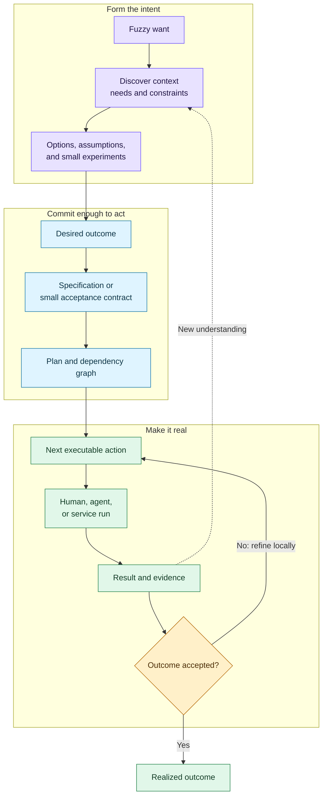
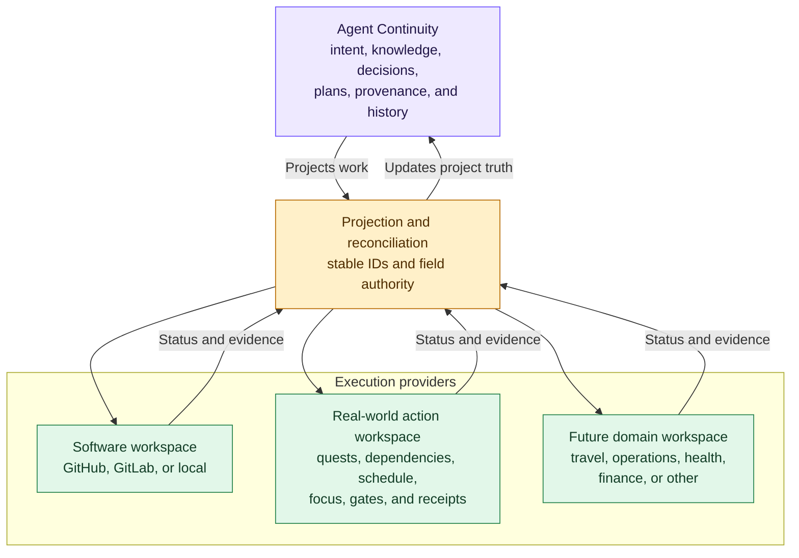

# IDEA-0006 - Adaptive Goal-To-Outcome Quest Planning

## Raw Thought

A person should be able to begin with almost any expression of desired change:

- “I want to move house.”
- “I want to cook dinner for two tomorrow.”
- “I want to make this interaction faster.”
- “I have a blurry product idea, but I do not yet know what it is.”

The system would conversationally help form the goal, ask only the questions that materially affect the next decision, record the resulting understanding, and recursively decompose the work until the person has an action they can actually begin. It would then remain present through execution, evidence, interruption, and replanning rather than ending after generating a checklist.

This is an executive-function support system in the broad sense: it externalizes clarification, working memory, task decomposition, sequencing, initiation, follow-through, and resumption. It may be especially useful for people who experience executive-function difficulties, including some people with Attention-Deficit/Hyperactivity Disorder (ADHD), but it must not be presented as medical treatment without appropriate research and validation.

“Life quest” is a strong interface metaphor: goals become quests, plans become questlines, milestones become checkpoints, prerequisites become gates, and immediately executable leaves become next actions. It is not yet a reason to add a canonical `QUEST-*` document type.

## Sharpened Product Thesis

The product is not merely an Artificial Intelligence (AI) task-breakdown tool or a project tracker with unlimited subtasks.

It is an **adaptive intent-to-outcome system** that keeps one continuous, inspectable model across:

1. fuzzy desire
2. discovery and problem framing
3. options, assumptions, and experiments
4. commitment to a desired outcome
5. specification and planning where warranted
6. dependent human, agent, and service work
7. execution, evidence, interruption, and resumption
8. replanning when reality changes
9. accepted outcome and reusable learning

The differentiator is continuity across that whole path. Recursive decomposition is one mechanism inside it, not the product boundary.

## The Whole Path Is A Loop, Not A Waterfall



The existing Agent Continuity artifact responsibilities remain available inside this loop:

```text
IDEA -> discovery -> SPEC -> PLAN -> optional IMPL / execution brief
                                          |
                                          v
                              work -> runs -> evidence -> replan
```

Small goals should not be forced through every document type. “Cook dinner tomorrow” may need a compact goal and plan held in one view. A consequential software product may need durable ideas, research, a specification, a parent plan, and bounded implementation briefs. The system should scale the ceremony with risk and complexity.

## Recursive Decomposition Needs A Stopping Rule

The data model may support arbitrarily deep nesting, but the product must not endlessly expand a tree. Decompose lazily and just in time.

A leaf is sufficiently actionable when:

- a known human, agent, or service is eligible to perform it
- its prerequisites are satisfied or explicitly represented
- it begins with an observable action rather than a vague outcome
- its completion or returned evidence is clear
- it fits the person's requested level of guidance, available time, energy, tools, and context
- no unresolved choice would substantially change what the actor should do first

If the person still feels stuck, the system can decompose that leaf further. If the person already knows how to do several leaves, the interface can collapse them. Granularity is therefore contextual and personal, not a universal duration such as “every task must be under fifteen minutes.”

The strongest control is a simple assistance-depth setting—similar in spirit to Goblin Tools' “spiciness”—combined with an in-context **break this down more** action. Over time, the system can learn preferred granularity by domain without hiding the reasoning.

## A Tree Is Not Enough

The interface can present a quest tree, but the canonical execution structure must allow a graph:

- **AND decomposition:** all child outcomes are required, such as packing, arranging transport, and handing over keys when moving house.
- **OR decomposition:** alternative ways to satisfy an outcome, such as hiring movers or renting a van.
- **cross-branch dependencies:** signing a tenancy agreement may be required before arranging utility activation.
- **gates:** identity, payment, approval, physical presence, or subjective acceptance may require a human.
- **feedback:** evidence from one action can invalidate assumptions and replace part of the plan.

Hierarchical Task Network (HTN) planning is a relevant technical ancestor: it repeatedly decomposes compound tasks until executable primitive tasks remain. Its classic limitation is that useful decompositions require rich domain knowledge. A conversational AI system can help elicit, retrieve, and learn that knowledge, but it still needs domain playbooks and verification rules rather than trusting unconstrained generation.

## Adaptive Discovery, Not An Interrogation Form

The questioning behavior should resemble a good coach, designer, business analyst, or consultant:

1. infer the highest-impact uncertainty
2. ask one compact question when the answer changes the plan materially
3. offer a safe default when possible
4. record assumptions and confidence rather than pretending certainty
5. let the person choose **good enough—start now**
6. defer questions that only matter later
7. reopen a decision when new evidence invalidates its basis

For dinner, dietary restrictions and the desired tone of the meal may matter before recipe selection; garnish details probably do not. For moving house, target date, budget, current tenancy obligations, destination constraints, and who is moving may change the entire graph. The system should maximize decision value per question, not completeness per interview.

## What Already Exists

The ingredients are established, and several products overlap materially:

| Existing approach | Strong overlap | What remains disconnected in the bounded scan |
|---|---|---|
| Goblin Tools | Brain-dump-to-actions, recursive task breakdown, user-controlled depth, one-task-at-a-time execution, and “break down when stuck” | A persistent goal model, discovery history, dependency/evidence graph, and cross-session replanning |
| Tiimo | Neurodivergent-oriented visual planning, brain-dump conversion, task breakdown, duration estimates, scheduling, focus support, and daily follow-through | Full project discovery, semantic evolution, multi-actor execution, and evidence-driven resumption |
| Taskade | Natural-language project generation with task hierarchies, dependencies, agents, automations, risks, metrics, and workspace history | The documented feature is primarily project generation and workspace execution rather than a provider-neutral, versioned intent-to-outcome record spanning personal and physical work |
| Jira Product Discovery, Confluence, Jira, and Linear | Discovery artifacts, documents, hierarchies, dependencies, delivery work, and agent delegation | Adaptive personal clarification and evidence-driven continuity across external providers and non-software outcomes |
| Getting Things Done (GTD) | Clarifying a desired outcome and identifying the next action | Automated discovery, live dependencies, execution, evidence, and dynamic replanning |
| Design and business analysis | Discovering needs, defining problems, evaluating solutions, requirements elicitation, and traceability | Usually delivered as a professional practice rather than a persistent personal execution engine |
| ADHD and executive-function coaching | Collaborative goal setting, prioritization, planning, scheduling, problem solving, accountability, and practical daily-life support | Software may augment some mechanics, but should not claim to replace therapeutic or licensed professional care |
| HTN planning | Formal recursive decomposition from compound tasks to executable actions | Knowledge authoring, uncertainty, personal granularity, conversational goal formation, and human evidence |

The bounded August 2026 scan did not establish that no one combines these elements. It established that **task decomposition alone is crowded**, while the complete continuous model is not clearly represented in the reviewed product documentation.

## Who Currently Handles The “Former Half”

The user's intuition is broadly right, but the work is distributed among roles rather than absent:

- product managers and product-discovery teams shape opportunities and outcomes
- design researchers and service designers investigate people, context, and the right problem
- business analysts define needs, requirements, solutions, value, and traceability
- management consultants structure ambiguous organizational problems and options
- coaches help individuals turn goals into practical plans and accountability
- occupational therapists and licensed clinicians may support functional or health-related barriers within their professional scopes
- domain specialists handle particulars such as moving, travel, finance, events, or food

Traditional project management generally becomes most useful after there is enough commitment to define scope, work, responsibility, and schedule. Modern product-discovery tools move upstream, but the transition from private, blurry desire to a sufficiently formed endeavor is still often conversational, manual, fragmented, or expensive.

## Candidate Architecture

Use a small general engine plus domain-specific skills and playbooks:

| Layer | Responsibility |
|---|---|
| Intent model | Goal, stakeholder, need, desired outcome, constraints, values, assumptions, and acceptance |
| Discovery loop | Questions, research, options, experiments, decisions, and confidence changes |
| Goal/work graph | AND/OR decomposition, dependencies, gates, alternatives, and next-action eligibility |
| Playbooks and skills | Domain knowledge for moving, cooking, software, research, travel, and other repeatable situations |
| Execution layer | Human, agent, and service assignments, permissions, costs, runs, and retries |
| Evidence layer | Results, receipts, observations, acceptance, provenance, and semantic history |
| Adaptive interface | Quest view, zoomable granularity, current next action, Human Inbox, and resumption context |

“AI can help me do anything” should remain the vision. The first product should prove a small engine across contrasting fixtures rather than claim safe competence in every domain.

## Separate Product Surface, Shared Continuity

The real-world human-action experience is likely a separate bounded product surface from Agent Continuity, but it should not become a disconnected truth universe.

The durable split is not **human work versus agent work**. GitHub is used by humans, agents, and automation; what makes it distinct is that it is an execution environment specialized for software. Likewise, a real-world action workspace may contain tasks for a human, an agent, or a connected service. Its specialty is operationalizing embodied and mixed work.



### Agent Continuity Owns The Why And What

- fuzzy intent and the evolution of the goal
- needs, constraints, assumptions, research, and decisions
- specifications, high-level plans, acceptance, and semantic history
- the relationship between multiple execution providers
- provenance for why work exists and what evidence supports completion

### The Real-World Action Workspace Owns The How And Now

- the live actionable graph and current dependency frontier
- operational status, assignment, schedule, place, energy, materials, and reminders
- focused next-action and step-by-step modes
- human requests, permissions, check-ins, and notifications
- returned receipts, observations, and completion evidence
- native interaction patterns for doing work away from a code repository

It could be independently installable and useful for a user who never sees Agent Continuity. When paired with Agent Continuity, it receives linked execution slices and returns status and evidence. This is analogous to using GitHub without requiring GitHub to own the original product idea, research, private reasoning, or every cross-project relationship.

Conceptually preserve these boundaries now, but implement the first local prototype as a **modular monolith**: one codebase and runtime with explicit continuity, relationship-core, provider-adapter, and action-workspace modules. Do not create several network services or a generalized plugin platform before the three evaluation fixtures prove the contracts. Separately installable products can emerge later without first making their data models independent.

## Existing Parallels For The Split

An independent product/workflow scan found that the strongest precedent is not another consumer to-do list. It is the separation between knowledge or case context and operational execution:

| Parallel | Relevant split | Design lesson |
|---|---|---|
| [Confluence and Jira](https://www.atlassian.com/software/confluence/jira-integration) | Knowledge, decisions, and plans connect to separately managed trackable work | Separate products can share identities, links, graph search, and actors without duplicating ownership |
| [Case Management Model and Notation](https://www.omg.org/cmmn/) and [Business Process Model and Notation](https://www.omg.org/bpmn/) | Evolving knowledge-driven cases complement more predefined executable processes | “Move house” behaves more like an adaptive case than a fixed workflow; use the concepts without exposing enterprise notation |
| [ServiceNow cases and case tasks](https://www.servicenow.com/docs/r/customer-service-management/csm-cases-case-tasks-overview.html) plus [playbooks](https://www.servicenow.com/docs/r/customer-service-management/setting-up-csm-playbooks.html) | A contextual case contains assigned tasks, staged guidance, manual steps, and automation | Context, guided execution, and mixed actors can coexist while case and task state remain distinct |
| [Camunda processes](https://docs.camunda.io/docs/components/concepts/processes/) and [ad-hoc subprocesses](https://docs.camunda.io/docs/8.8/components/modeler/bpmn/ad-hoc-subprocesses/) | One orchestration may mix human user tasks, automated service tasks, flexible ordering, and subprocesses | Human and machine work should be executor types within work, not separate ontologies |
| [HL7 FHIR PlanDefinition](https://hl7.org/fhir/plandefinition.html), [CarePlan](https://hl7.org/fhir/R5/careplan.html), and [Task](https://hl7.org/fhir/task.html) | A reusable definition becomes a contextual plan whose tasks track actual execution and outputs | Preserve the distinction between reusable playbook, one goal's contextual plan, and live executable action |
| [Asana Work Graph](https://asana.com/resources/work-graph) | Goals, portfolios, projects, tasks, and people form many-to-many relationships beneath several views | A graph can remain canonical while the human interface shows a calm hierarchy or focused view |
| [Hierarchical Task Analysis](https://digital.ahrq.gov/health-it-tools-and-resources/evaluation-resources/workflow-assessment-health-it-toolkit/all-workflow-tools/hierarchical-task-analysis) | Goals decompose into subgoals and operations with explicit ordering and alternatives | This is a close human-factors precedent for recursive goals, plans, and a deliberate stopping point |
| [Celonis objects and events](https://docs.celonis.com/en/objects-events.html) | Operational objects, changes, and relationships support different process perspectives | Record what actually happened as events without flattening the whole undertaking into one list |

The precise architectural category is therefore close to **adaptive case management** or **goal-to-outcome orchestration**. The consumer-facing “quest” metaphor can remain friendlier. The potential product is best summarized as a consumer-grade adaptive case-management system with an executive-function-aware action surface connected to durable intent, provenance, and cross-provider relationships.

Commodity capabilities include arbitrary nesting, blockers, templates, reusable playbooks, human or agent assignment, approval gates, task generation, and audit logs. The candidate differentiation remains:

- high-information questioning before work generation
- decomposition depth that changes per person, branch, context, and moment
- an actionable frontier instead of a complete-plan dump
- a navigable why-chain from action to desired outcome
- semantic reasons for invalidation, supersession, and replanning
- one authoritative owner per fact across multiple execution providers
- portable personal continuity across software and real-world undertakings
- evidence-aware learning from completed cases without erasing uncertainty

## The Move-House Structure Is A Hierarchical Dependency Graph

Goblin Tools' hundred-item output exposes three relationships that a flat checklist conflates:

| Relationship | Meaning | Move-house example |
|---|---|---|
| `contributes_to` | A child outcome is part of a larger outcome | “Pack kitchen” contributes to “Move belongings” |
| `requires` / `blocked_by` | One node cannot proceed until another condition is satisfied | “Activate utilities” requires the new address and start date |
| `alternative_to` | Either branch may satisfy the same need | Hire movers or rent a van |

The underlying structure is therefore best described as a **hierarchical dependency graph**, often represented more formally as an AND/OR graph. It is normally a Directed Acyclic Graph (DAG): dependencies point forward without circular prerequisites. Evidence may cause a new revision of the graph, but that feedback belongs in project history rather than as a circular execution dependency.

Every surfaced action should be able to answer:

- **Why does this exist?** Show the `contributes_to` path back to the desired outcome.
- **Why now?** Show that its prerequisites are satisfied and it is on the actionable frontier.
- **What does it unlock?** Show dependent outcomes that become available afterward.
- **Who or what can do it?** Human, agent, service, or a permitted combination.
- **What proves it is done?** Define the expected receipt or observation.

The default interface should never dump the entire graph. It should show the next meaningful branch and a small actionable frontier, summarize locked branches, and expand detail only when the user explores a branch or becomes stuck. Generation becomes incremental planning, not a one-shot “maximum spiciness” request.

## First Prototype

### Personal-First Product Wedge

Do not begin with a company platform or a cold universal life-planning app. Begin with a local native **personal project cockpit** over the user's existing Agent Continuity projects. Its recurring promise is:

> Open a project, understand what is happening, and choose one meaningful next action in under a minute.

The smallest combined surface should have:

1. **Projects** - registered local projects, current state, active plan, open gates, and recent evidence
2. **Now** - one to five actionable frontier items with why, why now, unlocks, executor, and completion evidence
3. **Context** - type-aware ideas, specifications, plans, briefs, decisions, sessions, evidence, relationships, and backlinks

This is deliberately narrower than either a generic Markdown viewer or a complete action workspace. It uses an existing personal corpus and tests whether linked project truth plus a calm actionable frontier improves real behavior.

Start with a concierge proof before product code: manually derive the frontier for active projects, record corrections and selected actions, then measure resumption the next day. Build the read-only cockpit only if that loop proves useful. Add app-owned actions and relationship mutation after the first useful queries are known.

### Two Horizons, One Research Lineage

Personal-first scope must not erase the broader abstraction. Keep two explicit horizons in the prospective product repository:

| Horizon | Purpose | Constraint |
|---|---|---|
| Product horizon | Build something the user repeatedly uses for current projects | Only add behavior justified by personal use and evaluation |
| Research horizon | Investigate general goal, work, agency, evidence, time, change, and reality models | Research may shape vocabulary and experiments, but does not silently expand the first product |

The personal cockpit is an instrument for discovering the larger model, not a denial that the model exists. Every narrow implementation decision should be traceable to the broader idea, while every broad idea remains a hypothesis until it survives real cases.

The research horizon should eventually include separate surveys of knowledge representation and ontologies, temporal and event-sourced graphs, goals and intentionality, activities and processes, provenance and evidence, personal information management, and human-computer cognitive scaffolding. These surveys should compare incompatible world-model assumptions rather than prematurely declaring one universal ontology.

Preserve B2B compatibility through stable actor IDs, separate accountability and execution, authority, provenance, workspace boundaries, external references, append-only events, and schema-versioned export. Defer organizations, teams, role-based access control, collaboration, billing, portfolios, resource pools, compliance, retention, and service-level policies until real multi-person demand appears.

Build the smallest conversation-first loop that can:

1. capture one fuzzy goal
2. ask at most a few high-value questions before offering a useful start
3. show current understanding, assumptions, and unresolved questions
4. generate a dependency-aware goal/work graph
5. surface one next action with **do it**, **delegate**, **break down more**, and **not right** controls
6. record the result or evidence
7. replan locally without regenerating the entire project
8. resume later with a concise explanation of what changed and what is next

Do not begin with a universal marketplace of playbooks, full tracker replacement, autonomous payments, or a novel document type for every level in the tree.

## Evaluation Fixtures And Metrics

Use three deliberately different fixtures:

| Scale | Fixture | What it stresses |
|---|---|---|
| Small | Cook dinner for two tomorrow | Clarification efficiency, preference handling, scheduling, and immediate actionability |
| Medium | Move house | Long horizon, cross-branch dependencies, alternatives, human/external gates, and resumption |
| Complex | Deliver a software feature | Durable artifacts, delegated agents, evidence, semantic history, and tracker projection |

Compare the prototype with an ordinary AI chat and a static checklist using:

- time to first genuinely useful next action
- high-value questions asked before action
- missing-prerequisite and unsafe-assumption rate
- user corrections required per plan
- unnecessary decomposition and perceived overwhelm
- successful resumption after interruption
- completion or verified-progress rate
- whether plan changes preserve an understandable reason and evidence trail

## Questions

- Is the initial product primarily for personal executive-function support, professional agent orchestration, or a shared engine with different interfaces?
- What personal data should the system learn about preferred granularity, energy, routines, and constraints, and how is that kept private?
- Which questions are worth interrupting the user for, and which should become explicit assumptions?
- How should alternatives and trade-offs appear without overwhelming the “just tell me what to do next” experience?
- When does a compact goal record promote into an idea, specification, plan, or other durable artifact?
- Which high-risk domains require professional review, constrained playbooks, or a refusal to automate?
- Can one minimal vocabulary represent dinner, moving house, and software without becoming either vague or enormous?

## Promotion Criteria

Promote this into a concept only when a working or simulated prototype across the three fixtures shows that:

- the same small intent and execution vocabulary survives all three domains
- adaptive questions outperform either no clarification or exhaustive upfront questioning
- the actionability stopping rule produces useful leaves at different personal granularity settings
- the graph handles alternatives, prerequisites, human gates, and local replanning
- the system can resume after interruption without chat archaeology
- evidence can change the plan without erasing the history of why
- users experience less planning burden, not merely a longer AI-generated checklist

## Sources Consulted

- [Goblin Tools overview](https://goblin.tools/)
- [Goblin Tools Magic ToDo](https://goblin.tools/ToDo)
- [Goblin Tools Taskmaster](https://goblin.tools/Taskmaster)
- [Goblin Tools Compiler](https://goblin.tools/Compiler)
- [Tiimo visual AI planner](https://www.tiimoapp.com/)
- [Taskade AI project generation](https://www.taskade.com/wiki/ai-agents/generation)
- [Design Council Double Diamond history](https://www.designcouncil.org.uk/resources/the-double-diamond/history-of-the-double-diamond/)
- [International Institute of Business Analysis definition](https://www.iiba.org/professional-development/career-centre/what-is-business-analysis/)
- [International Institute of Business Analysis requirements, designs, and traceability](https://www.iiba.org/knowledgehub/the-business-analysis-standard/4-implementing-business-analysis/4-4-understanding-requirements-and-designs/)
- [Children and Adults with Attention-Deficit/Hyperactivity Disorder coaching overview](https://chadd.org/about-adhd/coaching/)
- [Getting Things Done desired outcome and next action](https://gettingthingsdone.com/2008/08/whats-your-desired-outcome/)
- [Overview of Hierarchical Task Network planning](https://arxiv.org/abs/1403.7426)
- [Object Management Group Case Management Model and Notation](https://www.omg.org/cmmn/)
- [ServiceNow cases and case tasks](https://www.servicenow.com/docs/r/customer-service-management/csm-cases-case-tasks-overview.html)
- [HL7 FHIR PlanDefinition](https://hl7.org/fhir/plandefinition.html)
- [Hierarchical Task Analysis](https://digital.ahrq.gov/health-it-tools-and-resources/evaluation-resources/workflow-assessment-health-it-toolkit/all-workflow-tools/hierarchical-task-analysis)

## Related Documents

- [IDEA-0005 - General Human-Agent Execution Graph](IDEA-0005-general-human-agent-execution-graph.md)
- [EXPL-0004 - From Fuzzy Intent To Next Action](../../docs/orientation/explainers/EXPL-0004-from-fuzzy-intent-to-next-action.md)
