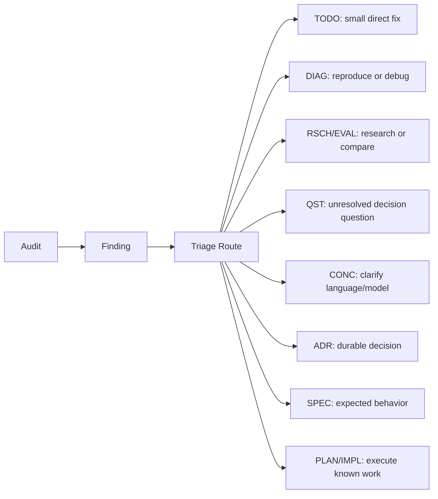

# CONC-0003 - Open Loop Review Cadence

## Purpose

Define a repo-agnostic workflow for keeping AGENT-DOCS systems from becoming passive archives of unfinished findings, TODOs, questions, audits, diagnostics, plans, and stale ideas.

The goal is not to make every captured thought urgent. The goal is to make neglected open loops visible, keep the active queue intentionally small, and route findings into the right follow-up artifact.

## Core Principle

Every durable open loop needs enough metadata to be reviewed later:

- status
- owner or responsible role
- updated timestamp
- route or next action
- resolution, when closed

Open loops include:

- audit findings
- structured TODOs
- open questions
- active diagnostics
- in-progress or blocked plans
- stale implementation briefs
- research/evaluation docs that are still active

Captured ideas are allowed to sit quietly. Ready, blocked, or in-progress work should create review pressure.

## Status Pressure

Use statuses to distinguish storage from commitment.

| Status | Meaning | Review Pressure |
|---|---|---|
| `captured` | Worth saving, not selected for action | low |
| `open` | Unresolved question, finding, or issue | medium |
| `ready` | Intentionally selected for near-term work | high |
| `in_progress` | Actively being worked | high |
| `blocked` | Cannot proceed without something else | high |
| `routed` | Finding has a follow-up artifact | medium |
| `deferred` | Not now, with reason | low |
| `accepted-risk` | Known risk intentionally accepted | low |
| `done` / `completed` | Resolved | none |
| `archived` | No longer active | none |

The system should avoid turning every captured item into `ready`. A large captured backlog is acceptable. A large ready backlog is a planning smell.

## Audit Findings Flow

Audits should be evidence snapshots that route work. They should not become the permanent owner of the fix.



An audit can be marked `completed` only when every finding is one of:

- resolved directly
- routed to a specific follow-up artifact
- deferred with reason
- accepted as risk
- archived as no longer relevant

## Finding Register Shape

Audits should carry a structured finding register that can be parsed or reviewed deterministically.

```md
| ID | Severity | Status | Finding | Route | Follow-up | Resolution |
|---|---|---|---|---|---|---|
| FINDING-001 | high | open | Old plan conflicts with current roadmap | PLAN |  |  |
| FINDING-002 | medium | routed | Missing schema source-of-truth note | ADR | ADR-0012 |  |
| FINDING-003 | low | accepted-risk | Legacy doc naming mismatch | none |  | Accepted because historical docs keep legacy names |
```

Suggested finding statuses:

- `open`
- `routed`
- `resolved`
- `deferred`
- `accepted-risk`
- `archived`

Suggested routes:

- `TODO`
- `DIAG`
- `RSCH`
- `EVAL`
- `QST`
- `CONC`
- `ADR`
- `SPEC`
- `PLAN`
- `IMPL`
- `none`

## Review Command Concept

A future `docs-meta review` command should gather all open loops into one attention queue.

Example output:

```text
Needs attention

Blocked TODOs
- TODO-0012 blocked 9 days, no owner

Stale open docs
- PLAN-0004 ready, not updated in 18 days
- QST-0003 open, not updated in 32 days

Audit findings
- repo-health/audits/2026-04-28-roadmap-audit.md FINDING-003 is open with no route
- FINDING-006 routed to PLAN-0007, but PLAN-0007 is blocked

Audits due
- No completed docs-health audit in 41 days
```

The command should be read-only at first. It should make neglected loops visible before attempting automatic cleanup.

## Cadence

The cadence should be lightweight enough to actually use.

| Moment | Action |
|---|---|
| Session start | Check recent docs, active TODOs, and health before creating new work |
| Before new work | Search for existing open docs or TODOs to avoid duplicates |
| Session end | Route, close, defer, or own every newly created finding/TODO |
| Weekly or milestone boundary | Run a docs-health audit or `docs-meta review` queue |
| Monthly or before major planning | Prune backlog, archive dead items, merge duplicates, promote only a small ready set |

## Completion Rules

An agent should not leave a meaningful session with newly created untracked work.

New work must end in one of these states:

- implemented and verified
- represented by a structured TODO
- routed to a specific follow-up artifact
- explicitly deferred with reason
- archived or accepted as risk

An audit should not be considered complete if it contains open findings with no route or resolution.

A plan should not remain `ready` indefinitely. If it is not actually near-term work, demote it to `deferred`, `captured`, or `archived`, depending on the doc type.

## Non-Goals

This concept does not require:

- cron jobs
- external issue trackers
- one issue document per finding
- automatic prioritization
- automatic deletion of old docs

External issue trackers can still be linked later. AGENT-DOCS should first make the repo-local open loops visible and traceable.

## Open Questions

- Should audit findings become their own parsed entity in `docs-meta`, or is a structured Markdown table enough for the first version?
- Should `docs-meta review` be separate from `docs-meta health`, or should health grow into the review queue?
- Should `ready` queues have a hard recommended maximum, such as five items per domain?
- Should backlog pruning create an audit receipt, a session log, or both?

## Promotion Path

This concept can become:

- an audit guide rule for finding closeout
- a `docs-meta review` spec
- additions to scaffold `AGENTS.md`
- additions to audit templates and guides
- a structured docs workflow skill instruction
