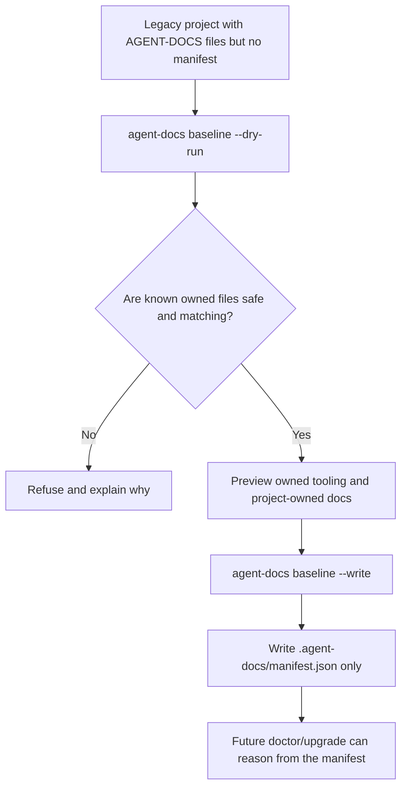

# EXPL-0001 - AGENT-DOCS Baseline Manifest

## Use This When

Use this when someone asks what `agent-docs baseline` does, why legacy installs
need it, or how it differs from `init`, `doctor`, and `upgrade`.

## Short Answer

`baseline` means: "Look at an existing AGENT-DOCS install that was created
before manifests existed, verify the pieces we can safely recognize, and write
the first `.agent-docs/manifest.json` that describes that current state."

It does not install AGENT-DOCS from scratch. It does not overwrite project docs.
It does not upgrade files. It creates a cautious starting receipt so future
`doctor` and `upgrade` commands can reason about the install safely.

## Mental Model

Think of AGENT-DOCS like a shared workshop kit copied into a project repo.
Older copies of the kit did not include an inventory sheet. The files might
still be fine, but the tool cannot tell which pieces are official kit pieces,
which pieces the project owns, and which pieces were locally changed.

`baseline` is the inventory day:

- It inspects the existing project.
- It checks official AGENT-DOCS-owned tooling against the current upstream copy.
- It records project-owned Markdown as project-owned without checksums.
- It writes the inventory sheet only if the situation is unambiguous.

## Explanation

Fresh write installs now create `.agent-docs/manifest.json` automatically.
That manifest is a small machine-readable receipt containing the installed
profile, optional components, source metadata, and file records.

Legacy installs are different. They may already have AGENT-DOCS files, but no
manifest. Without a manifest, `agent-docs doctor` can say "this looks legacy or
manual", but it cannot confidently repair or upgrade anything because there is
no trusted baseline.

The baseline command creates that first trusted baseline only when it can prove
enough:

- Known AGENT-DOCS-owned tooling must exist, be regular non-symlinked and
  non-hardlinked files, match upstream checksums, and have the expected mode.
- Project-owned files, such as local Markdown docs, may be recorded if present,
  but they are not checksummed and are not treated as AGENT-DOCS-owned.
- Empty or unrelated targets are refused.
- Existing manifests are refused because manifest updates belong to `upgrade`.
- Ambiguous filesystem shapes are refused.

The command is preview-first:

```sh
agent-docs baseline --dry-run /path/to/project --profile small --docs-meta yes
agent-docs baseline --write /path/to/project --profile small --docs-meta yes
```

`--dry-run` shows what would be recorded. `--write` creates only
`.agent-docs/manifest.json`, and writes it last.

## Visual



## Common Misunderstandings

- "Baseline" does not mean "install everything fresh." That is `agent-docs init`.
- "Baseline" does not mean "upgrade my docs." That is a later `upgrade` path.
- The manifest is not the source of truth for project knowledge. It is a tool
  receipt for installation and upgrade safety.
- A project can have AGENT-DOCS-shaped files and still be refused if the tool
  cannot prove they are safe to claim.

## How This Connects To The Repo

`scripts/agent-docs` owns the `baseline` command. It reuses profile/action data
from `scripts/agent-docs-init` so ownership classification stays tied to the
same install model.

`tests/agent-docs-doctor-upgrade-smoke.sh` covers preview/write behavior and
refusal cases: existing manifests, empty targets, missing/drifted/wrong-mode
owned tooling, symlinks, hardlinks, and project-owned Markdown non-mutation.

PLAN-0006 keeps generated-view write mode separate because regenerating views is
a different safety problem from writing the first manifest for a legacy install.

## Check Your Understanding

- If a project already has `.agent-docs/manifest.json`, should `baseline` run?
  No. Use `doctor` or `upgrade`.
- If a legacy project has local edits to an AGENT-DOCS-owned script, should
  `baseline` silently accept it? No. It should refuse and explain the checksum
  mismatch.
- If a legacy project has local changes to project-owned Markdown, should
  `baseline` overwrite them? No. It should leave them alone.

## Related Docs

- [SPEC-0003 - AGENT-DOCS Versioning And Safe Upgrade](../../../plans/agent-docs-versioning-and-upgrade/SPEC-0003-agent-docs-versioning-and-upgrade.md)
- [PLAN-0006 - Generated View And Legacy Manifest Upgrade Follow-ups](../../../plans/agent-docs-upgrade-follow-ups/PLAN-0006-generated-view-and-legacy-manifest-upgrade-follow-ups.md)
- [IMPL-0006-01 - Legacy Manifest Baseline](../../../plans/agent-docs-upgrade-follow-ups/implementation-briefs/IMPL-0006-01-legacy-manifest-baseline.md)
