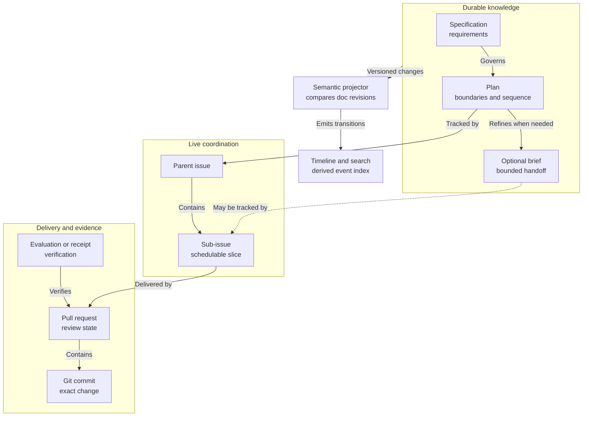

# EXPL-0002 - Documents, Work, Delivery, And Semantic History

## Use This When

Use this when it is unclear whether a specification, plan, implementation brief, GitHub issue, milestone, pull request, commit, or semantic-history record should own a fact.

## Short Answer

They are connected objects with different jobs:

- Agent Continuity documents own durable knowledge and intent.
- The selected work provider—such as GitHub, Jira, Linear, or local state—owns live coordination once work is published there.
- Result providers own delivery or changed external state; in software this includes pull requests and Git commits.
- Evaluations, diagnostics, tests, and receipts own verification evidence.
- A semantic-history index derives what structured fields and relationships changed in each document revision.

The Agent Continuity application joins these objects. It should not copy their fields into several editable sources of truth.

## Mental Model

Think in terms of object family, lifecycle, and authority:

| Object family | Question it answers | Example lifecycle |
|---|---|---|
| Knowledge artifact | What should be true, why, and within which boundaries? | Draft, approved, superseded, archived |
| Work item | Who is doing what now, and what blocks it? | Backlog, ready, in progress, blocked, done |
| Result or delivery artifact | Which output or changed external state delivers it? | Produced, reviewed, accepted, merged, confirmed, released |
| Evidence object | What was observed or verified? | Captured, evaluated, accepted, rejected |
| Semantic event | What structured fact changed, and in which revision? | Derived from one commit-parent comparison |

Two objects may both have a `status` without representing the same lifecycle. A closed issue does not prove that a plan met its completion criteria, and a completed plan does not prove that every linked issue should close automatically.

## Visual

What this shows:

- A plan and issue are linked but not interchangeable.
- An implementation brief is an optional refinement, not a mandatory stage.
- Pull requests, commits, and evidence support closeout without owning the plan's lifecycle.
- Semantic history is rebuilt from versioned sources rather than authored as a second history ledger.

## How Semantic History Answers A Question

For “When did `PLAN-0048` become completed?” the application:

1. Finds the document by stable ID, even if its path moved.
2. Walks the selected Git history, initially the default branch's first-parent history.
3. Parses the structured state at each commit and its parent.
4. Emits a `field_transition` when `status` changes from `in_progress` to `completed`.
5. Shows the exact commit, raw diff, timestamp, and explicitly linked implementation or verification evidence.

The derived event knows what changed. Claimed rationale still comes from authored sources such as an Architecture Decision Record (ADR), session log, issue, pull request, revision note, or commit message.

## Why Same-Repository Commits Are Not Enough

Code and documentation can share one Git repository yet still land separately. In this repository, `PLAN-0004` became completed in documentation commit `537ffb8`, while its closeout session points to implementation/verification commit `639228d`.

That is normal. The durable connection comes from stable IDs, commit trailers, session `commits` lists, pull-request links, and explicit typed relationships—not from assuming nearby commits caused one another.

## Where GitHub Fits As One Work Provider

- Parent issues and sub-issues decompose and assign work.
- Issue dependencies express operational `blocked by` and `blocking` relationships.
- Milestones group issues and pull requests around a delivery target.
- Projects provide table, board, and roadmap views.
- Pull requests own review and merge state.

Plans still own architecture, invariants, durable dependency rationale, and completion criteria. A GitHub milestone is a delivery grouping, not an architecture plan. A sub-issue is a schedulable slice, not automatically an implementation brief.

[EXPL-0003](EXPL-0003-agent-continuity-jira-linear-and-general-execution.md) shows how Jira, Confluence, and Linear fit the same provider-neutral model and how the execution graph generalizes beyond software.

## Implementation Brief Rule

Create an `IMPL-*` only when independent delegation, tricky sequencing, file ownership, migration, verification, or cross-session resumption needs a durable execution contract. Otherwise execute the parent plan directly or use a small issue for a small task.

The user interface can present the brief as a child tab or card within its plan so the conceptual distinction does not become navigation ceremony.

## Structured Todo Rule

The current `TODO-*` system makes Markdown the work-status authority. If a future GitHub integration makes an issue authoritative instead, the linked todo must become a one-way projection or stable reference. Both copies cannot remain independently editable.

## Common Misunderstandings

- Misunderstanding: every issue needs a specification, plan, and implementation brief.
  Correction: tiny work can remain issue-to-pull-request; add durable artifacts only when their distinct job is needed.
- Misunderstanding: closing all sub-issues means the parent plan is complete.
  Correction: it creates a reconciliation candidate; plan completion criteria and verification still need review.
- Misunderstanding: Git history already provides semantic queries.
  Correction: Git provides revisions and diffs; the projector supplies typed field and relationship transitions.
- Misunderstanding: storing derived events creates a second source of truth.
  Correction: the event index is disposable and reproducible from Git-backed canonical sources.
- Misunderstanding: product, design, and marketing each automatically need unique document types.
  Correction: use domains first; add a type only for a distinct lifecycle, schema, relationships, authority, or user-interface actions.

## How This Connects To The Repo

- [IDEA-0004](../../../agent-continuity/ideas/IDEA-0004-semantic-history-and-work-projections.md) owns the candidate architecture and open questions.
- [IDEA-0003](../../../agent-continuity/ideas/IDEA-0003-federated-document-library-and-relationship-graph.md) owns the larger federated document-application and canonical-relationship idea.
- [Planning Docs Guide](../../../scaffold/docs/product/plans/README.md) defines the current plan, brief, and issue conventions.
- [SPEC-0001 - Stable Todo System](../../../plans/stable-todo-system/SPEC-0001-stable-todo-system.md) owns the current Markdown-canonical todo model.

## Check Your Understanding

- If a pull request merges, should the linked plan silently become completed?
  No. Record the delivery and reconcile it with the plan's completion criteria and verification.
- If a task is obvious and takes one small pull request, is an implementation brief required?
  No.
- If the UI can rebuild a status transition from Git, should that transition also be manually copied into every document's frontmatter?
  No. Keep authored current state canonical and derive the history.

## Related Docs

- [EXPL-0003 - Agent Continuity, Jira, Linear, And General Execution](EXPL-0003-agent-continuity-jira-linear-and-general-execution.md)
- [IDEA-0005 - General Human-Agent Execution Graph](../../../agent-continuity/ideas/IDEA-0005-general-human-agent-execution-graph.md)
- [IDEA-0004 - Semantic History And Work Projections](../../../agent-continuity/ideas/IDEA-0004-semantic-history-and-work-projections.md)
- [IDEA-0003 - Federated Document Library And Canonical Relationship Graph](../../../agent-continuity/ideas/IDEA-0003-federated-document-library-and-relationship-graph.md)
- [Doc Types And Responsibilities](../../../guides/doc-types-and-responsibilities.md)
