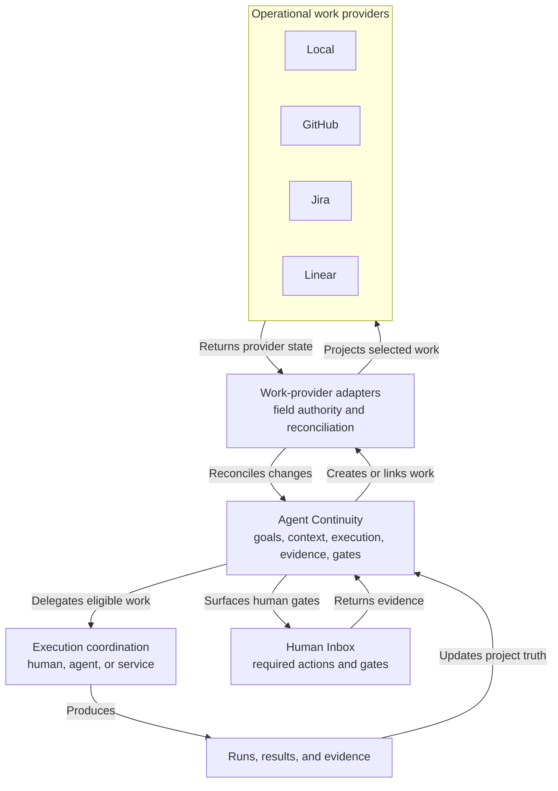

# EXPL-0003 - Agent Continuity, Jira, Linear, And General Execution

## Use This When

Use this when someone asks whether Agent Continuity is just Jira or Linear for agents, whether those products already have documents, or why Agent Continuity could apply outside software development.

## Short Answer

“Jira or Linear for agents” is directionally useful but too narrow.

Jira and Linear already manage substantial hierarchies of work. Confluence and Linear both provide long-form documents. Linear already lets humans delegate issues to agents while retaining human accountability. Building those same features again would not be a meaningful product boundary.

The distinct candidate is a provider-neutral system that connects:

- what the human wants
- durable understanding and decisions
- executable work and dependencies
- human, agent, and service assignments
- actual runs and results
- evidence and semantic history
- explicit human gates and resumption conditions

It can use Jira, Linear, GitHub, or local files as the operational work provider.

[EXPL-0004](EXPL-0004-from-fuzzy-intent-to-next-action.md) expands what happens before the goal and plan are clear: adaptive questions, discovery, personally appropriate task granularity, next-action selection, and evidence-driven replanning.

## The Artifact Hierarchy Remains

Generalizing beyond software does not collapse everything into a specification. The durable hierarchy still has distinct jobs:

```text
IDEA -> SPEC -> PLAN -> optional IMPL / execution brief
                              |
                              v
                    work items -> runs -> evidence
```

- `IDEA` preserves a possibility before it is ready for commitment.
- `SPEC` defines what should be true, for whom, and why.
- `PLAN` defines the overall execution shape: approach, dependencies, sequencing, parallel work, gates, and completion criteria.
- `IMPL` defines one bounded software implementation handoff when the extra execution detail is useful.
- A future non-software equivalent might be called an execution brief, but it would preserve the same bounded-handoff responsibility rather than remove the layer.
- Work items in Jira, Linear, GitHub, or local state track live assignment and workflow.
- Runs and evidence record what was actually attempted and verified.

The tracker does not replace the plan or brief. It receives selected executable slices from them. Small work can skip unnecessary layers, but the system must not stop at a specification when planning or execution detail is needed.

## Where The Existing Products Fit

| Layer | Jira and Atlassian | Linear | Agent Continuity candidate |
|---|---|---|---|
| Ideas and discovery | Jira Product Discovery ideas and insights | Project or initiative descriptions and documents | Typed ideas, research, evaluations, and promotion relationships |
| Durable documents | Confluence pages, live docs, databases, whiteboards | Documents attached to projects, initiatives, teams, issues, and cycles | Portable Markdown plus canonical relationships and private cross-project context |
| Work tracking | Jira work items, workflows, dependencies, boards, plans | Issues, sub-issues, projects, initiatives, dependencies, cycles | Local work or projection into an external provider |
| Delivery | Development integrations and linked repository activity | GitHub and GitLab integrations | Provider-neutral result and evidence links |
| Agents | Rovo-assisted content and work-item creation | Delegated agent app users and agent guidance | Multi-provider agent runs, handoffs, evidence, resumability, and semantic history |
| Human intervention | Ordinary assignees, approvals, workflow states | Human remains primary owner after agent delegation | Explicit gates, requested actions, expected evidence, and a Human Inbox |

## Product Shape



The arrows show authored or imported information flow. They do not approve unrestricted two-way synchronization. Field-level authority still determines which side may update each fact.

## Jira And Confluence

Jira is already a general work system, not merely a software backlog. Its work items can represent bugs, tasks, requests, and other configured work types. Jira spaces provide boards, backlogs, timelines, fields, workflows, and permissions.

Jira plans can also [show and manage dependencies between work items](https://support.atlassian.com/jira-software-cloud/docs/view-and-manage-dependencies-in-advanced-roadmaps/).

Confluence is the adjacent knowledge system. It supports versioned pages, continuously collaborative live docs, databases, whiteboards, and other content. Jira work can be displayed or created from Confluence, including from requirements content.

Jira Product Discovery adds a separate early-stage layer for ideas, insights, prioritization, roadmaps, and delivery links.

Atlassian therefore already resembles:

```text
Jira Product Discovery -> Confluence -> Jira -> development integrations
```

Agent Continuity should not compete by merely drawing the same arrows. Its opportunity is portable typed knowledge, agent-execution provenance, cross-provider semantics, private project memory, and explicit evidence-driven human gates.

## Linear

Linear is closer to the integrated experience imagined here than a simple issue tracker:

- Initiatives group projects around objectives.
- Projects include descriptions, documents, milestones, updates, and predicted progress.
- Issues support sub-issues and blocking relationships.
- Documents have collaborative editing, comments, templates, version history, and visible agent-authored changes.
- Agents can work on issues, projects, and documents.
- Delegating an issue to an agent keeps the human as primary assignee and accountable owner.

That last rule is important and should influence Agent Continuity: delegation is not the same as transferring accountability.

## What Generalizes Beyond Coding

The software-specific path is:

```text
specification -> plan -> issue -> agent run -> pull request -> tests -> human review
```

The general path is:

```text
goal -> knowledge -> work -> assignment -> run -> result -> evidence -> next work
```

Code commits, pull requests, and builds are only one family of results. Other results include reports, reservations, submitted forms, published pages, call notes, purchases, approvals, and physical observations.

Git can still version the project knowledge, but the domain model must not require every outcome to end in a repository commit.

## Human Gates

A human gate is a required condition that cannot or should not currently be satisfied automatically. Common reasons include:

- legal identity or authority
- consent or spending approval
- physical presence or manipulation
- subjective acceptance
- privacy or security policy
- a phone call or interaction without a safe integration
- automation that is technically possible but too risky or expensive

The system should not merely mark the project “blocked.” It should tell the human:

- what to do
- why it requires them
- what is waiting
- what evidence to return
- what will resume afterward

The Human Inbox is the focused view of those unresolved requests. Ordinary development tickets can stay in Jira, Linear, or GitHub without mixing in every physical or approval checkpoint.

## Badminton Court Example

An agent can search Japanese sources, validate venue rules, distinguish individual play from exclusive hire, rank pathways, and keep retrieval evidence. It cannot legitimately invent eligibility, physically attend, or assume that a venue listing proves bookability.

A realistic graph contains:

```text
agent: gather and rank legitimate pathways
human gate: call venue and report current answer
agent: re-rank using the call evidence
human gate: approve payment and make reservation
external service: return booking confirmation
human gate: physically verify successful access
project: record actual outcome and update future knowledge
```

That is recognizably project execution, even though the result is not software.

## Recommended Boundary

Build Agent Continuity as the layer that understands and resumes human-agent projects. Integrate with Jira, Linear, and GitHub instead of initially reproducing their mature tracker interfaces.

“Do not reproduce tracker interfaces” means preserve Agent Continuity's ideas, specifications, plans, and optional implementation briefs while reusing external systems for commodity ticket operations such as boards, assignees, sprints, and workflow administration.

The first unique capabilities should be:

1. conversation-to-goal and durable project knowledge
2. executor-aware dependency graph
3. agent run and evidence receipts
4. human gates and a Human Inbox
5. automatic resumption after verified input
6. semantic history across documents, work, and evidence
7. provider adapters with explicit field authority

## Common Misunderstandings

- Misunderstanding: Linear has agents, so this product already exists.
  Correction: Linear proves agent delegation inside a tracker; the candidate here spans provider-neutral knowledge, runs, evidence, human gates, and non-software outcomes.
- Misunderstanding: Confluence already stores documents, so a document library adds nothing.
  Correction: the value is the typed, versioned relationship and execution model, not generic rich-text storage.
- Misunderstanding: a human gate is just another blocked issue.
  Correction: it needs an exact action, reason, evidence contract, notification path, and resumption condition.
- Misunderstanding: non-code projects do not benefit from agents.
  Correction: research, synthesis, monitoring, comparison, drafting, and coordination can be automated even when final authority or physical action remains human.
- Misunderstanding: the goal is to replace Jira or Linear.
  Correction: use them as operational providers where they already fit; replace them only if the local provider eventually becomes independently better for a specific user group.

## How This Connects To The Repo

- [IDEA-0005](../../../agent-continuity/ideas/IDEA-0005-general-human-agent-execution-graph.md) owns the candidate generalized domain model and open questions.
- [IDEA-0004](../../../agent-continuity/ideas/IDEA-0004-semantic-history-and-work-projections.md) owns semantic history and external work projection.
- [IDEA-0003](../../../agent-continuity/ideas/IDEA-0003-federated-document-library-and-relationship-graph.md) owns the federated private/public document application.

## Check Your Understanding

- If a Linear issue is delegated to an agent, who remains accountable?
  The human primary assignee.
- If a phone call blocks agent research, should the user have to discover that inside a ticket comment?
  No. It should appear as a precise Human Inbox action with an evidence and resumption contract.
- Must every Agent Continuity project use Jira or Linear?
  No. A private project can use local work state; external trackers are adapters.

## Sources

- [Jira work items](https://support.atlassian.com/jira-software-cloud/docs/what-is-a-work-item/)
- [Jira plan dependencies](https://support.atlassian.com/jira-software-cloud/docs/view-and-manage-dependencies-in-advanced-roadmaps/)
- [Confluence content types](https://support.atlassian.com/confluence-cloud/docs/create-and-edit-content/)
- [Jira and Confluence integration](https://support.atlassian.com/confluence-cloud/docs/use-jira-and-confluence-together/)
- [Jira Product Discovery ideas and delivery](https://support.atlassian.com/jira-product-discovery/docs/link-an-idea-to-a-jira-issue/)
- [Linear documents](https://linear.app/docs/documents)
- [Linear initiatives](https://linear.app/docs/initiatives)
- [Linear project dependencies](https://linear.app/docs/project-dependencies)
- [Linear AI agents](https://linear.app/docs/agents-in-linear)

## Related Docs

- [IDEA-0005 - General Human-Agent Execution Graph](../../../agent-continuity/ideas/IDEA-0005-general-human-agent-execution-graph.md)
- [EXPL-0002 - Documents, Work, Delivery, And Semantic History](EXPL-0002-documents-work-delivery-and-semantic-history.md)
- [EXPL-0004 - From Fuzzy Intent To Next Action](EXPL-0004-from-fuzzy-intent-to-next-action.md)
- [Doc Types And Responsibilities](../../../guides/doc-types-and-responsibilities.md)
