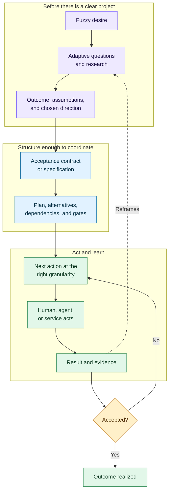

# EXPL-0004 - From Fuzzy Intent To Next Action

## Use This When

Use this when someone asks whether Agent Continuity could help with any goal, whether that is just project management, or where recursive task breakdown fits beside ideas, specifications, plans, and implementation briefs.

## Short Answer

The new abstraction is valid, but “AI creates infinitely nested subtasks” is too narrow and already substantially covered by existing tools.

The stronger idea is an **adaptive intent-to-outcome loop**. It helps a person form a blurry desire, asks only decision-changing questions, commits enough understanding to act, selects the right planning depth, surfaces a genuinely executable next action, observes evidence, and replans without losing why anything changed.

Project management is one middle section of that loop. It usually coordinates committed work. This system begins before the project is well formed and remains after planning, through real execution and acceptance.

## Mental Model

The flow is not a one-way waterfall. Cooking may expose a missing ingredient. A house viewing may invalidate the preferred neighborhood. A prototype may reveal that the original product idea was solving the wrong problem. Evidence loops back into understanding.

## What The Existing Artifact Types Still Do

Nothing about this removes plans or implementation briefs:

| Artifact | Question it answers |
|---|---|
| Idea | Is this possibility worth preserving before commitment? |
| Specification | What should be true, for whom, under what constraints, and how will we recognize acceptance? |
| Plan | What approach, sequence, dependencies, alternatives, gates, and parallel work will get us there? |
| Implementation or execution brief | What bounded handoff does one executor need to carry out safely? |
| Work item | Who or what is doing which live unit of work now? |
| Run and evidence | What actually happened, and what does it prove? |

Small goals can compress these responsibilities into one lightweight record. Large or risky goals should preserve the distinctions. Infinite nesting belongs to the goal/work graph, not to an infinite number of document types.

## When To Stop Breaking A Task Down

A task is actionable enough when a known actor can begin it now, its prerequisites are met or visible, the first action is concrete, completion evidence is understandable, and its size fits the person's current need for guidance.

That definition is deliberately personal. “Prepare vegetables” may be enough for one cook. Another person may need “take the chopping board out,” especially when tired or stuck. The interface should offer both an assistance-depth preference and **break this down more** on any current action.

Supporting arbitrary nesting in storage is sensible. Expanding everything in advance is not. Generate detail lazily, keep the default view shallow, and reveal the next relevant branch.

## Existing Overlap

- [Goblin Tools](https://goblin.tools/) turns brain-dumps into tasks, breaks tasks down to a user-controlled “spiciness” depth, and can break the current step down again when the user is stuck.
- [Tiimo](https://www.tiimoapp.com/) converts spoken or typed thoughts into broken-down, estimated, scheduled plans and combines that with visual timers and daily follow-through.
- [Taskade](https://www.taskade.com/wiki/ai-agents/generation) documents natural-language project generation with hierarchies, dependencies, agents, automations, risks, timelines, and success metrics.
- [Getting Things Done](https://gettingthingsdone.com/2008/08/whats-your-desired-outcome/) emphasizes clarifying the desired outcome and then framing a next action.
- [Hierarchical Task Network planning](https://arxiv.org/abs/1403.7426) formally decomposes compound tasks until executable tasks remain, but depends on rich domain knowledge.

These products and methods mean recursive breakdown is not the unique wedge. The candidate wedge is the continuous, inspectable connection between intent formation, personal granularity, execution, evidence, resumption, and semantic history.

## Who Does The Upstream Work Today

The “former half” is not empty. It is split across:

- designers doing discovery and problem framing
- business analysts defining needs, value, requirements, solutions, and traceability
- product managers shaping opportunities and outcomes
- consultants structuring ambiguous choices
- coaches helping people plan, prioritize, follow through, and reflect
- domain specialists supplying context-specific knowledge

The [Design Council's Double Diamond](https://www.designcouncil.org.uk/resources/the-double-diamond/history-of-the-double-diamond/) names Discover, Define, Develop, and Deliver. The [International Institute of Business Analysis](https://www.iiba.org/professional-development/career-centre/what-is-business-analysis/) describes business analysis as defining needs and recommending solutions that deliver value. [Children and Adults with Attention-Deficit/Hyperactivity Disorder](https://chadd.org/about-adhd/coaching/) describes ADHD coaching as targeting practical planning, time management, goal setting, organization, and problem solving.

What AI changes is the possibility of making portions of this expensive, intermittent human support continuous and available at the moment of friction. It should augment rather than falsely claim to replace professional judgment, therapeutic care, or domain expertise.

## Recommended First Cut

Prototype one conversation-to-action loop with:

1. a fuzzy-goal intake
2. a few high-value questions and explicit assumptions
3. a zoomable goal/dependency graph
4. one focused next-action view
5. **break down more**, **show less detail**, **delegate**, and **not right** controls
6. a result/evidence response
7. local replanning and a clean later resumption summary

Test it on dinner for two, moving house, and one software feature. Those three expose whether the model is genuinely general or merely vague.

## Common Misunderstandings

- Misunderstanding: this replaces specifications and plans with one giant quest tree.
  Correction: intent discovery precedes them; plans still own approach and dependencies when that depth is warranted.
- Misunderstanding: every possible subtask should be generated immediately.
  Correction: support deep nesting but expand only the branch needed to act.
- Misunderstanding: a hierarchy is sufficient.
  Correction: real work has alternatives, cross-branch dependencies, gates, and feedback, so the canonical structure is a graph.
- Misunderstanding: no one helps with the fuzzy beginning today.
  Correction: designers, analysts, consultants, product managers, coaches, and specialists do; their work is simply fragmented and often expensive.
- Misunderstanding: the ADHD framing makes this a treatment product.
  Correction: it is an executive-function support concept unless and until clinical claims are properly established.

## How This Connects To The Repo

- [IDEA-0006](../../../agent-continuity/ideas/IDEA-0006-adaptive-goal-to-outcome-quest-planning.md) owns the expanded product idea, overlap scan, stopping rule, architecture candidate, and evaluation fixtures.
- [IDEA-0005](../../../agent-continuity/ideas/IDEA-0005-general-human-agent-execution-graph.md) owns the general goal/work/run/evidence/gate model and tracker-provider boundary.
- [EXPL-0003](EXPL-0003-agent-continuity-jira-linear-and-general-execution.md) explains how this differs from Jira, Linear, and a tracker replacement.

## Check Your Understanding

- Is “move house” initially a task?
  It is better treated as a desired outcome whose meaning, constraints, alternatives, and dependent work must be discovered.
- Should “pack kitchen” always be decomposed to individual cupboard actions?
  No. Only when that extra guidance is useful for the current person and context.
- Does project management disappear?
  No. It becomes the coordination portion inside a larger intent-to-outcome loop.

## Related Docs

- [IDEA-0006 - Adaptive Goal-To-Outcome Quest Planning](../../../agent-continuity/ideas/IDEA-0006-adaptive-goal-to-outcome-quest-planning.md)
- [EXPL-0003 - Agent Continuity, Jira, Linear, And General Execution](EXPL-0003-agent-continuity-jira-linear-and-general-execution.md)
