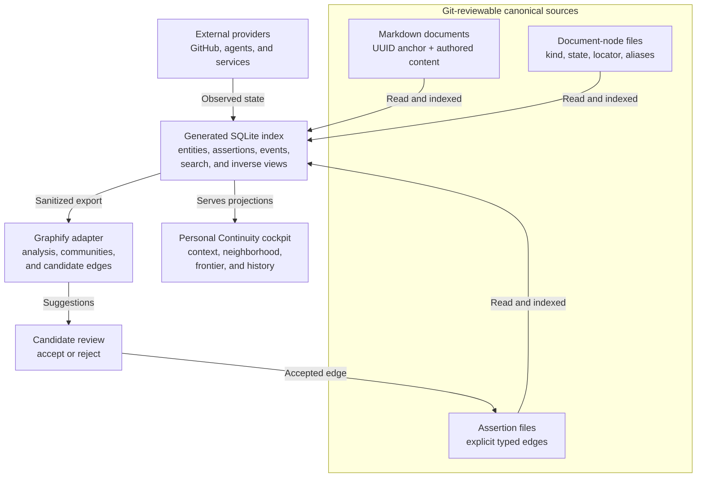

# RSCH-0009 - Graphify And Canonical Relationship Store Fit

## Question

Should Agent Continuity extract typed relationships from document frontmatter into a canonical graph, what role should Graphify play, and what is the smallest personal-first storage architecture?

## Short Answer

The user's normalization instinct is correct, with one Graphify correction:

> Graphify externalizes relationships into a generated queryable graph, but it does not make that graph the canonical authored source of truth.

Agent Continuity should store each explicit typed relationship once outside the two endpoint documents, then generate children, parents, inverse labels, backlinks, graph views, and health checks. This removes duplicated reciprocal assertions.

The original recommended personal-first architecture was:

1. Markdown owns intrinsic document facts.
2. Source-sharded YAML relation files own explicit typed relationships once.
3. SQLite is a disposable local index over documents, explicit relationships, textual references, provider observations, and inferred candidates.
4. Graphify is an optional analysis, visualization, and candidate-edge adapter.
5. No graph database is needed initially.

The storage mechanics are straightforward. The medium-difficulty work is defining predicates, authority, migration, privacy, validation, and one editable owner per fact.

## 2026-08-20 Native-Design Refinement

The graph-native direction now extends from relationships to the document-node metadata that participates in workflow. The refined ownership split is:

1. Markdown keeps an embedded UUID binding reference, H1 title, body, inline links, and citations.
2. A document node record owns immutable identity, kind, lifecycle status, current locator, legacy aliases, and graph-relevant provenance.
3. A relationship assertion owns one typed edge between UUID-addressed entities.
4. SQLite and user interfaces remain rebuildable projections.
5. Graphify remains optional analysis and candidate-edge generation.

The UUID binding is deliberately left in the Markdown. It is a foreign-key-style reference to the identity-owning node, not a second independently editable identity assertion. If both identity and locator lived only outside the file, a free filename change could sever the binding unless every rename used one transactional tool. The embedded reference lets a scan rediscover and rebind the same node after ordinary Git or filesystem moves.

This refinement supersedes the ownership table below where it says all intrinsic metadata remains in frontmatter. It does not change the research conclusion that relationships should be stored once or that a graph database is unnecessary for the first implementation.

## Three Meanings Of “The Graph Is The Source Of Truth”

The earlier wording can be misread because it uses “graph” for three different layers:

| Layer | Meaning | Canonical? |
|---|---|---|
| Logical relationship graph | Identified entities plus explicit typed assertions such as `PLAN-0012 depends_on SPEC-0012` | Yes, this is the intended authority for relationships |
| Durable graph representation | The files or database records that persist those assertions | Initially versioned relation files; a later application-owned database may take over through an explicit migration |
| Generated graph projection | SQLite indexes, backlinks, Graphify output, visual layouts, inferred communities, and caches | No; rebuildable or reviewable unless authority is deliberately transferred |

Therefore the end goal may absolutely be described as **graph-native**: relationships, dependencies, refinements, evidence links, and authority are first-class canonical assertions rather than duplicated frontmatter hints. That conclusion does not require choosing a graph database now. YAML edge files, relational tables, Resource Description Framework triples, and a property-graph database can all represent a graph.

The pilot recommendation is not “avoid making the graph canonical.” It is:

> Make the logical relationship graph canonical immediately, while keeping its first durable representation simple, versioned, inspectable, and replaceable until the vocabulary and write workflows have survived real use.

If the personal application later becomes the primary authoring surface, its transactional database may become canonical for graph entities and assertions. That would be a deliberate authority migration with export, backup, provenance, and compatibility rules—not an accidental promotion of a generated SQLite cache or Graphify output.

## Correcting The Mental Model

| Claim | Verdict | Explanation |
|---|---|---|
| Graphify makes relationships first-class graph edges outside documents | Correct for its generated read model | Its graph can be queried in either direction and combines extracted and inferred relationships |
| Graphify removes relationship truth from source documents | Incorrect | `graph.json` is generated from sources; the original files remain authoritative |
| An external relationship store can remove reciprocal frontmatter duplication | Correct if explicitly made canonical | Store one directional relationship assertion, then derive inverse and backlink views |
| SQLite must be the canonical relationship store | No | Git-reviewable relation files better match current Agent Continuity portability and review; SQLite is a strong index |
| A graph database is required | No | Personal-scale traversals fit SQLite recursive queries and in-memory graph algorithms |

This distinction separates **authority** from **confidence**. Graphify's `EXTRACTED`, `INFERRED`, and `AMBIGUOUS` labels describe how an edge was obtained. They do not say who is allowed to make it control scheduling, blocking, completion, or privacy.

## Current Agent Continuity State

Agent Continuity currently has two graph-like mechanisms:

1. Markdown links, images, wikilinks, and autolinks are parsed into physical references. The tool derives backlinks, broken links, and orphans. See [`link_graph`](../scripts/agent-continuity-docs) in the current script.
2. Frontmatter relationships are summarized separately by scanning `parent_plan`, `related_*`, `supersedes`, `superseded_by`, `promoted_to`, and `resolved_by`.

These are not equivalent:

- An inline Markdown link is an authored reference occurrence with prose and location.
- `IMPL-0012-01 part_of PLAN-0012` is a domain assertion.
- “PLAN-0012 has child IMPL-0012-01” is a generated inverse view.

The current checker mostly protects physical links, schemas, statuses, IDs, and generated views. It does not yet normalize every reciprocal semantic field into one assertion. The relationship-store proposal replaces reciprocal maintenance; it does not eliminate validation.

There is also a current representation mismatch: some `related_*` frontmatter values are stable IDs while others are relative paths. A normalized relation contract should use stable project and entity identities and let the index resolve paths.

## Ownership Model

| Fact kind | Canonical owner | Example |
|---|---|---|
| Authored document content | Markdown | UUID binding reference, H1 title, body |
| Document-node metadata | Versioned node record | UUID identity, kind, lifecycle status, current locator, legacy aliases |
| Explicit authored relationship | Versioned assertion source | `brief-uuid part_of plan-uuid` |
| Textual reference occurrence | Markdown body | A sentence links to an ADR |
| Inverse or backlink | Generated index/view | A plan view shows its child brief |
| Extracted relationship | Generated index | Markdown file links to another file |
| Inferred relationship | Candidate queue | Two concepts may describe the same subsystem |
| Provider-native relationship | External provider | GitHub issue 12 is blocked by issue 9 |
| Cross-provider semantic relationship | Agent Continuity relation source | Plan delivered by GitHub pull request 88 |

Do not move every current field at once:

- Add the UUID anchor first and retain current frontmatter during compatibility migration.
- Move kind, lifecycle state, current locator, aliases, and graph-relevant provenance only after document-node records and rename recovery are proven.
- Keep the human title and authored body in Markdown.
- Move well-defined semantic edges such as `parent_plan`, `depends_on`, `promoted_to`, `supersedes`, `resolved_by`, `evidenced_by`, and delivery links.
- Generate `superseded_by`, child lists, and backlinks.
- Audit generic `related_*` fields because many are navigation hints without a precise predicate.
- Keep inline Markdown links; their textual location is useful.
- Keep `areas` as classification until areas become first-class entities.
- Leave `linked_paths` in place during the pilot unless stable code-reference work is included.

## Recommended Architecture



The diagram shows data lineage, not a chosen live synchronization mechanism. File watching, refresh, provider polling, and webhooks remain implementation decisions.

## Canonical Graph Records

Keep document nodes and relationship assertions in simple Git-reviewable files. One relation file per subject keeps diffs readable and reduces unrelated conflicts:

```text
.agent-continuity/
  graph/
    nodes/
      019d2f60-7d3a-7bb0-bf46-ae03ee6b6472.yaml
    relations/
      019d2f62-a44e-75cb-98c9-38e95b8980d3.yaml
```

Minimum candidate shape:

```yaml
schema_version: 1
subject: 019d2f62-a44e-75cb-98c9-38e95b8980d3

edges:
  - id: 019d2f64-0b4c-79ca-880b-731480aa88b6
    predicate: part_of
    object: 019d2f60-7d3a-7bb0-bf46-ae03ee6b6472
```

The file class already means these are explicit authored assertions, so an `authority: explicit` value need not be repeated on every edge. Git provides author, timestamp, commit identity, diff, and history.

Use stable project IDs plus entity UUIDs for cross-repository references. A private edge to a public node must live only in the private source. Directed edges normally live with their subject. A genuinely symmetric relation should be stored once using canonical endpoint ordering or a workspace-owned assertion.

## Generated SQLite Index

SQLite can normalize every source into queryable assertions without becoming canonical:

```sql
CREATE TABLE entity (
  entity_key       TEXT PRIMARY KEY,
  project_id       TEXT NOT NULL,
  local_id         TEXT NOT NULL,
  entity_type      TEXT,
  source_uri       TEXT NOT NULL,
  source_revision  TEXT,
  visibility_scope TEXT NOT NULL
);

CREATE TABLE edge_assertion (
  assertion_id     TEXT PRIMARY KEY,
  subject_key      TEXT NOT NULL,
  predicate        TEXT NOT NULL,
  object_key       TEXT NOT NULL,
  assertion_kind   TEXT NOT NULL,
  authority_uri    TEXT,
  provenance_uri   TEXT NOT NULL,
  source_revision  TEXT,
  confidence       REAL,
  disposition      TEXT NOT NULL,
  observed_at      TEXT,
  valid_from       TEXT,
  valid_to         TEXT
);

CREATE TABLE edge_evidence (
  assertion_id TEXT NOT NULL,
  evidence_uri TEXT NOT NULL,
  role         TEXT NOT NULL,
  PRIMARY KEY (assertion_id, evidence_uri, role)
);
```

Recommended meanings:

- `authority_uri`: who owns the fact
- `provenance_uri`: where this assertion or observation came from
- `assertion_kind`: `explicit`, `extracted`, `inferred`, or `provider`
- `disposition`: `accepted`, `candidate`, `rejected`, or `retracted`
- `confidence`: primarily for inferred relationships, not a substitute for authority
- `observed_at`: provider snapshot time
- `valid_from` and `valid_to`: optional until a real time-bounded relationship requires them

SQLite recursive Common Table Expressions are sufficient for personal-scale ancestry, dependency, frontier, and unlock queries. Full-text search can use SQLite FTS. Deleting the index must leave all authored documents and explicit edges intact.

The real-world action workspace may legitimately use writable SQLite or SwiftData as canonical for its live operational actions. That is a different bounded product with different diff and merge needs:

- Agent Continuity knowledge edges: Git-reviewable relation files
- action-workspace tasks, dependencies, schedule, and status: app-native writable database
- shared vocabulary and index: normalized entity, assertion, provider, evidence, and event contracts

## What Graphify Actually Contributes

The current inspected Graphify version builds generated graph data, reports, interactive views, incremental/global graphs, and query or analysis interfaces. Markdown links become generic `references` relationships, while model-backed processing may infer semantic relationships.

Graphify is useful for:

- source and document extraction
- incremental content-hash caching
- source-located extracted edges
- `EXTRACTED`, `INFERRED`, and `AMBIGUOUS` epistemic labels
- path, neighborhood, query, and explain interfaces
- community and relationship suggestions
- source-code and pull-request impact overlays
- optional exports to other graph tools

Do not adopt:

- `graph.json` as canonical Agent Continuity data
- generic `references` as the domain vocabulary
- path-derived document identity
- undirected or simple-graph behavior as workflow truth
- inferred edges in scheduling, blocking, authorization, or completion logic
- confidence as a replacement for authority
- union-merging generated output as the authored conflict model
- a graph database merely because Graphify can export to one

The integration contract should be:

```text
canonical docs + explicit relation files
  -> generated SQLite/application projection
  -> sanitized Graphify export

Graphify suggestions
  -> candidate review queue
  -> accepted suggestion writes a canonical relation file
```

Acceptance must never mean editing generated Graphify JSON.

## Storage Options Compared

| Option | Strength | Main cost | Recommendation |
|---|---|---|---|
| Reciprocal frontmatter | Portable and visible with each doc | Duplicate truth and awkward inverse maintenance | Keep only for compatibility during migration |
| One global YAML relationship file | Git-reviewable | Merge-conflict hotspot and poor privacy partitioning | Avoid |
| Source-sharded relation YAML | Reviewable, portable, one assertion owner | Requires predicate schema and migration tooling | Canonical Agent Continuity choice |
| Generated SQLite | Fast joins, recursion, search, timelines | Schema/cache maintenance and authority confusion risk | Recommended disposable index |
| Canonical SQLite for documents | Easy transactional app writes | Poor Git diffs, merging, review, and agent editing | Defer or reject for repo-owned knowledge |
| Canonical SQLite for action workspace | Good native operational state | Needs backup/export and app lifecycle | Appropriate for that bounded product |
| Graph database | Powerful graph query ecosystem | Server, migrations, auth, backup, operational complexity | Premature |
| Graphify graph output | Immediate analysis and visualization | Derived, generic, inference-heavy, not workflow-authoritative | Optional adapter only |

## Migration And Validation Sequence

1. Freeze the current schema; do not bulk-migrate yet.
2. Define only five or six predicates from real personal use: likely `part_of`, `depends_on`, `implements`, `supersedes`, `evidenced_by`, and one provider projection relationship.
3. Build a read-only normalizer that reports frontmatter relations, Markdown occurrences, duplicate inverses, unresolved targets, and ambiguous `related_*` values.
4. Pilot relation files on 10–20 artifacts in one private personal project.
5. Generate inverses and a disposable SQLite index.
6. Build one neighborhood view: parents, children, blockers, evidence, and textual backlinks.
7. Migrate one relation family at a time. Start with `supersedes`; generate `superseded_by`; compare the old and new projections; then remove the duplicate field.
8. Add validation for endpoint existence, allowed predicate/type combinations, cardinality, dependency cycles, stable identity, provider reconciliation, and public/private leakage.
9. Export a sanitized pilot to Graphify and compare its analysis value. Import output only as candidates.
10. Connect the action workspace later through explicit authority rules.

Relationship normalization removes reciprocal-update logic. It does not remove validators; it gives them one unambiguous assertion source.

## Difficulty

| Work | Difficulty | Why |
|---|---|---|
| Store and query edges | Low | YAML parsing and SQLite rows are straightforward |
| Generate inverse views | Low | Deterministic predicate mappings and backlinks |
| Define precise predicates | Medium to high | Vague `related_*` fields hide several meanings |
| Migrate existing documents | Medium | Requires compatibility, comparison, and gradual removal |
| Cross-repository identity and privacy | Medium to high | Hidden nodes and private backlinks must not leak |
| External-provider reconciliation | High later | Each provider has different state, events, identities, and authority |
| Multi-user collaboration | High and deferred | Access control, conflicts, audit, retention, and tenancy |

## Personal First And Deferred B2B Concerns

Preserve stable identities, authority, provenance, visibility boundaries, schema-versioned export, and append-only events. Do not build organization/tenant accounts, role-based access control, approval policies, provider webhooks, legal retention, multi-user conflict handling, or service-level infrastructure for the first personal product.

Those are not reasons to distort the personal schema. A future company product can add policy and identity around the same assertions if the personal ontology proves useful.

## Risks And Unknowns

- The predicate vocabulary may become either vague or bureaucratically large.
- A sidecar relation store can feel detached during ordinary Markdown editing without good tooling.
- Source-sharded files still conflict when several agents edit the same subject.
- Generated and canonical data may be confused in the UI.
- Model-inferred edges can look authoritative unless candidate status is unmistakable.
- Cross-repository private edges can reveal sensitive facts through backlinks or counts.
- Migrating every generic `related_*` field may destroy useful loose navigation.
- Current Graphify behavior and interfaces may change; pin and re-evaluate any adapter.

## Recommendation

Approve the architecture only as a pilot direction, not a bulk schema migration:

> Documents own intrinsic facts. Versioned relation files own explicit semantic edges once. SQLite owns no authored truth; it provides fast derived views. Graphify may analyze and suggest, but never authorize or silently mutate workflow relationships.

The first valuable implementation is not a graph database. It is a type-aware document neighborhood that proves one migrated relation family is easier to author, understand, validate, and navigate than reciprocal frontmatter.

## Follow-Ups

- Turn the five-predicate pilot and compatibility rules into a specification after the personal cockpit evaluation selects its first queries.
- Add an evaluation that compares legacy and normalized projections on 10–20 artifacts.
- Update CONC-0001 only after the index query set and canonical relation-file contract are approved.
- Use a sanitized Graphify export to evaluate query and visualization value without sharing private continuity sources.

The strongest retrieval cue is: **externalize authored relationships, not document identity or content; generate the graph views, and keep inference out of authority.**
