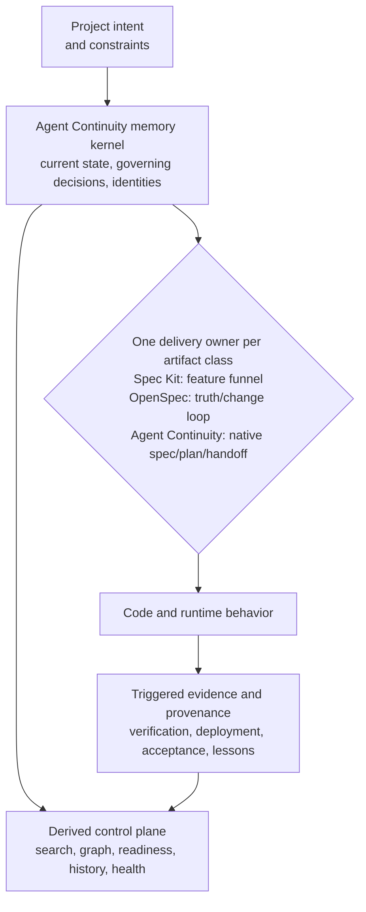
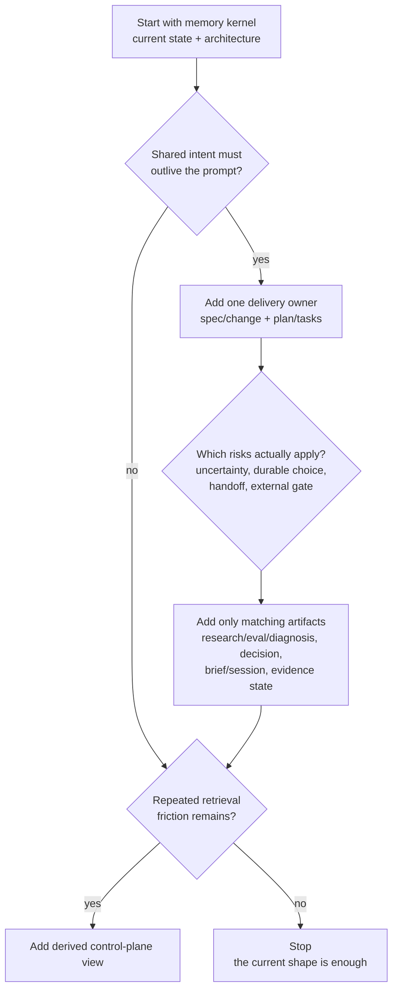

# RSCH-0010 - Spec Systems And Agent Continuity Fit

## Question

Which parts of GitHub Spec Kit, OpenSpec, and Agent Continuity solve distinct jobs, which parts overlap, and what should be retained, replaced, or evaluated before changing Agent Continuity?

## Short Answer

Spec Kit is worth studying and testing. It is the strongest lightweight baseline in this comparison for turning one feature intent into a specification, technical plan, task list, and implementation. Its newer resumable workflows and review gates also make it more than a folder of prompts.

OpenSpec is the stronger reference for continuously maintaining **current behavioral truth** separately from **proposed changes**, then folding accepted deltas back into that truth. Its Stores beta maps naturally to a private operations repository shared across several code repositories.

Agent Continuity is broader. It attempts to preserve current state, ideas, research, evaluations, decisions, implementation structure, evidence states, session receipts, provenance, and cross-project relationships. That breadth is useful only if the system can retrieve the right material cheaply and if individual document types change decisions, prevent mistakes, or shorten recovery. Otherwise it is ceremony with unusually tidy frontmatter.

The current recommendation is therefore:

1. Keep a small Agent Continuity **memory kernel**.
2. Treat Spec Kit and OpenSpec as candidate **delivery workflow owners**, not additional layers that duplicate the same specs and plans.
3. Make provenance and evidence types **triggered extensions**, not a default checklist.
4. Keep the future control plane as a **derived retrieval and health surface**, never a second owner of truth.
5. Run the paired evaluation in EVAL-0002 before deleting document families, adopting either tool broadly, or implementing a large migration.

No framework adoption or Agent Continuity migration is approved by this survey.

## The Three Jobs, Visually



The three middle branches show alternatives, not a mandatory pipeline. Spec Kit is centered on feature delivery; OpenSpec is centered on current truth and proposed change; Agent Continuity's native delivery path is one possible owner when its broader memory kernel remains useful. The control plane reads the kernel but owns no authored truth.

| System | Primary unit | Best question it answers | Strongest capability | Important gap for Owen's use |
|---|---|---|---|---|
| Spec Kit | One feature directory and execution cycle | "How do we turn this intent into implemented code?" | Constitution, spec, plan, tasks, analysis, implementation, convergence, and resumable workflow gates | Not a general long-lived project-memory, evidence, or cross-project provenance model |
| OpenSpec | Current domain specs plus a proposed change folder | "What is true now, and what delta are we proposing?" | Explicit current-truth versus change separation; archival delta merge; optional cross-repo Store | No first-class broad idea, decision, learning, acceptance-evidence, or global work graph model |
| Agent Continuity | Typed project-memory corpus and generated projections | "What is true, why, with what evidence, and what work is safe next?" | Rich provenance, evidence-state separation, durable handoff, and typed knowledge across time | More artifact kinds, more routing choices, fragile discoverability without a good control plane |

## GitHub Spec Kit

### Confirmed Current Shape

GitHub describes Spec Kit as an extensible, intent-driven harness for Spec-Driven Development (SDD). The built-in path is:

```text
constitution -> specify -> clarify -> plan -> tasks -> analyze -> implement -> converge
```

The minimal advertised core is `Spec -> Plan -> Tasks -> Implement`. Each phase produces Markdown that feeds the next. Current official material also documents:

- quality checklists and cross-artifact consistency analysis
- more than thirty agent integrations, including Codex
- extensions, presets, project-local template overrides, and bundles
- resumable workflows with explicit human gates
- a `spec of specs` approach for large features, where a roadmap holds stable sub-feature IDs and dependencies and each slice gets its own spec, plan, and tasks

This makes Spec Kit relevant for Agent Continuity in three ways:

1. It is a credible lightweight baseline against which Agent Continuity's extra memory must prove value.
2. Its constitution and cross-artifact analysis are useful patterns for making governing constraints visible without inventing many new document types.
3. Its workflow and gate model may be a better execution mechanism than embedding increasingly detailed procedural behavior inside Agent Continuity prose.

### Limits

Spec Kit's center of gravity is a feature execution cycle. The ordinary feature directory uses generic artifact filenames such as `spec.md`, `plan.md`, and `tasks.md`; identity is substantially carried by the feature directory or branch name. The current feature-creation script supports either sequential numbering or a timestamp prefix. That improves naming convenience but does not provide a separate, immutable, location-independent identity like a full Universally Unique Identifier (UUID).

The `spec of specs` pattern introduces stable roadmap entry IDs and dependency ordering, but those are a local convention inside a roadmap rather than a corpus-wide typed relationship model. It is useful evidence that workflow order should be represented by explicit dependencies, not inferred from one global number.

Spec Kit should therefore be evaluated as:

- a delivery funnel
- a workflow engine
- a possible replacement for parts of Agent Continuity's spec/plan/brief ceremony

It should not initially be treated as the owner of project history, research provenance, acceptance evidence, or the private cross-project control plane.

## OpenSpec

### Confirmed Current Shape

OpenSpec explicitly divides its corpus into:

- `openspec/specs/`: the agreed current behavior
- `openspec/changes/`: proposed modifications, each with artifacts and spec deltas

When a change is archived, OpenSpec applies the delta to the current specs and moves the full change folder under the archive. Custom schemas can define different artifact types and their prerequisites within a change.

The Stores beta allows planning to live in a Git repository of its own. Several code repositories can point to one Store or reference it as read-only upstream context. OpenSpec deliberately does not clone, pull, push, or synchronize; Git operations and checkout freshness remain the user's responsibility. Store registrations and worksets are machine-local, and the official guide says the beta's commands, file formats, and JSON shapes may still change.

### Fit And Risk

OpenSpec offers the cleanest existing shape for this invariant:

> Current truth and proposed change are different objects.

That is worth adapting even if OpenSpec itself is not adopted.

The largest integration risk is dual authority. If OpenSpec owns current specs, change lifecycle, and archive promotion while Agent Continuity also owns specifications, lifecycle status, and evidence, stable IDs will not prevent contradictory truth. Before any pilot, every artifact class needs exactly one declared owner.

OpenSpec Stores also do not by themselves solve the private/public discovery problem. A pointer committed to a public code repository can disclose a private Store name, remote, or organizational fact. The safer topology uses a private resolver keyed by public repository identity; the public repository remains independently understandable and contains no unapproved private pointer.

OpenSpec should therefore be tested as:

- a current-spec and proposed-change owner inside one private project operations satellite
- a cross-repository requirements workflow
- a possible replacement for some Agent Continuity spec/change/plan artifacts

It should not become a second archive, second status system, or implicit proof that work was implemented, automatically verified, or human accepted.

## Agent Continuity

### What Is Actually Distinctive

Agent Continuity's merit is not that it has more prefixes. Its potentially distinctive capability is the combination of:

- short current-state orientation
- differentiated uncertainty, including ideas, questions, research, evaluation, and diagnosis
- durable decisions and supersession
- specs, parent plans, bounded implementation briefs, and structured work dependencies
- explicit separation of proposed, implemented, automatically verified, deployed, and human-accepted evidence
- session receipts and lessons that survive context loss
- stable identities and typed relationships across repositories
- generated registries, health checks, and a future visual control plane

No reviewed system combines all of those in the same plain-Markdown, Git-reviewable corpus. That is evidence of a possible gap, not proof that filling the gap is valuable.

### Where It Is Too Heavy Today

The system becomes heavy when a document type is created because it exists rather than because a concrete information-loss risk triggered it. Specific current costs include:

- agents must choose among many similar-looking artifact families
- the same claim can be paraphrased into current state, a spec, a plan, an ADR, and a session log
- rich provenance is hard to benefit from when retrieval is mostly repository search
- generated views cover only the collections the current scanner knows about
- numeric allocation and roadmap sequence are easy to confuse with immutable identity or causal order
- large complete-profile trees can make small work feel ceremonially pre-approved by the Ministry of Markdown

Agent Continuity's own README already contains the correct countermeasure: profiles choose a starting footprint, and the document taxonomy is a menu rather than a mandatory pipeline. The revamp should make that adaptive behavior mechanically and visually clearer.

## Break Up The System By Responsibility

The useful decomposition is functional before it is organizational:

| Layer | Minimum responsibility | Canonical? | Candidate implementation |
|---|---|---:|---|
| Memory kernel | Current state, governing architecture, stable identity, one-owner rules | Yes | Small Agent Continuity core |
| Delivery workflow | Proposed feature/change, implementation plan, executable tasks | Yes, exactly one owner per artifact class | Agent Continuity, Spec Kit, or OpenSpec profile; never silent duplication |
| Evidence and provenance extensions | Research, evaluations, diagnostics, decisions, acceptance receipts, learnings | Yes when triggered | Optional Agent Continuity families |
| Relationship model | Typed links; only `depends_on` must be a directed acyclic graph (DAG) | Yes for explicit authored relations | Branch-safe IDs plus typed edges |
| Control-plane projection | Search, backlinks, current/blocked/ready views, health, history | No; rebuildable | Continuity Workspace or another read model |
| Storage topology | Distribution by project, authorization, retention, and collaboration boundary | Git repositories own their own content | Private operations satellites and a later thin hub |

This means Agent Continuity can remain one coherent format and product family without pretending every repository needs every document type. It also means the control plane can make rich provenance more useful without making the projection canonical.

## Adaptive Ceremony: Trigger It, Do Not Count The Project

Project size matters, but it is a weak proxy. A ten-file password manager can need stronger evidence than a large disposable prototype. Activate structure from actual risk:



Suggested admission rules:

| Artifact | Create only when | Do not create merely because |
|---|---|---|
| Idea | A possible direction is likely to be revisited but is not ready to bind work | A thought appeared in chat |
| Research | External or internal option evidence could change the choice | A web search occurred |
| Evaluation | A repeatable comparison can settle a real adoption or quality question | Numbers would look reassuring |
| Diagnostic | One real failure or slow path needs evidence that outlives the run | Every bug needs a report before a fix |
| Architecture decision record | A durable, hard-to-reverse choice has meaningful alternatives and consequences | Any implementation choice was made |
| Spec or change | Shared behavior or outcome must remain authoritative beyond the prompt | A tiny local edit is obvious from code and tests |
| Parent plan | Sequencing, boundaries, risk, or multiple verification paths matter | Work has more than one checkbox |
| Implementation brief | Delegation, interruption, or seam isolation makes a bounded handoff safer | Every plan must have child paperwork |
| Session log | Meaningful work changed truth, produced evidence, or needs archaeology | Every conversational turn ended |
| Learning | A corrected assumption should alter future behavior | Something mildly interesting happened |

## Storage Topology

The strongest long-term topology remains:

```text
private portfolio hub (later; links and cross-project assertions only)
  -> private project operations satellite A
       -> one or more public/private code repositories
  -> private project operations satellite B
       -> one or more public/private code repositories

separate personal vault (not ordinary project-agent context)
```

The default is one operations satellite per coherent project **only when** its readers, retention policy, and operational ownership align. Split a project when those access domains differ. Do not create one private repository per code repository automatically, and do not put every project and personal fact into one global Git history.

Public code repositories keep every contract, architecture note, build instruction, and contributor rule needed to use the public code. Private operations repositories keep private intent, proposed changes, internal decisions, cross-repo coordination, and acceptance evidence. The hub is a derived registry and relationship surface, not a copy of each project's truth.

OpenSpec Stores could implement part of one satellite. Spec Kit ordinarily remains close to the code repository and feature implementation cycle. Neither tool determines the storage boundary; authorization and lifecycle do.

## Identity And Workflow Order

The current ID problem should be separated from the ceremony decision:

- identity should be immutable and locally generatable without a central counter
- a friendly numeric or slug label may remain as display metadata
- workflow order should come from typed `depends_on` edges
- only the `depends_on` projection needs to be acyclic
- `parent`, `implements`, `supersedes`, `evidence_for`, and `related_to` are different relationships and should not be forced into one ordering number

Beads is useful prior art for this narrow seam. Its documentation explicitly uses hash-based IDs derived from random identity material to reduce concurrent branch collisions and computes ready work from dependencies. Agent Continuity can adapt the identity/relationship split without adopting Beads' Dolt database or replacing authored Markdown with an issue tracker.

The likely successor model is a full branch-safe internal ID, plus optional human aliases such as `SPEC-0012`. That remains a proposal until the identity work has its own schema, migration, compatibility, and adversarial merge evaluation.

## How To Measure Whether The Extra Documents Earn Their Keep

A document system cannot be justified by counting documents, links, or generated indexes. The comparison unit must be an accepted work outcome under controlled conditions.

Measure both sides:

| Value signal | Cost signal |
|---|---|
| Task outcome and acceptance score | Total elapsed time to accepted outcome |
| Missed or contradicted constraints | Time spent authoring and maintaining docs |
| Time and accuracy recovering current truth | Context tokens and tool-output bytes |
| Correct distinction between proposed, verified, deployed, and accepted | Number of documents opened, created, and touched |
| Human corrective turns and review findings | Merge-conflict and stale-doc repair time |
| Accurate answers to provenance and rejected-alternative questions | Orphan, duplicate-authority, and stale-artifact rate |
| Recovery after interruption or branch conflict | Time to first code or first useful action |

Useful derived measures include:

```text
ceremony_ratio = documentation_authoring_and_maintenance_time / total_task_time

recovery_gain = baseline_recovery_time - candidate_recovery_time

memory_return = (baseline_rework_and_recovery_time - candidate_rework_and_recovery_time)
                / candidate_documentation_maintenance_time

retrieval_yield = decision_relevant_artifacts_used / eligible_non_core_artifacts_available
```

None should become one universal score. A lower ceremony ratio does not excuse a security omission; a rich provenance record is not valuable if no eligible task can find or use it. Compare candidates on a Pareto frontier: outcome quality, recovery, human effort, and overhead.

EVAL-0002 defines a staged comparison that first isolates artifact-set value, then isolates the control plane's surfacing value, and only afterward tests live Spec Kit or OpenSpec tooling. It also instruments each document type so the system can identify which families are core, trigger-only, candidates to merge, or candidates to retire.

## Risks And Unknowns

1. **Tool comparison can be confounded by prompt quality.** Freeze tasks, model/tool access, acceptance rubrics, and evidence packets before each run.
2. **The rich packet can leak answers rather than improve reasoning.** Include decoy and stale documents, and score whether agents identify authority instead of merely quoting more context.
3. **One project cannot establish topology.** Test at least one small repo-local task, one interrupted medium change, and one cross-repository or private/public case.
4. **A control plane can hide stale truth beautifully.** Every view needs source revision and freshness state; the projection remains non-canonical.
5. **OpenSpec's archive is not acceptance evidence.** Rejected, superseded, partial, reverted, automatically verified, deployed, and human-accepted states must remain distinct in the pilot.
6. **Spec Kit and OpenSpec are moving targets.** Pin exact versions for any live trial and re-read current official documentation before adoption.
7. **More mature upstream projects are not automatically better fits.** Community scale improves prior-art value, but only representative evaluation can establish local outcome value.

## Recommendation

### Adopt Conceptually Now

- Spec Kit's explicit constitution and cross-artifact analysis patterns.
- OpenSpec's current-truth versus proposed-delta separation.
- One owner for every authoritative artifact class.
- A branch-safe identity separate from human display order.
- A typed relationship graph whose `depends_on` subgraph is a DAG.
- Private project operations satellites with a thin later portfolio projection.

### Pilot, Do Not Adopt Broadly Yet

- Spec Kit as the lightweight delivery baseline for a bounded repo-local feature.
- OpenSpec inside one private operations satellite for one cross-repository change and one adverse lifecycle case.
- The Continuity Workspace control plane as a read-only projection over the same frozen Agent Continuity corpus.

### Keep Until Evaluated

- Agent Continuity's ideas, research, evaluations, diagnostics, decisions, learnings, session receipts, and evidence-state distinctions.
- The complete taxonomy as available capabilities.

Keeping these types does not mean creating them by default. Their status is **trigger-only pending evidence**.

### Defer

- Migrating existing projects.
- Installing both Spec Kit and OpenSpec into one active workflow.
- A global graph database or automatic scheduler.
- A universal private documentation repository.
- Broad OpenSpec schema customization.
- Removing document types based on intuition alone.

## Follow-Ups

1. Run the low-cost calibration slice of EVAL-0002.
2. Use its results to classify each Agent Continuity document type as core, trigger-only, merge, or retire.
3. If a live tool pilot is still warranted, assign one bounded artifact owner to Spec Kit or OpenSpec and test an explicit exit path.
4. Handle immutable IDs and typed relationships in a separate schema decision after the branch-collision fixtures are frozen.
5. Promote a final choice to an architecture decision record only after the evaluation produces evidence.
