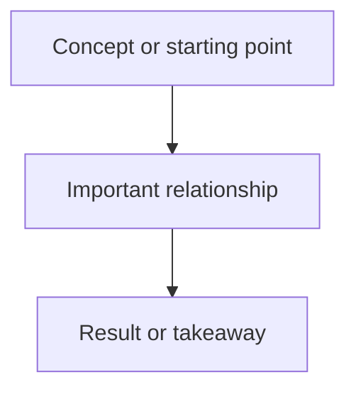

# EXPL-0000 - Explainer Title

## Use This When

Who should read this, and what confusion should it resolve?

## Short Answer

Give the smallest useful explanation first.

## Mental Model

Name the concepts, actors, or states the reader should hold in their head.

## Explanation

Explain the concept, workflow, or behavior in clear steps.

## Visual

Use a visualization pass when structure, flow, state, ownership, or behavior is easier to see than read.

What this shows:

- <key relationship>
- <source of truth or ownership boundary>
- <important caveat>

Assumptions or uncertainties:

- <label any inference>

## Common Misunderstandings

- Misunderstanding:
  Correction:

## How This Connects To The Repo

- Source docs:
- Source code:
- Related plans, ADRs, learnings, or questions:

## Check Your Understanding

- Question:
  Expected answer:

## Related Docs
